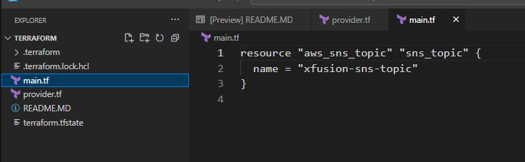

# Day 100: Create and Configure Alarm Using CloudWatch Using Terraform

**subject**

***

The Nautilus DevOps team has been tasked with setting up an EC2 instance for their application. To ensure the application performs optimally, they also need to create a CloudWatch alarm to monitor the instance's CPU utilization. The alarm should trigger if the CPU utilization exceeds 90% for one consecutive 5-minute period. To send notifications, use the SNS topic named`xfusion-sns-topic`, which is already created.

1. **Launch EC2 Instance:**&#x43;reate an EC2 instance named`xfusion-ec2`using any appropriate Ubuntu AMI (you can use AMI`ami-0c02fb55956c7d316`).
2. **Create CloudWatch Alarm:**&#x43;reate a CloudWatch alarm named`xfusion-alarm`with the following specifications:
   * Statistic: Average
   * Metric: CPU Utilization
   * Threshold: >= 90% for 1 consecutive 5-minute period
   * Alarm Actions: Send a notification to the`xfusion-sns-topic`SNS topic.
3. Update the`main.tf`file (do not create a separate .tf file) to create a EC2 Instance and CloudWatch Alarm.
4. Create an`outputs.tf`file to output the following values:

* `KKE_instance_name`for the EC2 instance name.
* `KKE_alarm_name`for the CloudWatch alarm name.

**Notes:**

1. The Terraform working directory is`/home/bob/terraform`.
2. Right-click under the`EXPLORER`section in`VS Code`and select`Open in Integrated Terminal`to launch the terminal.
3. Before submitting the task, ensure that`terraform plan`returns`No changes. Your infrastructure matches the configuration.`

***

https://registry.terraform.io/providers/hashicorp/aws/latest/docs/resources/instance.html

https://towardsaws.com/building-proactive-monitoring-on-aws-with-ec2-cloudwatch-terraform-from-setup-scripts-to-71bdc0e4a7dc

https://registry.terraform.io/providers/hashicorp/aws/latest/docs/resources/cloudwatch\_metric\_alarm

https://developer.hashicorp.com/terraform/language/values/outputs

* Check the current work

* Add content in main.tf

- Create outputs.tf

* Check 

- Run
