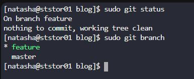
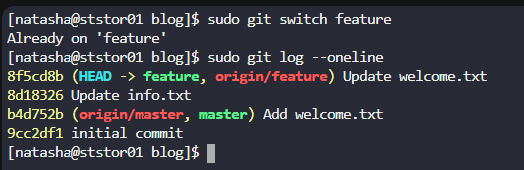
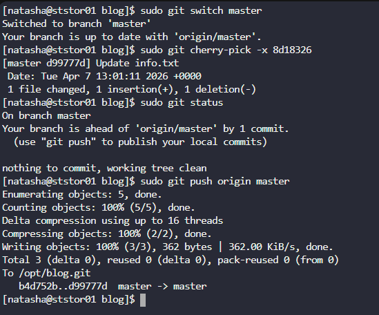

# Day 28: Git Cherry Pick 

subject

The Nautilus application development team has been working on a project repository`/opt/blog.git`. This repo is cloned at`/usr/src/kodekloudrepos`on`storage server`in`Stratos DC`. They recently shared the following requirements with the DevOps team:

There are two branches in this repository,`master`and`feature`. One of the developers is working on the`feature`branch and their work is still in progress, however they want to merge one of the commits from the`feature`branch to the`master`branch, the message for the commit that needs to be merged into`master`is`Update info.txt`. Accomplish this task for them, also remember to push your changes eventually.

***

https://comprendre-git.com/fr/commandes/git-cherry-pick/

* Check branches

* Check the commit needed

* Copy commit into master

