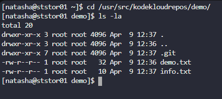
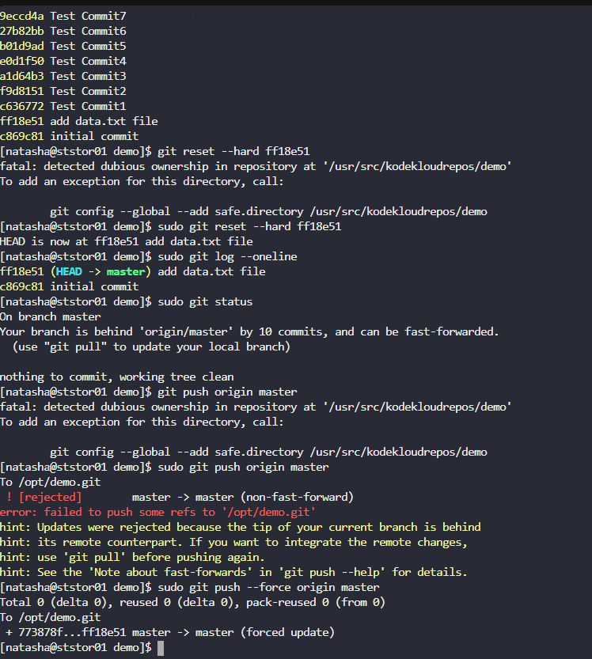

# Day 30: Git hard reset

**Subjects**

***

The Nautilus application development team was working on a git repository`/usr/src/kodekloudrepos/demo`present on`Storage server`in`Stratos DC`. This was just a test repository and one of the developers just pushed a couple of changes for testing, but now they want to clean this repository along with the commit history/work tree, so they want to point back the`HEAD`and the branch itself to a commit with message`add data.txt file`. Find below more details:

1. In`/usr/src/kodekloudrepos/demo`git repository, reset the git commit history so that there are only two commits in the commit history i.e`initial commit`and`add data.txt file`.

2. Also make sure to push your changes.

***

https://www.w3schools.com/git/git\_reset.asp

* moving there

* reset and push

