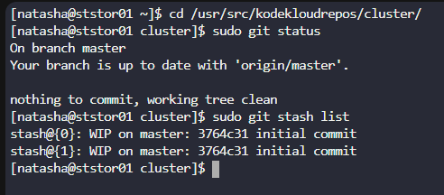
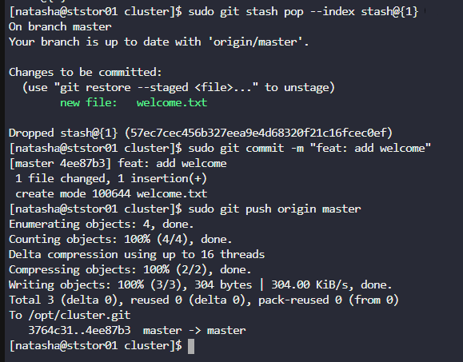

# Day 31: Git Stash 

**subjects**

***

The Nautilus application development team was working on a git repository`/usr/src/kodekloudrepos/cluster`present on`Storage server`in`Stratos DC`. One of the developers stashed some in-progress changes in this repository, but now they want to restore some of the stashed changes. Find below more details to accomplish this task:

Look for the stashed changes under`/usr/src/kodekloudrepos/cluster`git repository, and restore the stash with`stash@{1}`identifier. Further, commit and push your changes to the origin.

***

https://comprendre-git.com/fr/commandes/git-stash/

* List stash

* Stash and push

