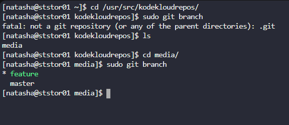
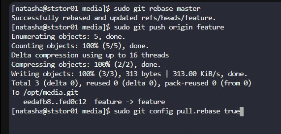

# Day 32: Git Rebase

**subjects**

***

The Nautilus application development team has been working on a project repository`/opt/media.git`. This repo is cloned at`/usr/src/kodekloudrepos`on`storage server`in`Stratos DC`. They recently shared the following requirements with DevOps team:

One of the developers is working on`feature`branch and their work is still in progress, however there are some changes which have been pushed into the`master`branch, the developer now wants to`rebase`the`feature`branch with the`master`branch without loosing any data from the`feature`branch, also they don't want to add any`merge commit`by simply merging the`master`branch into the`feature`branch. Accomplish this task as per requirements mentioned.

Also remember to push your changes once done.

***

* check the branch

* rebase it

