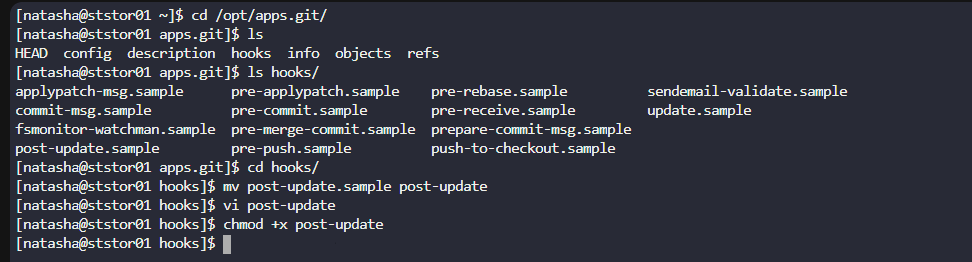
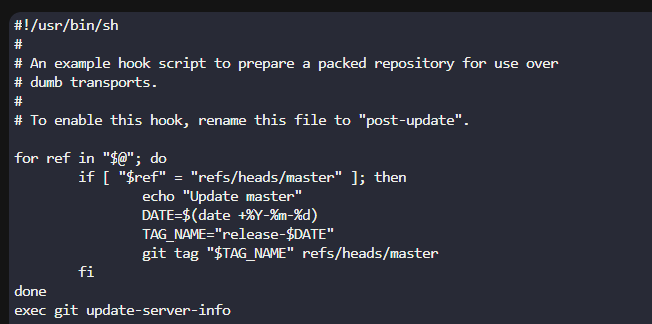
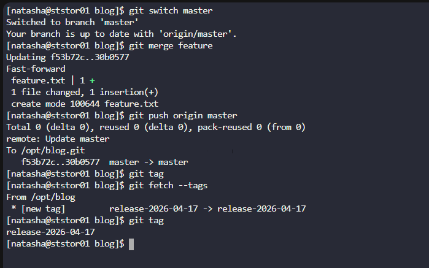

# Day 34: Git Hook

**subjects**

***

The Nautilus application development team was working on a git repository`/opt/news.git`which is cloned under`/usr/src/kodekloudrepos`directory present on`Storage server`in`Stratos DC`. The team want to setup a hook on this repository, please find below more details:

* Merge the`feature`branch into the`master`branch, but before pushing your changes complete below point.

* Create a`post-update`hook in this git repository so that whenever any changes are pushed to the`master`branch, it creates a release tag with name`release-2023-06-15`, where`2023-06-15`is supposed to be the current date. For example if today is`20th June, 2023`then the release tag must be`release-2023-06-20`. Make sure you test the hook at least once and create a release tag for today's release.

* Finally remember to push your changes.
  `Note:`Perform this task using the`natasha`user, and ensure the repository or existing directory permissions are not altered.

***

**solutions**

https://medium.com/@f3igao/get-started-with-git-hooks-5a489725c639

https://www.atlassian.com/git/tutorials/git-hooks

https://www.datacamp.com/tutorial/git-hooks-complete-guide

* configure the hooks on the remote repo 

* merge and push

1. **Local vs Serveur :**&#x51;uand vous faites un`git push origin master`, Git cherche les hooks de mise à jour sur la destination (`/opt/official.git`), pas sur la source (votre dossier local).
2. **Rôle du hook :**&#x4C;e hook`post-update`est conçu pour réagir quand le serveur*reçoit*des données. Sur votre machine locale, il ne se passera rien lors d'un push sortant.
