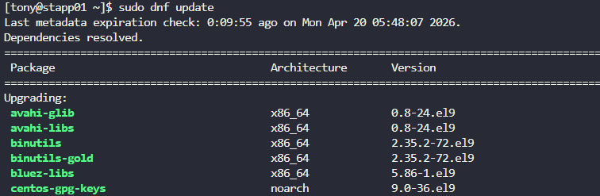
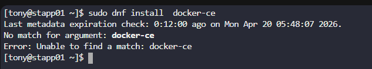
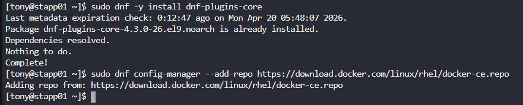
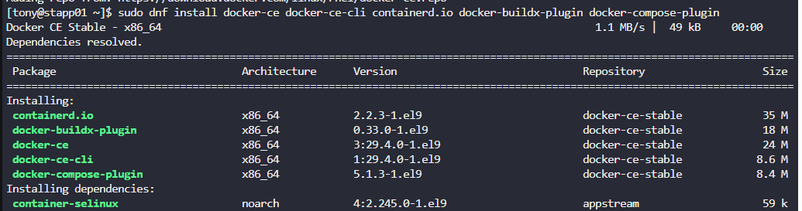
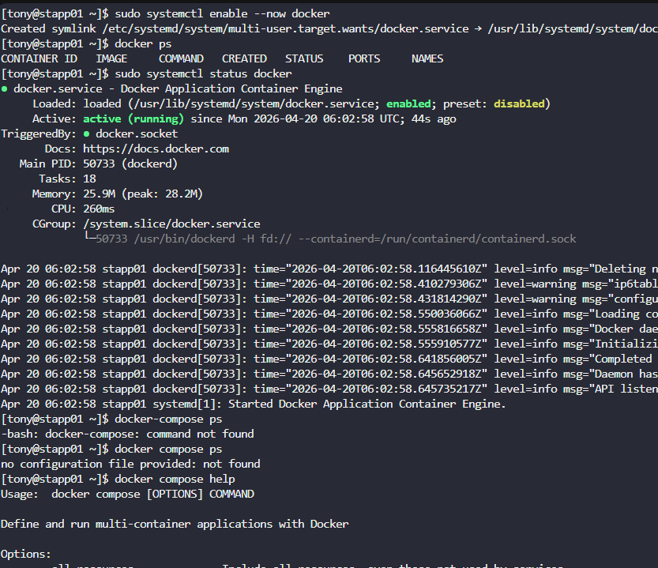

# Day 35:  Install Docker Packages and Start Docker Service

**subjects**

***

The Nautilus DevOps team aims to containerize various applications following a recent meeting with the application development team. They intend to conduct testing with the following steps:

1. Install`docker-ce`and`docker compose`packages on`App Server 1`.

2. Initiate the`docker`service.

***

* update and search

not found docker-ce directly

so adding the repo

* install docker-ce

* start and test docker engine

