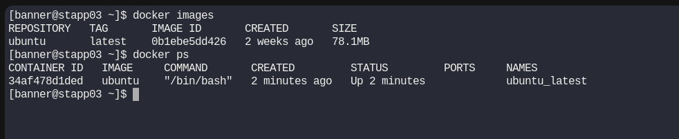
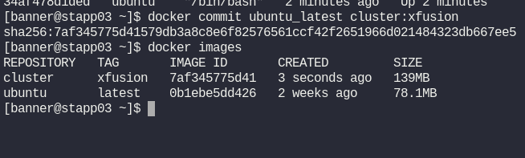

# Day 39: Create a Docker Image From Container

**subject**

***

One of the Nautilus developer was working to test new changes on a container. He wants to keep a backup of his changes to the container. A new request has been raised for the DevOps team to create a new image from this container. Below are more details about it:

a. Create an image `cluster:xfusion` on `Application Server 3` from a container `ubuntu_latest` that is running on same server.

***

https://docs.docker.com/reference/cli/docker/container/commit/

* Check images and container

* Create the image

