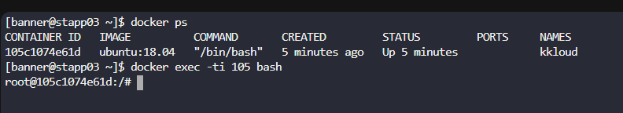
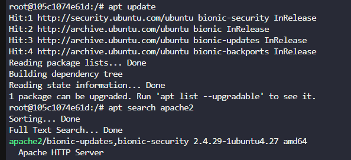
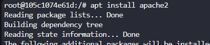
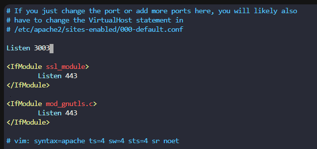
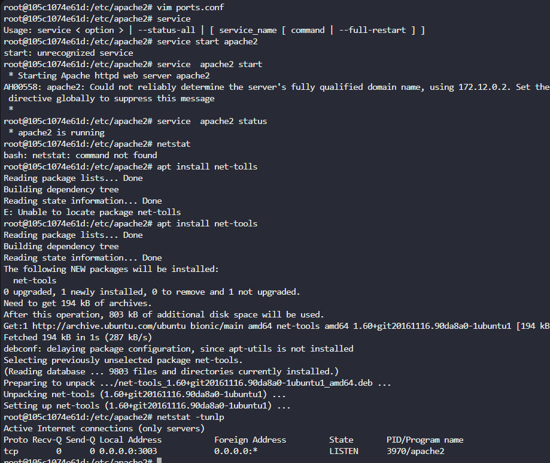

# Day 40: Docker EXEC Operations

**subject**

***

One of the Nautilus DevOps team members was working to configure services on a`kkloud`container that is running on`App Server 3`in`Stratos Datacenter`. Due to some personal work he is on PTO for the rest of the week, but we need to finish his pending work ASAP. Please complete the remaining work as per details given below:

a. Install`apache2`in`kkloud`container using`apt`that is running on`App Server 3`in`Stratos Datacenter`.

b. Configure Apache to listen on port`3003`instead of default`http`port. Do not bind it to listen on specific IP or hostname only, i.e it should listen on localhost, 127.0.0.1, container ip, etc.

c. Make sure Apache service is up and running inside the container. Keep the container in running state at the end.

***

* Access bash 

* Install apache2

* Configure it

to change port it 's in ports.conf

