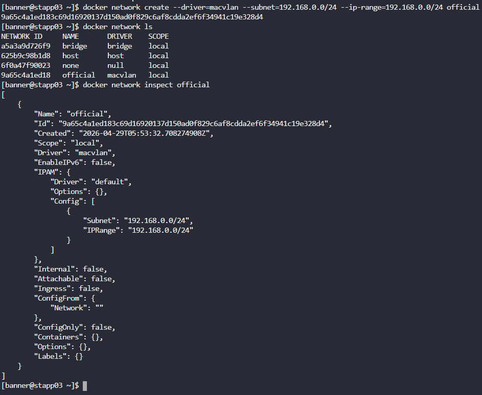

# Day 42: Create a Docker Network

**subjects**

***

The Nautilus DevOps team needs to set up several docker environments for different applications. One of the team members has been assigned a ticket where he has been asked to create some docker networks to be used later. Complete the task based on the following ticket description:

a. Create a docker network named as`official`on App Server`3`in`Stratos DC`.

b. Configure it to use`macvlan`drivers.

c. Set it to use subnet`192.168.0.0/24`and iprange`192.168.0.0/24`.

***

https://docs.docker.com/engine/network/

In Docker, thesubnetdefines the total address space available for a network (e.g.,`192.168.1.0/24`), while theip-range(or`--ip-range`) restricts the specific sub-segment of that subnet from which Docker actually allocates IP addresses to containers.**Subnet**sets the logical boundary and gateway;**IP Range**enables safer, smaller allocations within that boundary to avoid IP conflicts

