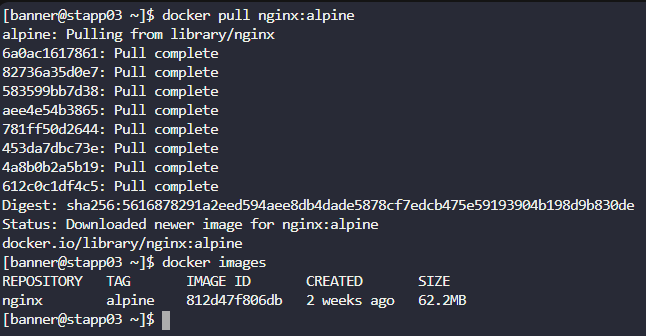
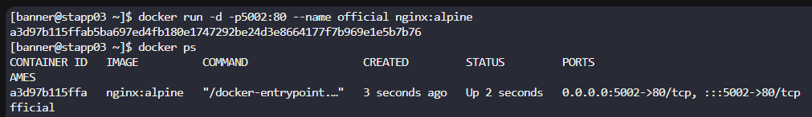
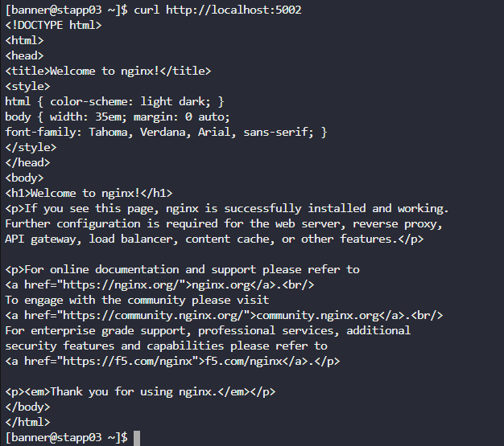

# Day 43: Docker Ports Mapping

**subject**

***

The Nautilus DevOps team is planning to host an application on a nginx-based container. There are number of tickets already been created for similar tasks. One of the tickets has been assigned to set up a nginx container on`Application Server 3`in`Stratos Datacenter`. Please perform the task as per details mentioned below:

a. Pull`nginx:alpine`docker image on`Application Server 3`.

b. Create a container named`official`using the image you pulled.

c. Map host port`5002`to container port`80`. Please keep the container in running state.

***

* Pull the image

* Create the container

