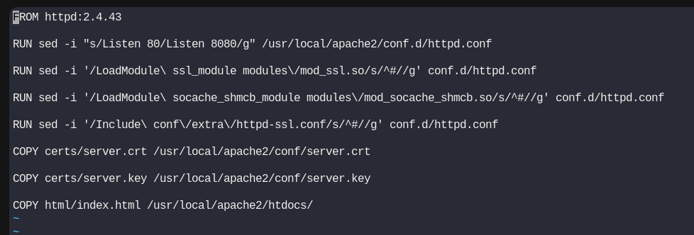
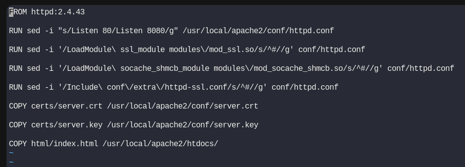
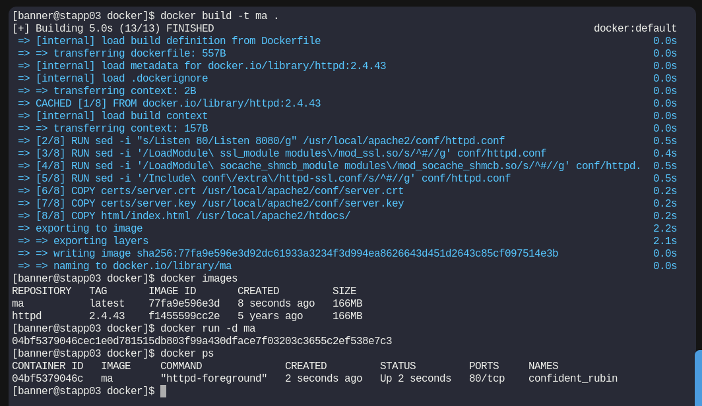

# Day 45: Resolve Dockerfile Issues

**subjets**

***

The Nautilus DevOps team is working to create new images per requirements shared by the development team. One of the team members is working to create a `Dockerfile` on `App Server 3` in `Stratos DC`. While working on it she ran into issues in which the docker build is failing and displaying errors. Look into the issue and fix it to build an image as per details mentioned below:

a. The `Dockerfile` is placed on `App Server 3` under `/opt/docker` directory.

b. Fix the issues with this file and make sure it is able to build the image.

c. Do not change base image, any other valid configuration within Dockerfile, or any of the data been used — for example, index.html.

`Note:` Please note that once you click on `FINISH` button all the existing containers will be destroyed and new image will be built from your `Dockerfile`.

***

* Check the Dockerfile with error

* Fix the error

conf.d doesn't exist only conf exist

* Test

