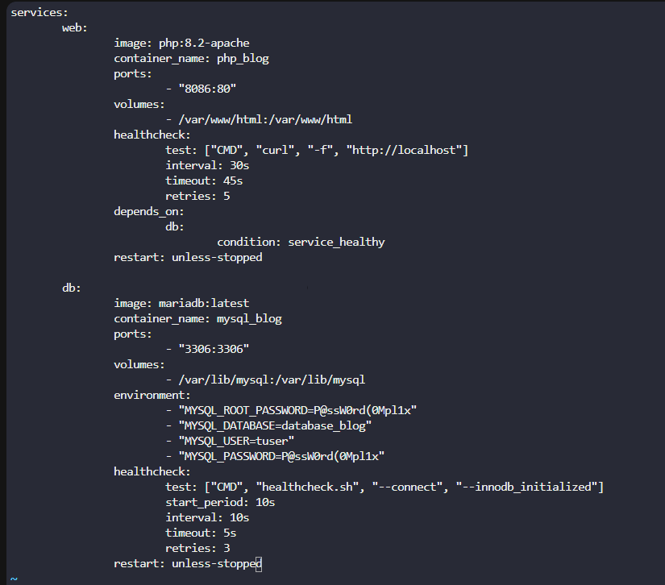
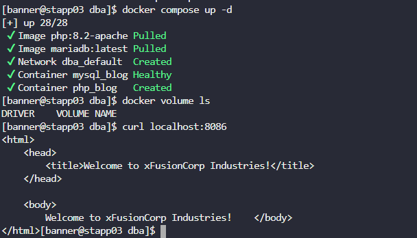

# Day 46: Deploy an App on Docker Containers

**subject**

***

The Nautilus Application development team recently finished development of one of the apps that they want to deploy on a containerized platform. The Nautilus Application development and DevOps teams met to discuss some of the basic pre-requisites and requirements to complete the deployment. The team wants to test the deployment on one of the app servers before going live and set up a complete containerized stack using a docker compose fie. Below are the details of the task:

1. On`App Server 3`in`Stratos Datacenter`create a docker compose file`/opt/data/docker-compose.yml`(should be named exactly).

2. The compose should deploy two services (web and DB), and each service should deploy a container as per details below:

`For web service:`

a. Container name must be`php_apache`.

b. Use image`php`with any`apache`tag. Check[here](https://hub.docker.com/_/php?tab=tags/)for more details.

c. Map`php_apache`container's port`80`with host port`3001`

d. Map`php_apache`container's`/var/www/html`volume with host volume`/var/www/html`.

`For DB service:`

a. Container name must be`mysql_apache`.

b. Use image`mariadb`with any tag (preferably`latest`). Check[here](https://hub.docker.com/_/mariadb?tab=tags/)for more details.

c. Map`mysql_apache`container's port`3306`with host port`3306`

d. Map`mysql_apache`container's`/var/lib/mysql`volume with host volume`/var/lib/mysql`.

e. Set MYSQL\_DATABASE=`database_apache`and use any custom user ( except root ) with some complex password for DB connections.

1. After running docker-compose up you can access the app with curl command`curl <server-ip or hostname>:3001/`

For more details check[here](https://hub.docker.com/_/mariadb?tab=description/).

`Note:`Once you click on`FINISH`button, all currently running/stopped containers will be destroyed and stack will be deployed again using your compose file.

***

* Write docker compose file

* Test

