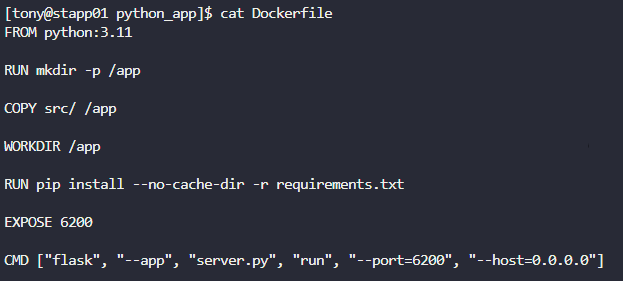
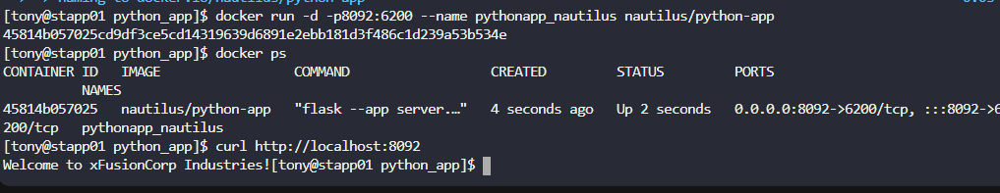

# Day 47: Docker Python App

**subjects**

***

A python app needed to be Dockerized, and then it needs to be deployed on`App Server 1`. We have already copied a`requirements.txt`file (having the app dependencies) under`/python_app/src/`directory on`App Server 1`. Further complete this task as per details mentioned below:

1. Create a`Dockerfile`under`/python_app`directory:
   * Use any`python`image as the base image.
   * Install the dependencies using`requirements.txt`file.
   * Expose the port`6200`.
   * Run the`server.py`script using`CMD`.
2. Build an image named`nautilus/python-app`using this Dockerfile.
3. Once image is built, create a container named`pythonapp_nautilus`:
   * Map port`6200`of the container to the host port`8092`.
4. Once deployed, you can test the app using`curl`command on`App Server 1`.

```
curl http://localhost:8092/
```

***

* Create dockerfile



* run and test



