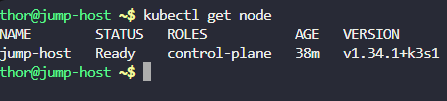
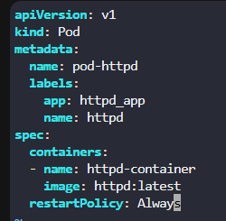
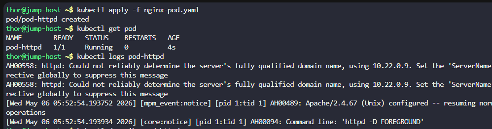

# Day 48: Deploy Pods in Kubernetes Cluster

**subjects**

***

The Nautilus DevOps team is diving into Kubernetes for application management. One team member has a task to create a pod according to the details below:

1. Create a pod named`pod-httpd`using the`httpd`image with the`latest`tag. Ensure to specify the tag as`httpd:latest`.
2. Set the`app`label to`httpd_app`, and name the container as`httpd-container`.

`Note`: The`kubectl`utility on the`jump-host`has been configured to work with the Kubernetes cluster.

***

* Check if there is a cluster ready

* Although, we can create a pod using the command imperative way the standard is to use yaml

* Create pod

