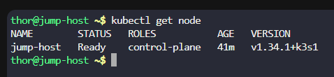
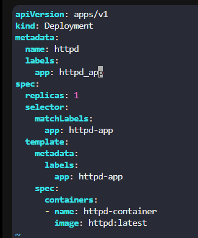
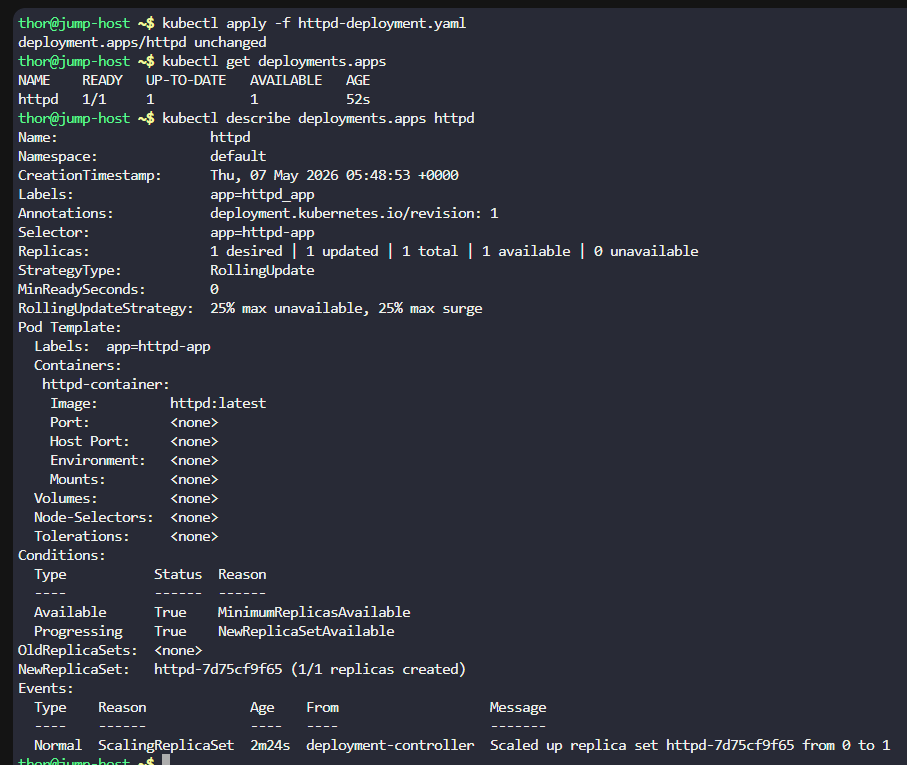

# Day 49: Deploy Applications with Kubernetes Deployments

**subject**

***

The Nautilus DevOps team is delving into Kubernetes for app management. One team member needs to create a deployment following these details:

Create a deployment named`httpd`to deploy the application`httpd`using the image`httpd:latest`(ensure to specify the tag)

`Note:`The`kubectl`utility on the`jump-host`has been configured to work with the Kubernetes cluster.

***

* Check if there is a k8s cluster

* Create the yaml for the deployment

* Test

