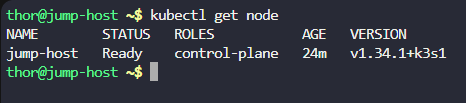
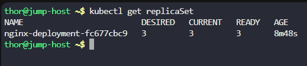
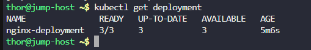
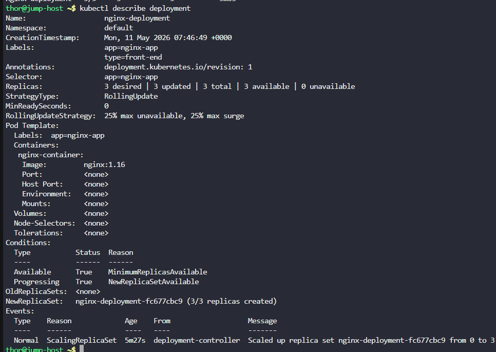
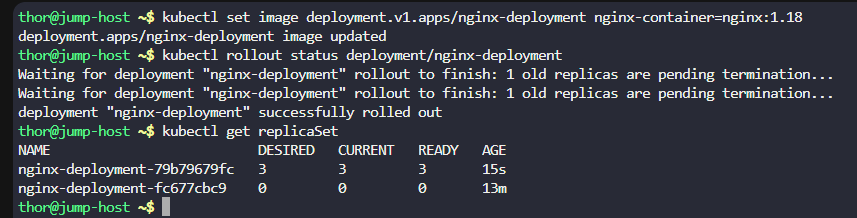

# Day 51: Execute Rolling Updates in Kubernetes

**subjects**

***

An application currently running on the Kubernetes cluster employs the nginx web server. The Nautilus application development team has introduced some recent changes that need deployment. They've crafted an image`nginx:1.18`with the latest updates.

Execute a rolling update for this application, integrating the`nginx:1.18`image. The deployment is named`nginx-deployment`.

Ensure all pods are operational post-update.

`Note:`The`kubectl`utility on the`jump-host`has been configured to work with the Kubernetes cluster.

***

* Check the cluster

* Check replicaset

* Check the deployment

* Update the deployment

