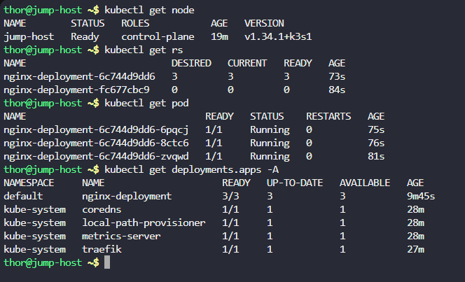
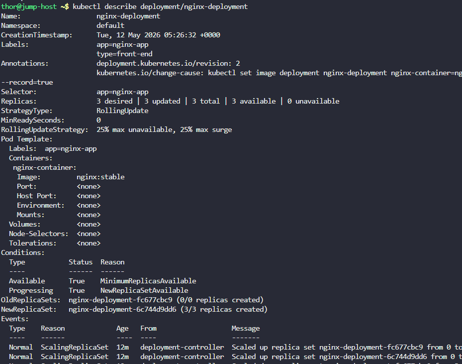
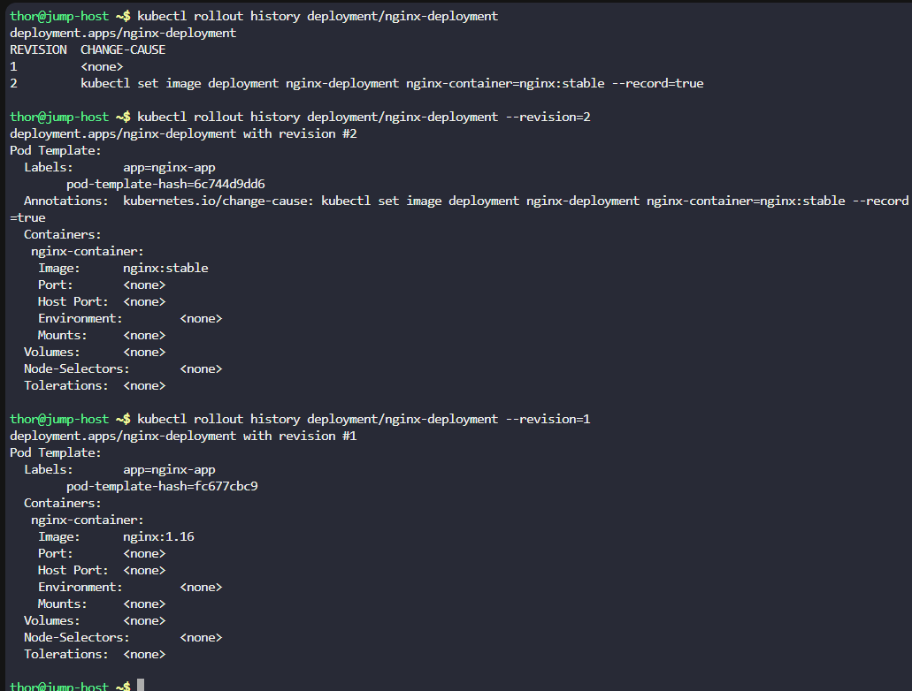
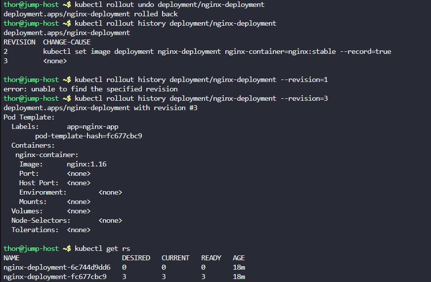
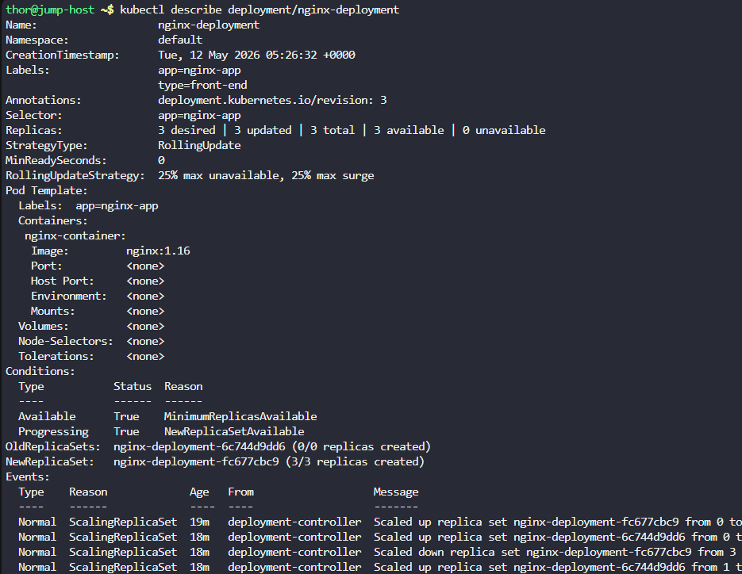

# Day 52: Revert Deployment to Previous Version in Kubernetes

**subjects**

***

Earlier today, the Nautilus DevOps team deployed a new release for an application. However, a customer has reported a bug related to this recent release. Consequently, the team aims to revert to the previous version.

There exists a deployment named`nginx-deployment`; initiate a rollback to the previous revision.

`Note:`The`kubectl`utility on the`jump-host`has been configured to work with the Kubernetes cluster.

***

https://blog.stephane-robert.info/docs/conteneurs/orchestrateurs/kubernetes/rolling-updates-rollbacks/

* Check the cluster exist

* Check the deployment

* Check rollout history

we can see that the change apply is just to change the nginx container version

Dans Kubernetes, la révision avec le numéro le plus élevé dans l'historique est celle qui est active

* now rollback

