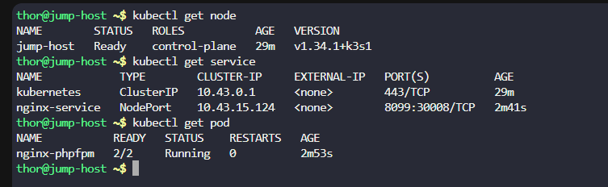
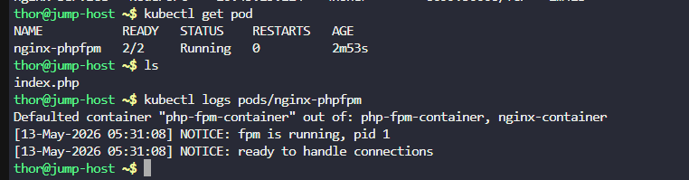
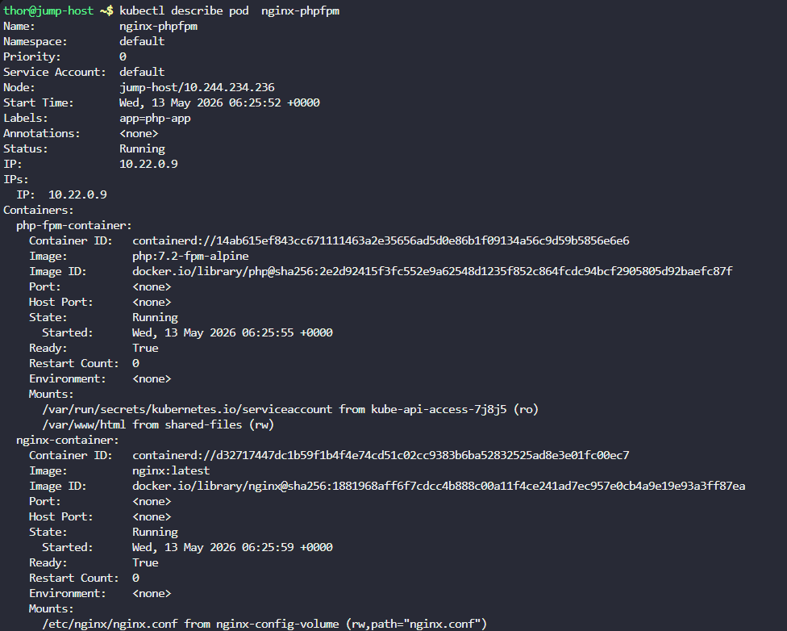
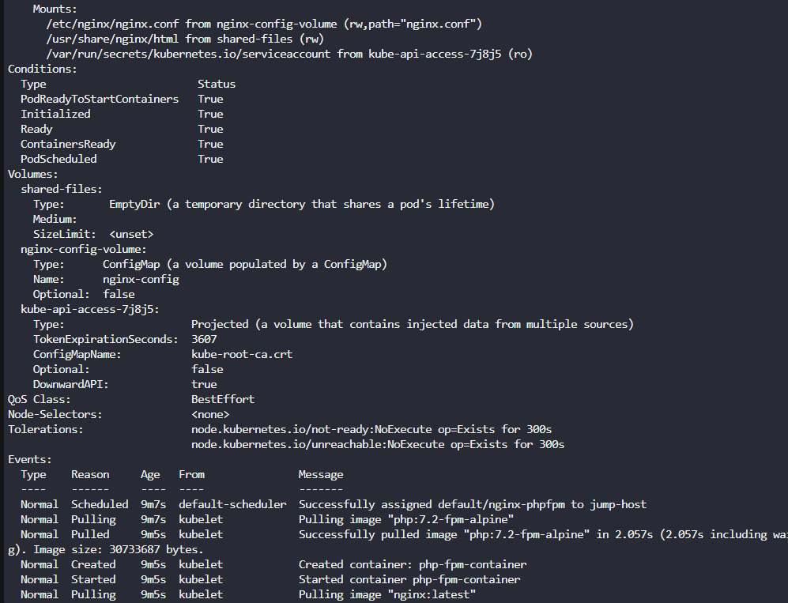
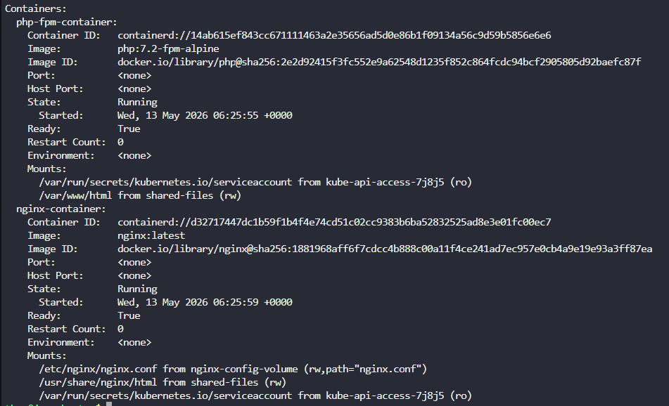
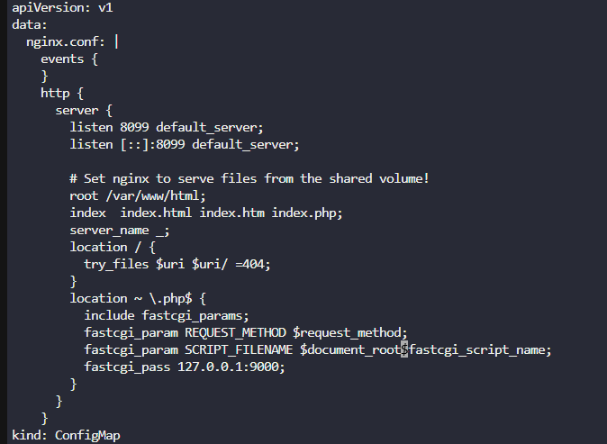
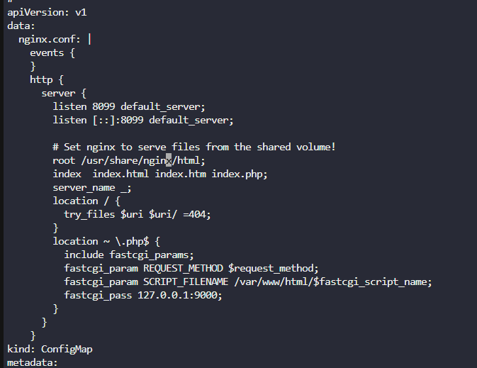
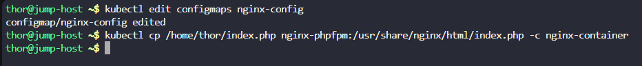
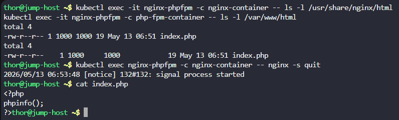
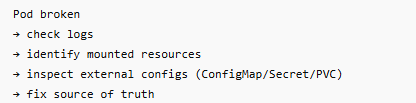

# Day 53: Resolve VolumeMounts Issue in Kubernetes

**subjects**

***

We encountered an issue with our Nginx and PHP-FPM setup on the Kubernetes cluster this morning, which halted its functionality. Investigate and rectify the issue:

The pod name is`nginx-phpfpm`and configmap name is`nginx-config`. Identify and fix the problem.

Once resolved, copy`/home/thor/index.php`file from the`jump host`to the`nginx-container`within the nginx document root. After this, you should be able to access the website using`Website`button on the top bar.

`Note:`The`kubectl`utility on the`jump-host`has been configured to work with the Kubernetes cluster.

***

https://blog.stephane-robert.info/docs/conteneurs/orchestrateurs/kubernetes/pods/

[https://kubernetes.io/docs/concepts/storage/volumes/
](https://kubernetes.io/docs/concepts/storage/volumes/)[https://kubernetes.io/docs/reference/kubectl/generated/kubectl\_cp/
](https://kubernetes.io/docs/reference/kubectl/generated/kubectl_cp/)

* Check the cluster

* Check the pod

* The error 

php container mount /var/www/html  and

nginx container /usr/share/nginx/html

but in the config

we see \$document\_root\$fastcgi\_script\_name which give /usr/share/nginx/htmll/index.php for eg

but the root for php is   /var/www/html

So we can modify it directly or mount also the root in php qnd also the mount root for nginx

That happens because many pod fields are immutable after creation, including container volume mounts.

You generally cannot directly edit a running pod’s `volumeMounts`.

so we need to update the configmap

* update configmap

* copy the file into the pod

* we need to stop the pod so the k8s will restart it with new config

***

**lesson**

* pod are immutable we cannot directly edit it
* we can 

kubectl get pod nginx-phpfpm -o yaml > pod.yaml

vi pod.yaml

kubectl replace - force -f pod.yaml
