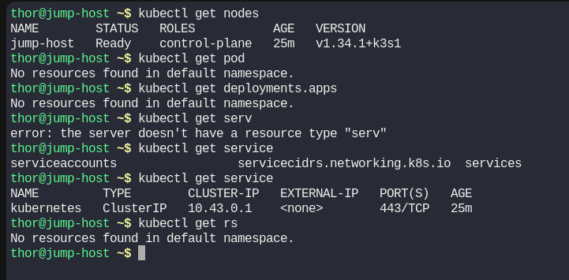
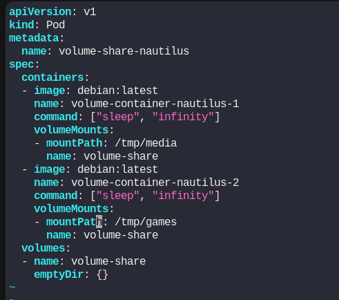
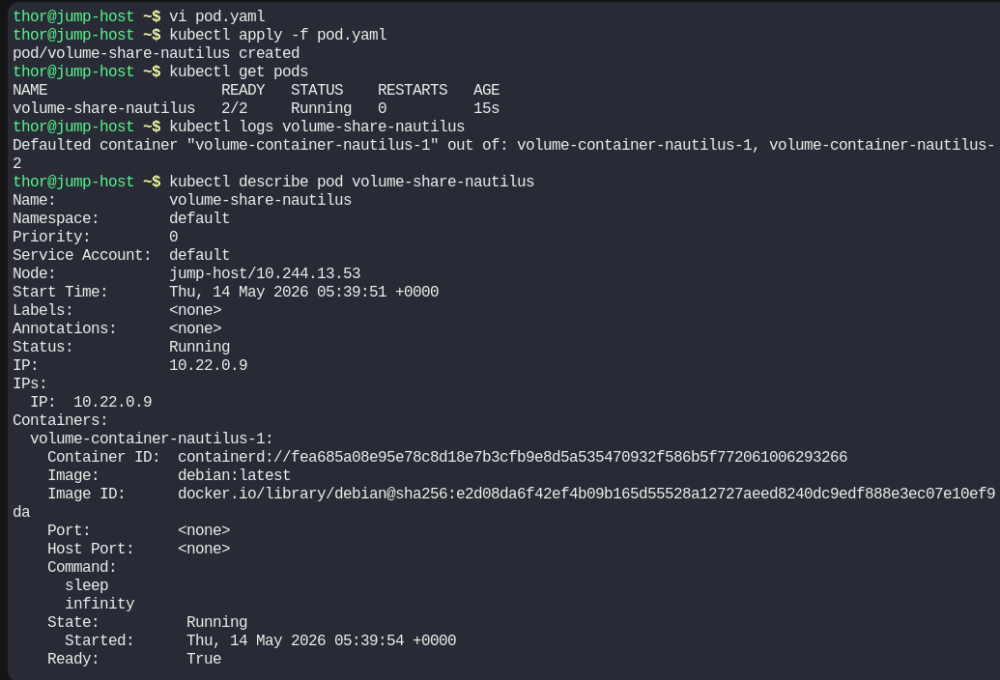
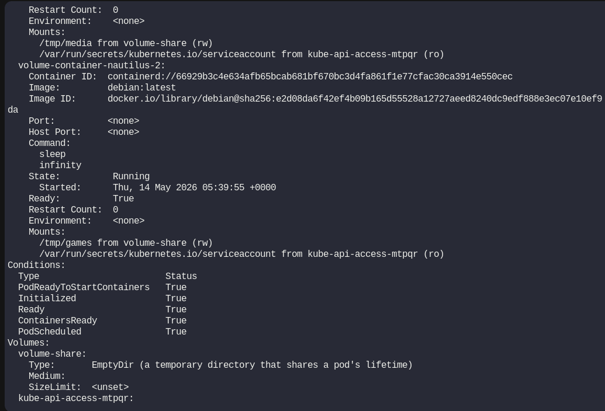
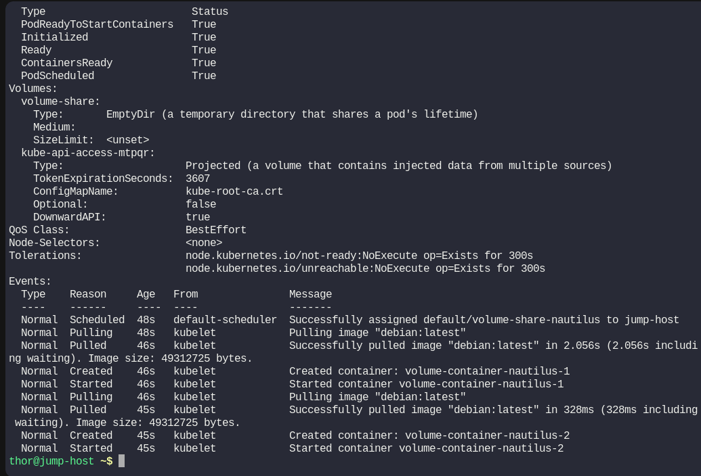
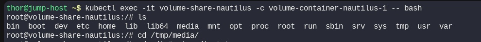
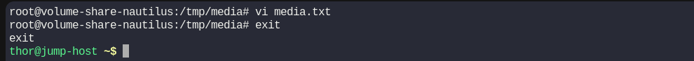
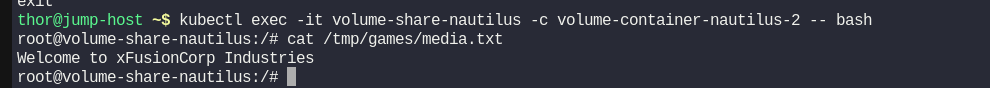

# Day 54: Kubernetes Shared Volumes

**subject**

***

We are working on an application that will be deployed on multiple containers within a pod on Kubernetes cluster. There is a requirement to share a volume among the containers to save some temporary data. The Nautilus DevOps team is developing a similar template to replicate the scenario. Below you can find more details about it.

1. Create a pod named `volume-share-nautilus`.
2. For the first container, use image `debian` with `latest` tag only and remember to mention the tag i.e `debian:latest`, container should be named as `volume-container-nautilus-1`, and run a `sleep` command for it so that it remains in running state. Volume `volume-share` should be mounted at path `/tmp/media`.

3. For the second container, use image `debian` with the `latest` tag only and remember to mention the tag i.e `debian:latest`, container should be named as `volume-container-nautilus-2`, and again run a `sleep` command for it so that it remains in running state. Volume `volume-share` should be mounted at path `/tmp/games`.

4. Volume name should be `volume-share` of type `emptyDir`.

5. After creating the pod, exec into the first container i.e `volume-container-nautilus-1`, and just for testing create a file `media.txt` with the content `Welcome to xFusionCorp Industries` under the mounted path of first container i.e `/tmp/media`.

6. The file `media.txt` should be present under the mounted path `/tmp/games` on the second container `volume-container-nautilus-2` as well, since they are using a shared volume.

`Note:` The `kubectl` utility on the `jump-host` has been configured to work with the Kubernetes cluster.

***

https://blog.stephane-robert.info/docs/conteneurs/orchestrateurs/kubernetes/pods/

https://kubernetes.io/docs/concepts/workloads/pods/

https://kubernetes.io/docs/concepts/storage/volumes/

https://kubernetes.io/docs/tasks/configure-pod-container/configure-volume-storage/

https://kubernetes.io/docs/tasks/inject-data-application/define-command-argument-container/

* Check basic init setup

* Create the pod manifest

* Launch pod

* Test file creation

