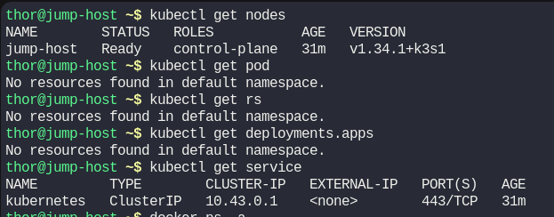
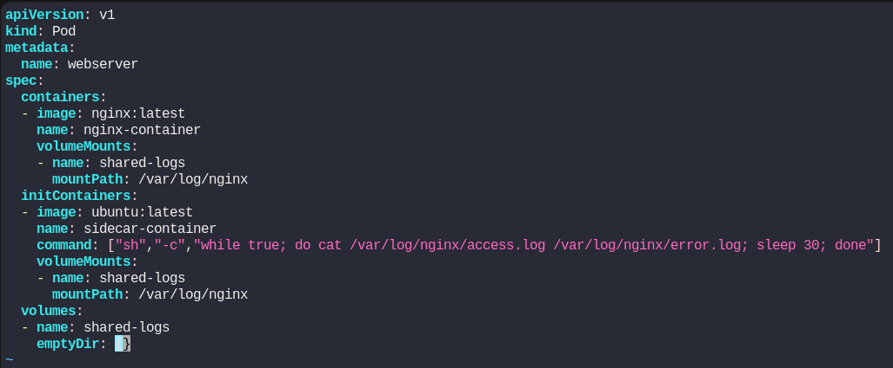
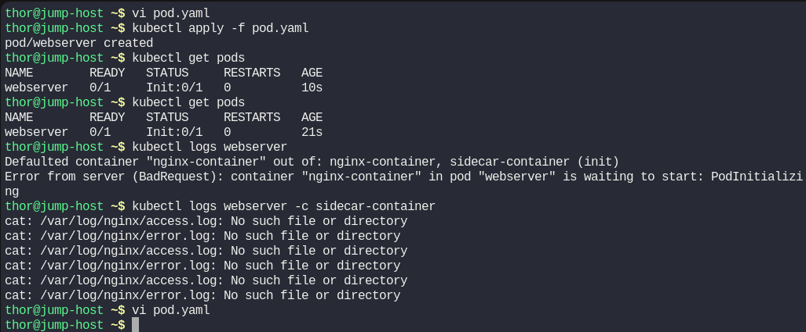
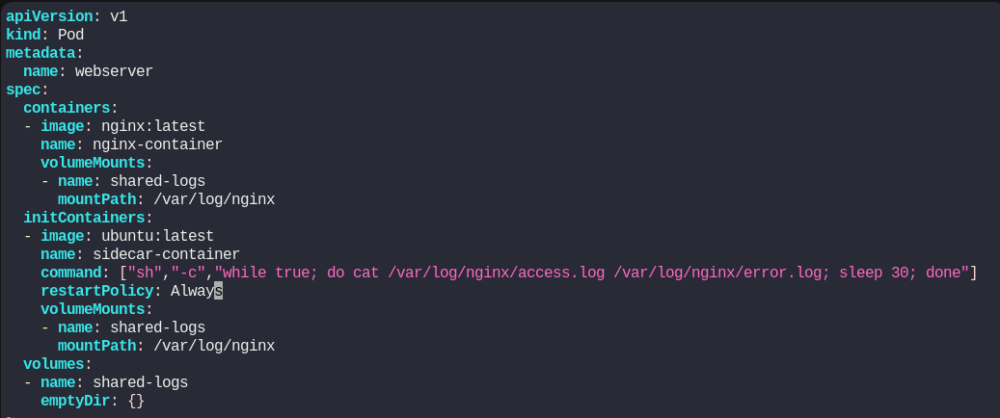
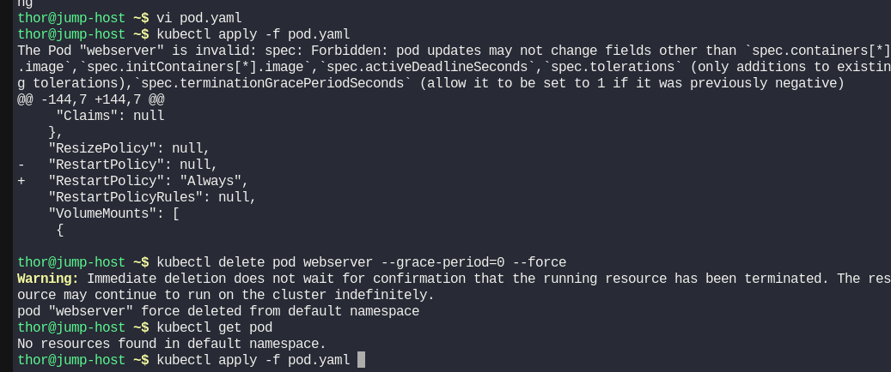
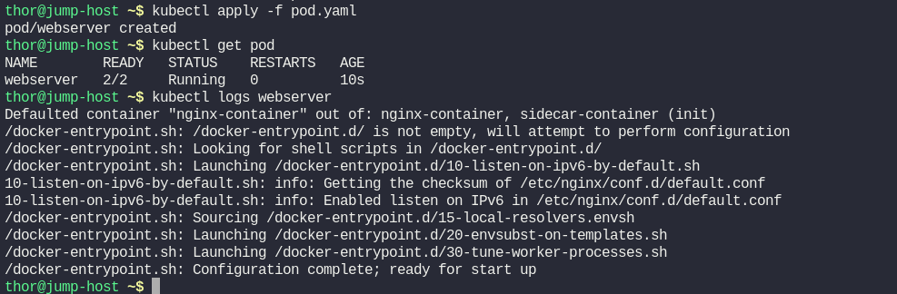

# Day 55: Kubernetes Sidecar Containers

**subject**

***

We have a web server container running the nginx image. The access and error logs generated by the web server are not critical enough to be placed on a persistent volume. However, Nautilus developers need access to the last 24 hours of logs so that they can trace issues and bugs. Therefore, we need to ship the access and error logs for the web server to a log-aggregation service. Following the separation of concerns principle, we implement the Sidecar pattern by deploying a second container that ships the error and access logs from nginx. Nginx does one thing, and it does it well - serving web pages. The second container also specializes in its task - shipping logs. Since containers are running on the same Pod, we can use a shared emptyDir volume to read and write logs.

1. Create a pod named `webserver`.
2. Create an `emptyDir` volume named `shared-logs`.
3. Create a regular container in the `webserver` pod from the `nginx:latest` image named `nginx-container`, and an init container from the `ubuntu:latest` image named `sidecar-container`.
4. Add the following command to the `sidecar-container"sh","-c","while true; do cat /var/log/nginx/access.log /var/log/nginx/error.log; sleep 30; done"`
5. Mount the `shared-logs` volume in both containers at `/var/log/nginx`. Ensure all containers are in a running state.

`Note:` The `kubectl` utility on the `jump-host` has been configured to work with the Kubernetes cluster.

***

does a container is compatible with a pod?

https://kubernetes.io/docs/concepts/workloads/pods/init-containers/

https://kubernetes.io/docs/concepts/workloads/pods/pod-lifecycle/

https://kubernetes.io/docs/concepts/workloads/pods/sidecar-containers/

* Check the setup

* Create the pod

* Test and check

it blocks because it wait for the initContainer to finish

* we need to add restart policy like for sidecar-container 

* Delete the last pod 

* Run and check

