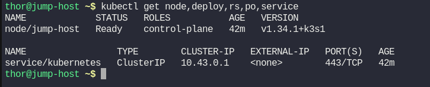
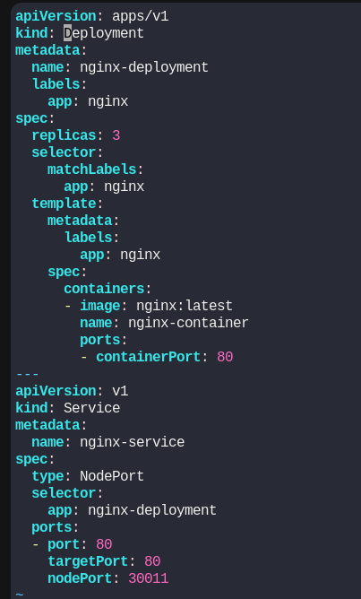
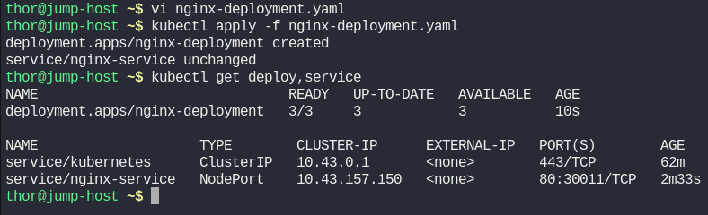
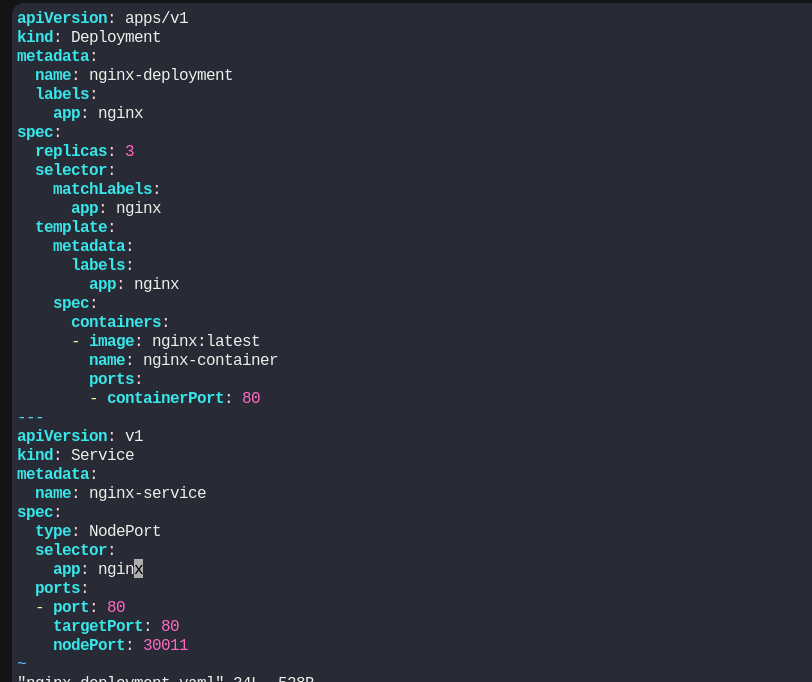
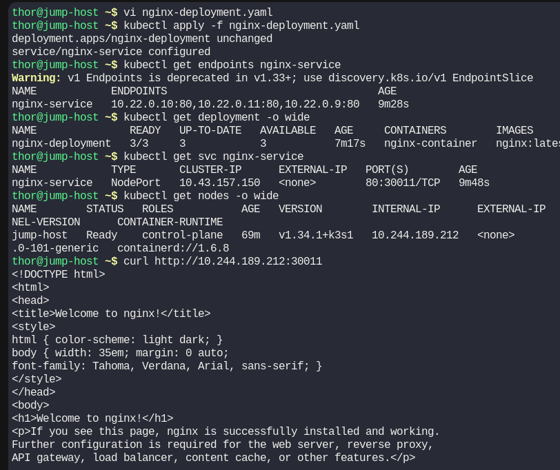

# Day 56: Deploy Nginx Web Server on Kubernetes Cluster

**subject**

***

Some of the Nautilus team developers are developing a static website and they want to deploy it on Kubernetes cluster. They want it to be highly available and scalable. Therefore, based on the requirements, the DevOps team has decided to create a deployment for it with multiple replicas. Below you can find more details about it:

1. Create a deployment using `nginx` image with `latest` tag only and remember to mention the tag i.e `nginx:latest`. Name it as `nginx-deployment`. The container should be named as `nginx-container`, also make sure replica counts are `3`.
2. Create a `NodePort` type service named `nginx-service`. The nodePort should be `30011`.

`Note:` The `kubectl` utility on the `jump-host` has been configured to work with the Kubernetes cluster.

***

https://kubernetes.io/docs/concepts/workloads/controllers/deployment/

https://kubernetes.io/docs/concepts/services-networking/service/

* Check the existing env

* Create the manifest

* Check and test

for this the selector need the label app

so new manifest

then test

