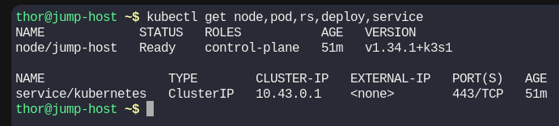
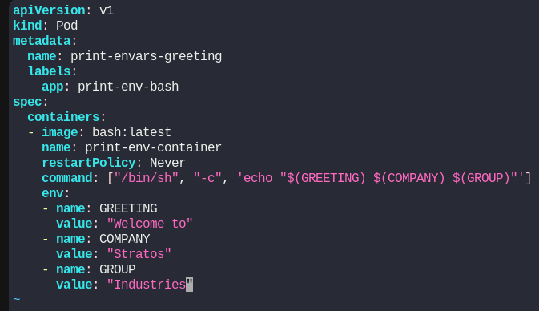
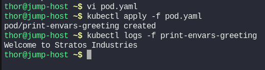

# Day 57: Print Environment Variables

**subject**

***

The Nautilus DevOps team is working on to setup some pre-requisites for an application that will send the greetings to different users. There is a sample deployment, that needs to be tested. Below is a scenario which needs to be configured on Kubernetes cluster. Please find below more details about it.

1. Create a `pod` named `print-envars-greeting`.
2. Configure spec as, the container name should be `print-env-container` and use `bash` image.
3. Create three environment variables:a. `GREETING` and its value should be `Welcome to`b. `COMPANY` and its value should be `Stratos`c. `GROUP` and its value should be `Industries`
4. Use command `["/bin/sh", "-c", 'echo "$(GREETING) $(COMPANY) $(GROUP)"']` (please use this exact command), also set its `restartPolicy` policy to `Never` to avoid crash loop back.
5. You can check the output using `kubectl logs -f print-envars-greeting` command.

`Note:` The `kubectl` utility on the `jump-host` has been configured to work with the Kubernetes cluster.

***

https://kubernetes.io/docs/tasks/inject-data-application/define-environment-variable-container/

* Check the env

* Create the pod

* Run and test

