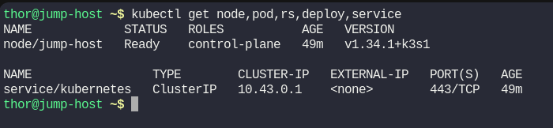
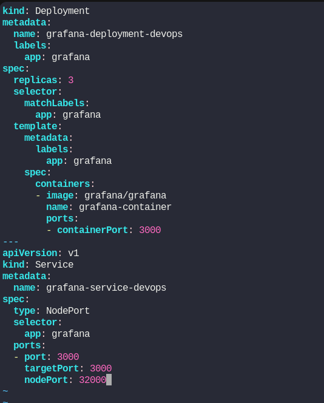
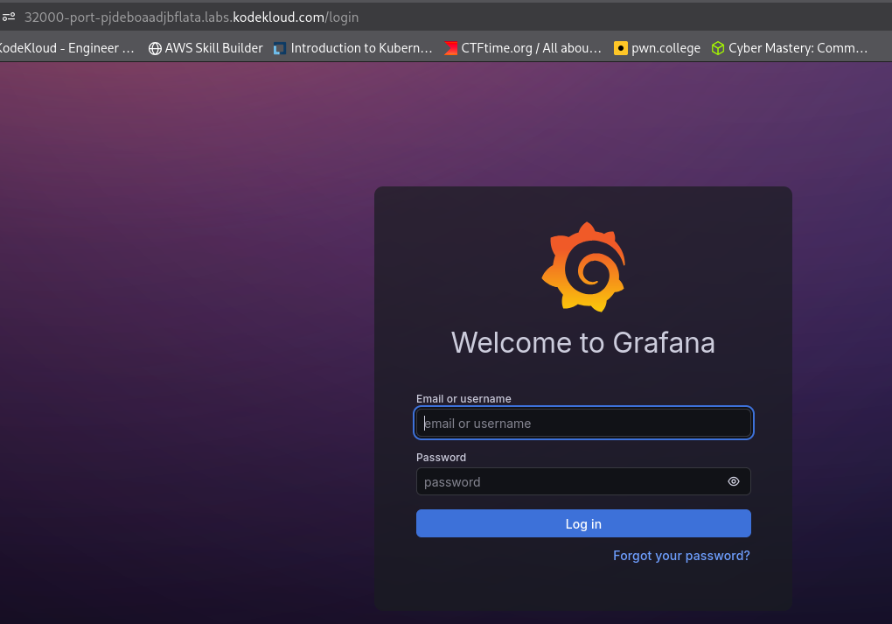

# Day 58: Deploy Grafana on Kubernetes Cluster

**subject**

***

The Nautilus DevOps teams is planning to set up a Grafana tool to collect and analyze analytics from some applications. They are planning to deploy it on Kubernetes cluster. Below you can find more details.

1.) Create a deployment named `grafana-deployment-devops` using any grafana image for Grafana app. Set other parameters as per your choice. 

2.) Create `NodePort` type service with nodePort `32000` to expose the app.

`You do not need to make any configuration changes inside the Grafana app once deployed; just make sure you can access the Grafana login page.`

`Note:` The `kubectl` utility on the `jump-host` has been configured to work with the Kubernetes cluster.

***

* Check the env

* Create the manifest

* run and test

