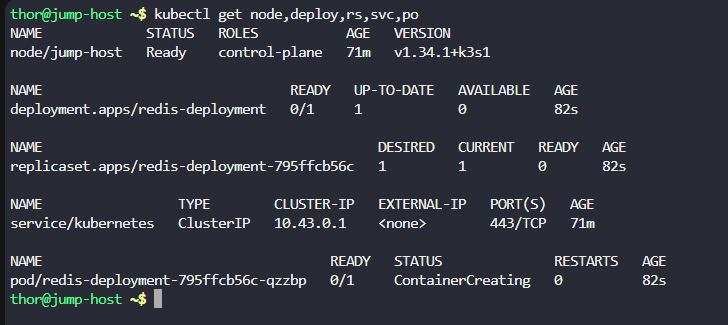
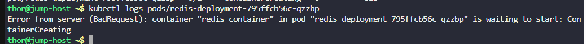
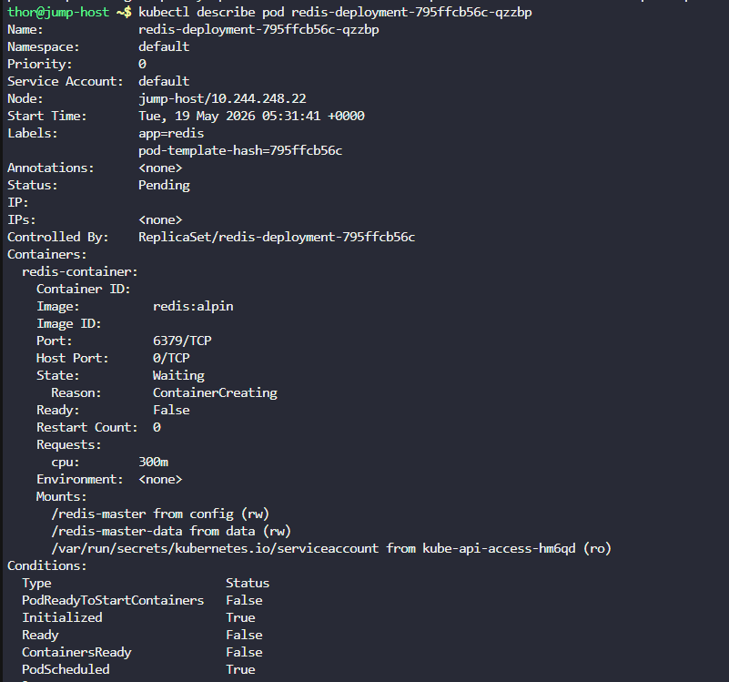
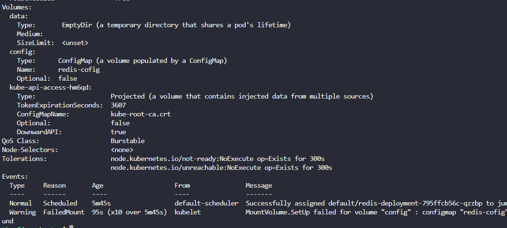
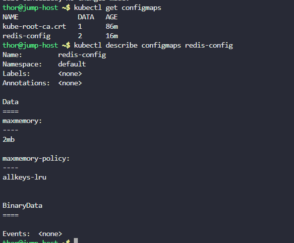
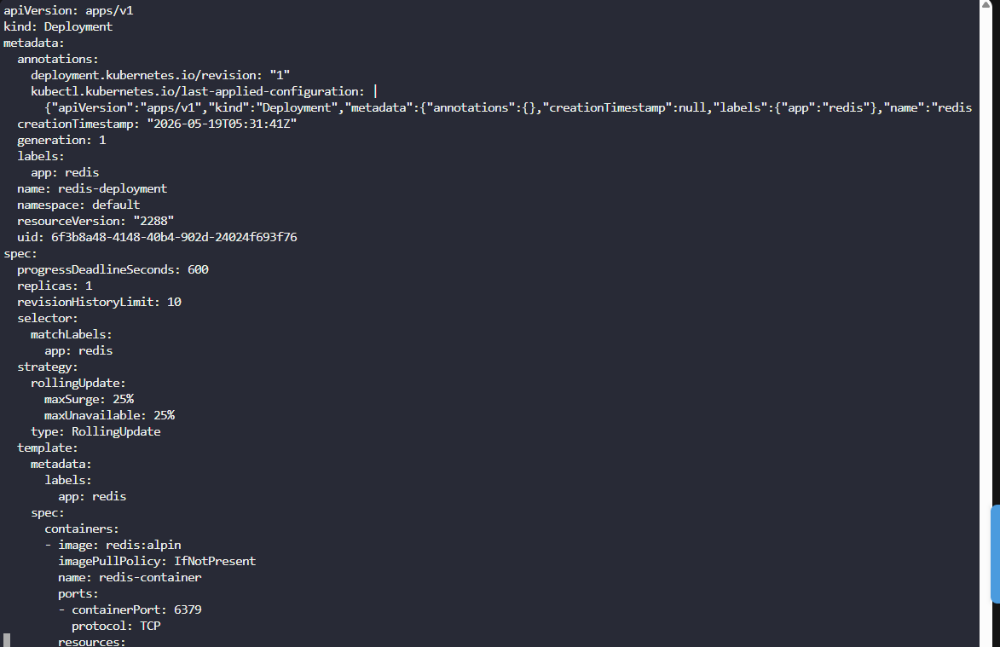
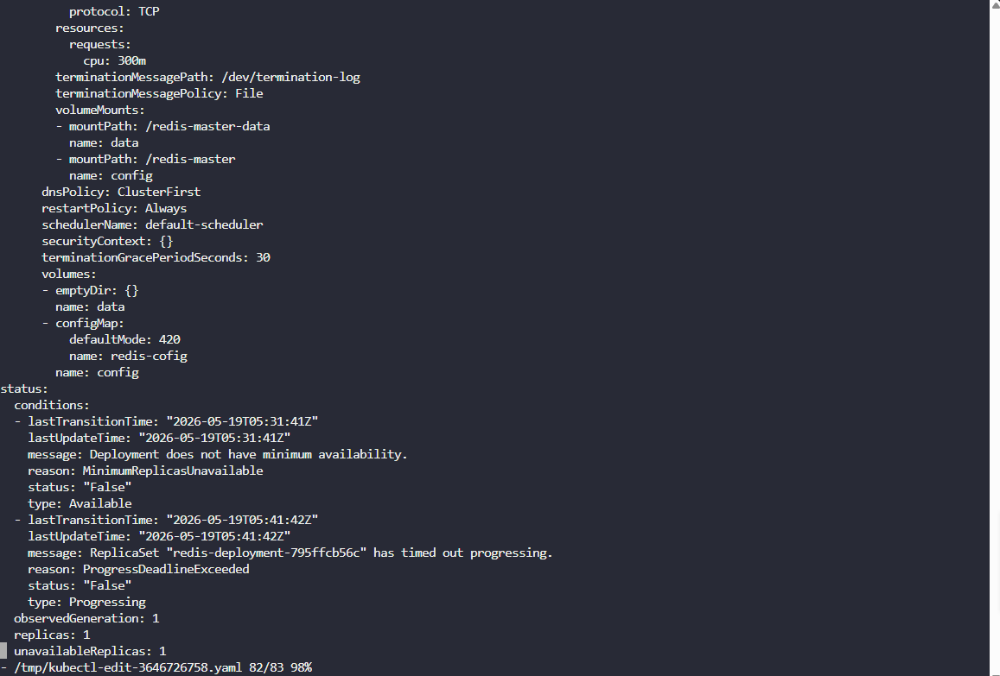
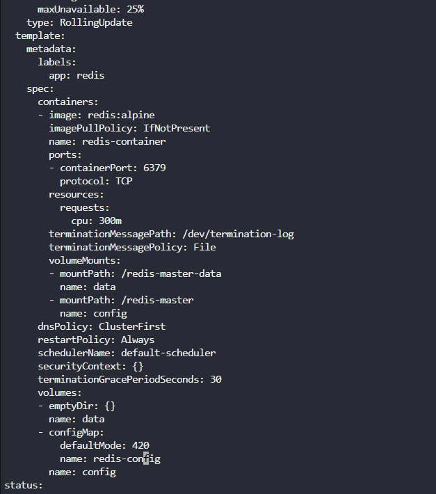
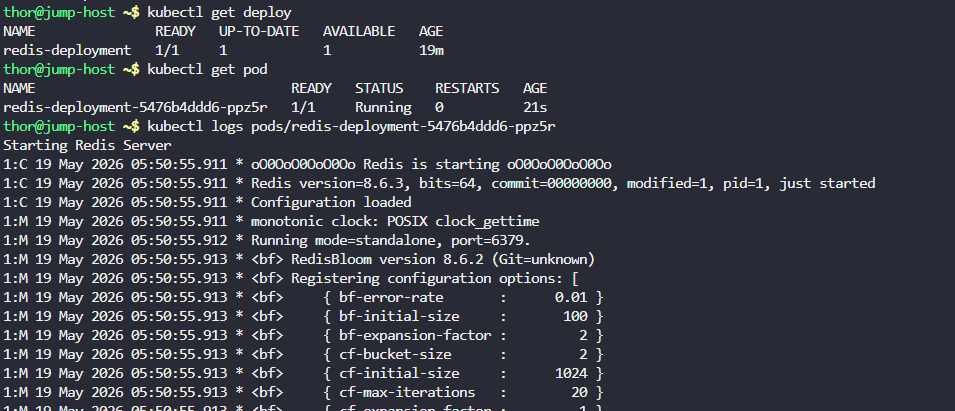

# Day 59: Troubleshoot Deployment issues in Kubernetes

**subject**

***

Last week, the Nautilus DevOps team deployed a redis app on Kubernetes cluster, which was working fine so far. This morning one of the team members was making some changes in this existing setup, but he made some mistakes and the app went down. We need to fix this as soon as possible. Please take a look.

The deployment name is`redis-deployment`. The pods are not in running state right now, so please look into the issue and fix the same.

`Note:`The`kubectl`utility on the`jump-host`has been configured to work with the Kubernetes cluster.

***

https://kubernetes.io/docs/reference/kubectl/generated/kubectl\_logs/

https://blog.stephane-robert.info/docs/conteneurs/orchestrateurs/outils/kubectl-get-describe-logs-top/

https://kubernetes.io/docs/tasks/configure-pod-container/configure-pod-configmap/

https://blog.stephane-robert.info/docs/conteneurs/orchestrateurs/kubernetes/configmaps/

https://blog.stephane-robert.info/docs/conteneurs/orchestrateurs/outils/kubectl-edit-patch-replace/

* Check the env

* Check logs and describe of the pod

there qre like two errors:

* the docker image
* the volume for the configMap

- Check the configmap

* Fix the deployment

before

after

* Check the result

