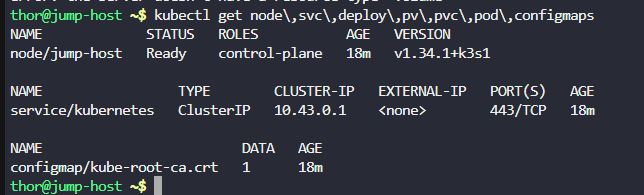
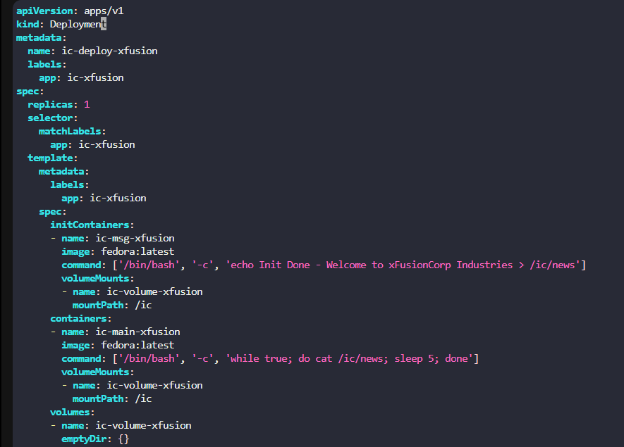
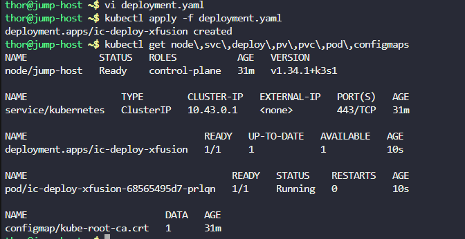
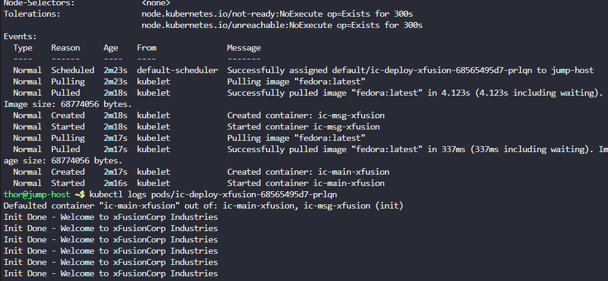

# Day 61:  Init Containers in Kubernetes

**subject**

***

There are some applications that need to be deployed on Kubernetes cluster and these apps have some pre-requisites where some configurations need to be changed before deploying the app container. Some of these changes cannot be made inside the images so the DevOps team has come up with a solution to use init containers to perform these tasks during deployment. Below is a sample scenario that the team is going to test first.

1. Create a`Deployment`named as`ic-deploy-xfusion`.
2. Configure`spec`as replicas should be`1`, labels`app`should be`ic-xfusion`, template's metadata lables`app`should be the same`ic-xfusion`.
3. The`initContainers`should be named as`ic-msg-xfusion`, use image`fedora`with`latest`tag and use command`'/bin/bash'`,`'-c'`and`'echo Init Done - Welcome to xFusionCorp Industries > /ic/news'`. The volume mount should be named as`ic-volume-xfusion`and mount path should be`/ic`.
4. Main container should be named as`ic-main-xfusion`, use image`fedora`with`latest`tag and use command`'/bin/bash'`,`'-c'`and`'while true; do cat /ic/news; sleep 5; done'`. The volume mount should be named as`ic-volume-xfusion`and mount path should be`/ic`.
5. Volume to be named as`ic-volume-xfusion`and it should be an emptyDir type.

`Note:`The`kubectl`utility on the`jump-host`has been configured to work with the Kubernetes cluster.

***

https://kubernetes.io/docs/concepts/workloads/pods/init-containers/

* Check the env

* Create the manifest

* Run and check

