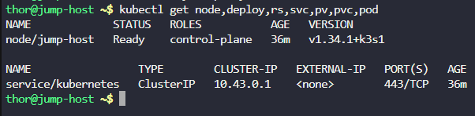
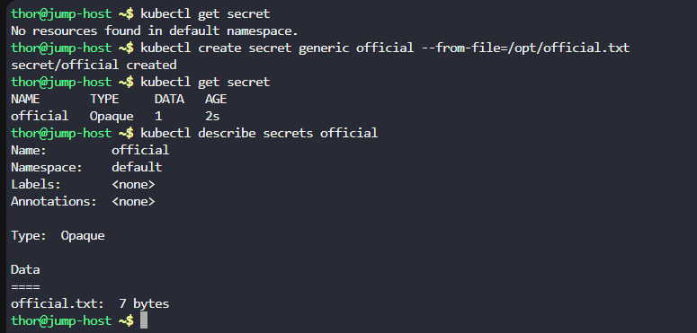
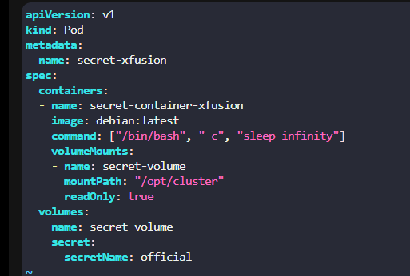
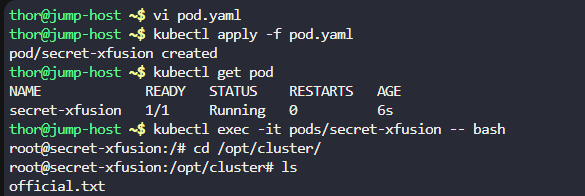

# Day 62: Manage Secrets in Kubernetes

**subject**

***

The Nautilus DevOps team is working to deploy some tools in Kubernetes cluster. Some of the tools are licence based so that licence information needs to be stored securely within Kubernetes cluster. Therefore, the team wants to utilize Kubernetes secrets to store those secrets. Below you can find more details about the requirements:

1. We already have a secret key file`official.txt`under the`/opt/`directory. Create a`generic secret`named`official`, it should contain the password/license-number present in`official.txt`file.
2. Also create a`pod`named`secret-xfusion`.
3. Configure pod's`spec`as container name should be`secret-container-xfusion`, image should be`debian`with`latest`tag (remember to mention the tag with image). Use`sleep`command for container so that it remains in running state. Consume the created secret and mount it under`/opt/cluster`within the container.
4. To verify you can exec into the container`secret-container-xfusion`, to check the secret key under the mounted path`/opt/cluster`. Before hitting the`Check`button please make sure pod/pods are in running state, also validation can take some time to complete so keep patience.

`Note:`The`kubectl`utility on the`jump-host`has been configured to work with the Kubernetes cluster.

***

https://kubernetes.io/docs/concepts/configuration/secret/

https://blog.stephane-robert.info/docs/conteneurs/orchestrateurs/kubernetes/secrets/

https://kubernetes.io/docs/reference/kubectl/generated/kubectl\_create/kubectl\_create\_secret\_generic/

* Check env

* Create the secret

* Create the pod and add the secret

* test and verify

