# Day 63: Deploy Iron Gallery App on Kubernetes

**subject**

***

There is an iron gallery app that the Nautilus DevOps team was developing. They have recently customized the app and are going to deploy the same on the Kubernetes cluster. Below you can find more details:

1. Create a namespace `iron-namespace-devops`
2. Create a deployment `iron-gallery-deployment-devops` for `iron gallery` under the same namespace you created. :- Labels `run` should be `iron-gallery`. :- Replicas count should be `1`.:- Selector's matchLabels `run` should be `iron-gallery`.:- Template labels `run` should be `iron-gallery` under metadata. :- The container should be named as `iron-gallery-container-devops`, use `kodekloud/irongallery:2.0` image ( use exact image name / tag ).:- Resources limits for memory should be `100Mi` and for CPU should be `50m`.:- First volumeMount name should be `config`, its mountPath should be `/usr/share/nginx/html/data`. :- Second volumeMount name should be `images`, its mountPath should be `/usr/share/nginx/html/uploads`.:- First volume name should be `config` and give it `emptyDir` and second volume name should be `images`, also give it `emptyDir`.
3. Create a deployment `iron-db-deployment-devops` for `iron db` under the same namespace.:- Labels `db` should be `mariadb`. :- Replicas count should be `1`.:- Selector's matchLabels `db` should be `mariadb`.:- Template labels `db` should be `mariadb` under metadata. :- The container name should be `iron-db-container-devops`, use `kodekloud/irondb:2.0` image ( use exact image name / tag ).:- Define environment, set `MYSQL_DATABASE` its value should be `database_apache`, set `MYSQL_ROOT_PASSWORD` and `MYSQL_PASSWORD` value should be with some complex passwords for DB connections, and `MYSQL_USER` value should be any custom user ( except root ).:- Volume mount name should be `db` and its mountPath should be `/var/lib/mysql`. Volume name should be `db` and give it an `emptyDir`.
4. Create a service for `iron db` which should be named `iron-db-service-devops` under the same namespace. Configure spec as selector's db should be `mariadb`. Protocol should be `TCP`, port and targetPort should be `3306` and its type should be `ClusterIP`.
5. Create a service for `iron gallery` which should be named `iron-gallery-service-devops` under the same namespace. Configure spec as selector's run should be `iron-gallery`. Protocol should be `TCP`, port and targetPort should be `80`, nodePort should be `32678` and its type should be `NodePort`.

`Note:`

1. We don't need to make connection b/w database and front-end now, if the installation page is coming up it should be enough for now.
2. The `kubectl` utility on the `jump-host` has been configured to work with the Kubernetes cluster.

***

https://blog.stephane-robert.info/docs/conteneurs/orchestrateurs/kubernetes/namespaces/

https://kubernetes.io/docs/tasks/inject-data-application/define-environment-variable-container/

https://blog.stephane-robert.info/docs/conteneurs/orchestrateurs/kubernetes/services/

* Check the env

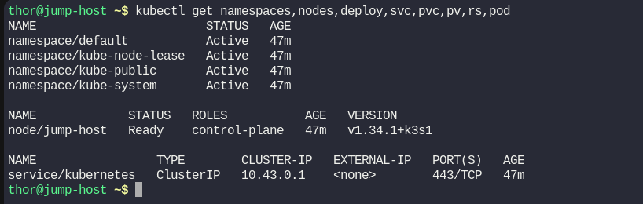

* Create a new namespace

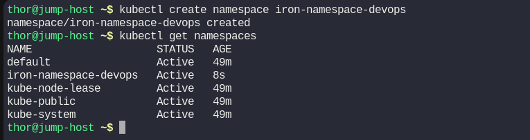

* Create the deployment for the app

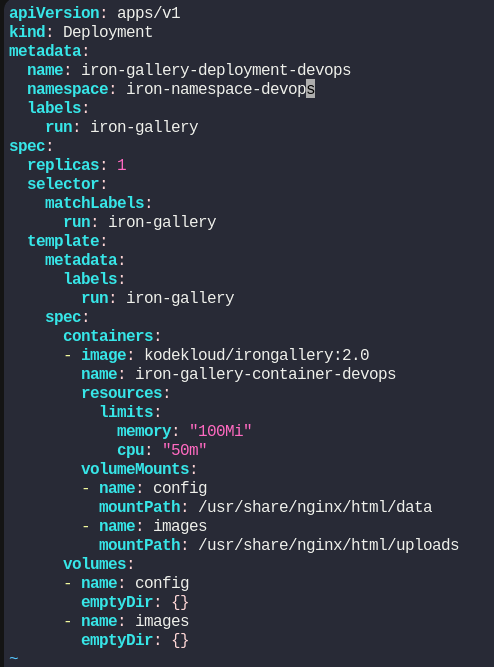

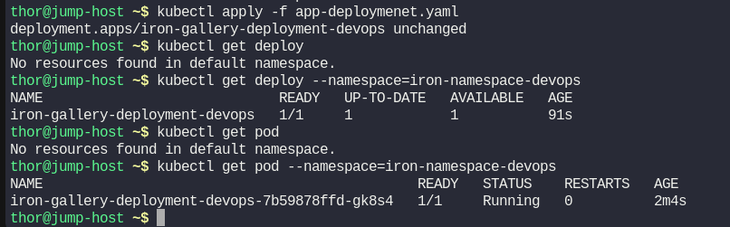

* Create deployment for db

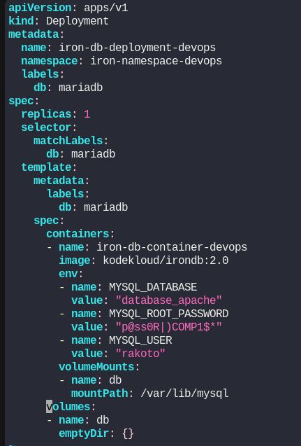

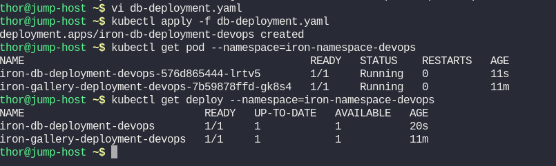

* Create db service

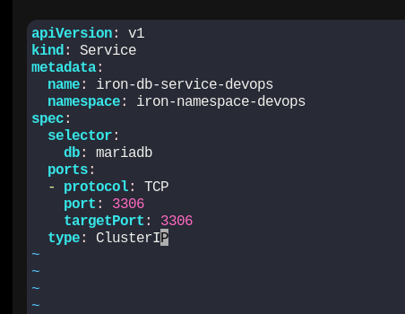

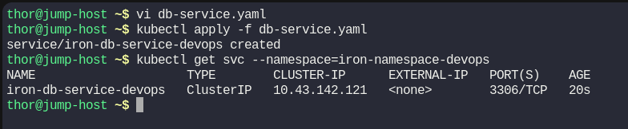

* Create the app service

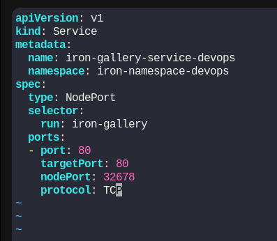

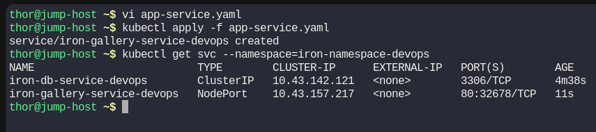

* Check the result

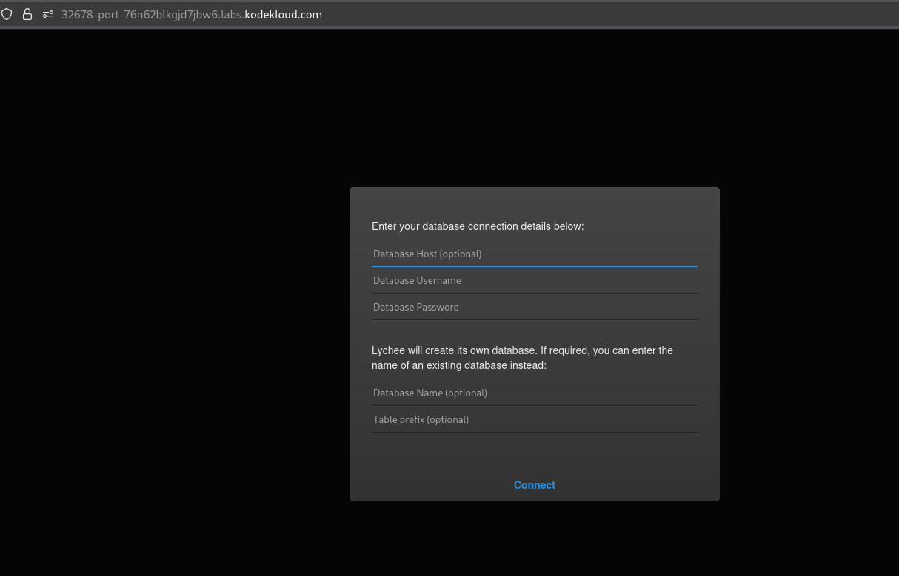

