# Day 64: Fix Python App Deployed on Kubernetes Cluster

**subject**

***

One of the DevOps engineers was trying to deploy a python app on Kubernetes cluster. Unfortunately, due to some mis-configuration, the application is not coming up. Please take a look into it and fix the issues. Application should be accessible on the specified nodePort.

1. The deployment name is `python-deployment-xfusion`, its using `poroko/flask-demo-app` image. The deployment and service of this app is already deployed.
2. nodePort should be `32345` and targetPort should be python flask app's default port.

`Note:` The `kubectl` utility on the `jump-host` has been configured to work with the Kubernetes cluster.

***

* Check the env

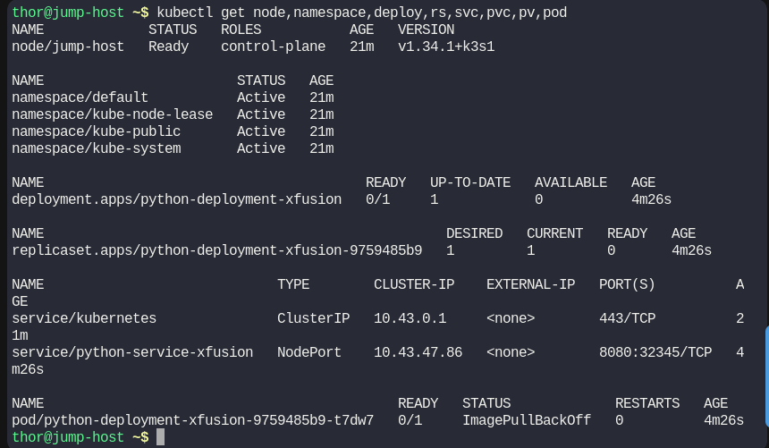

the pod and deploy has error

* Check logs

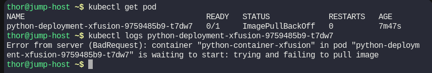

* Check the deployment manifest

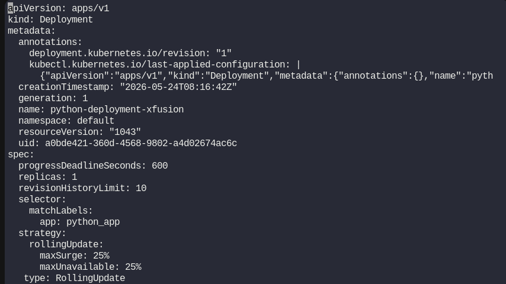

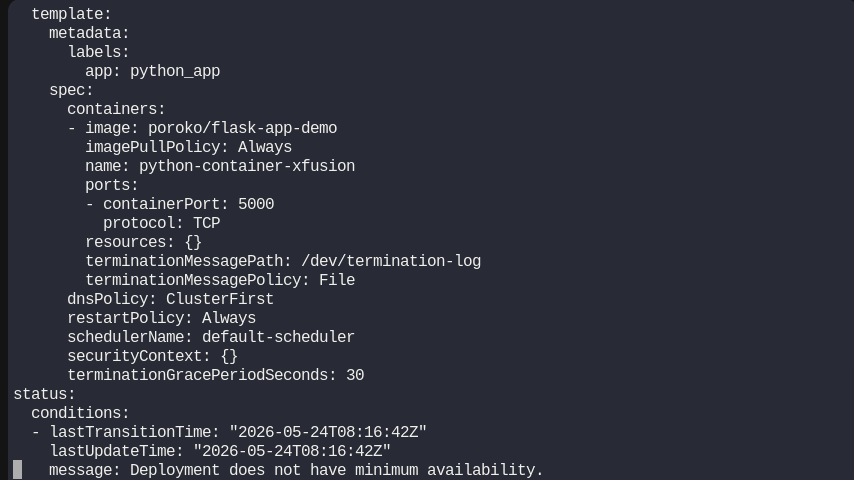

* Fix the deployment

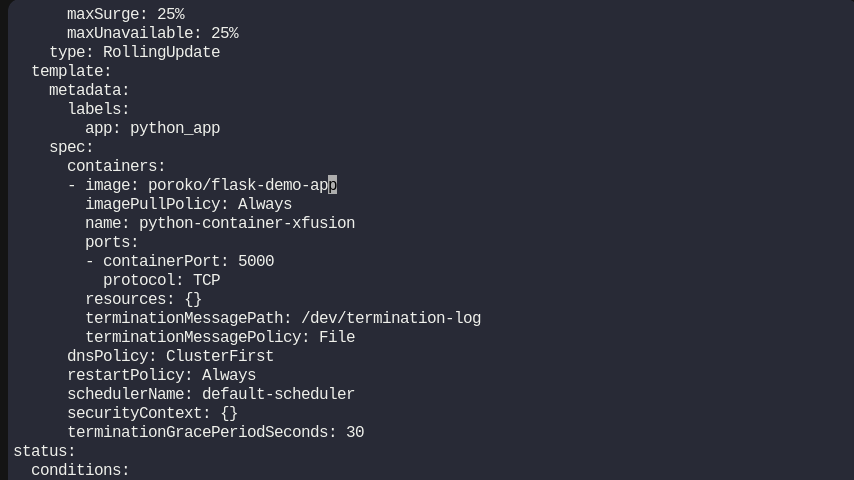

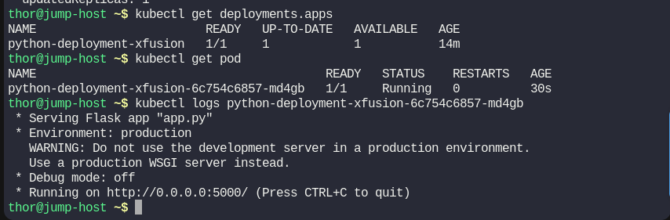

* Check the service that the app is using

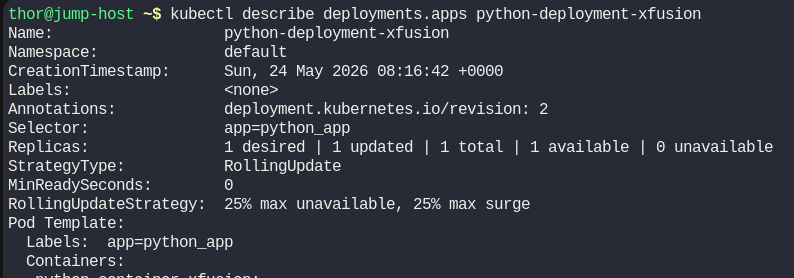

we know the label used then

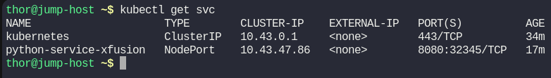

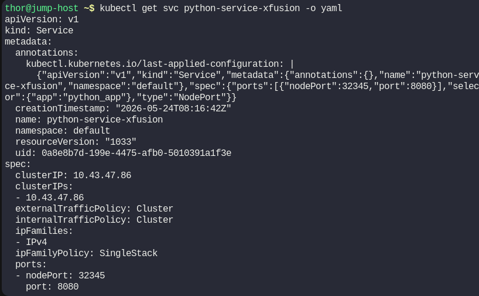

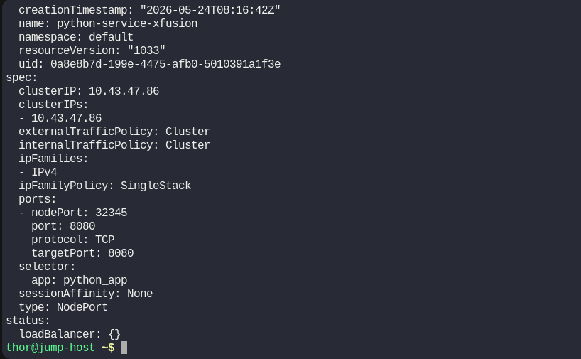

* fix the svc port

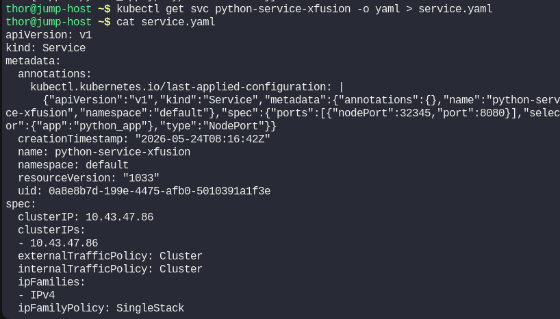

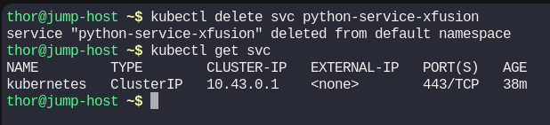

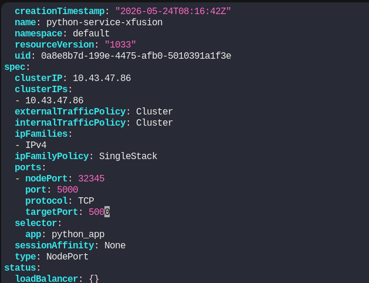

* Check the result

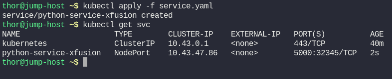

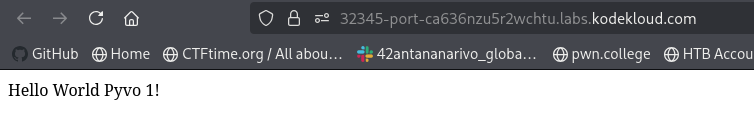
