# Day 66: Deploy MySQL on Kubernetes

**subject**

***

A new MySQL server needs to be deployed on Kubernetes cluster. The Nautilus DevOps team was working on to gather the requirements. Recently they were able to finalize the requirements and shared them with the team members to start working on it. Below you can find the details:

1.) Create a PersistentVolume`mysql-pv`, its capacity should be`250Mi`, set other parameters as per your preference.

2.) Create a PersistentVolumeClaim to request this PersistentVolume storage. Name it as`mysql-pv-claim`and request a`250Mi`of storage. Set other parameters as per your preference.

3.) Create a deployment named`mysql-deployment`, use any mysql image as per your preference. Mount the PersistentVolume at mount path`/var/lib/mysql`.

4.) Create a`NodePort`type service named`mysql`and set nodePort to`30007`.

5.) Create a secret named`mysql-root-pass`having a key pair value, where key is`password`and its value is`YUIidhb667`, create another secret named`mysql-user-pass`having some key pair values, where first key is`username`and its value is`kodekloud_top`, second key is`password`and value is`GyQkFRVNr3`, create one more secret named`mysql-db-url`, key name is`database`and value is`kodekloud_db9`

6.) Define some environment variables within the container:

a.)`name: MYSQL_ROOT_PASSWORD`, should pick value from secretKeyRef`name: mysql-root-pass`and`key: password`

b.)`name: MYSQL_DATABASE`, should pick value from secretKeyRef`name: mysql-db-url`and`key: database`

c.)`name: MYSQL_USER`, should pick value from secretKeyRef`name: mysql-user-pass`key`key: username`

d.)`name: MYSQL_PASSWORD`, should pick value from secretKeyRef`name: mysql-user-pass`and`key: password`

`Note:`The`kubectl`utility on the`jump-host`has been configured to work with the Kubernetes cluster.

***

https://blog.stephane-robert.info/docs/conteneurs/orchestrateurs/kubernetes/storage/

https://blog.stephane-robert.info/docs/conteneurs/orchestrateurs/kubernetes/secrets/

https://stackoverflow.com/questions/66973503/configure-mysql-replication-with-k8s-statefulset

what may happen if we use replica with mysql deployment?

* Check the env

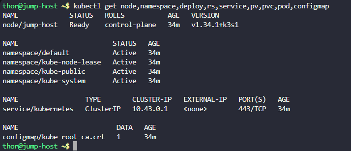

* Create the pv

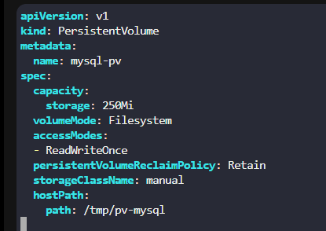

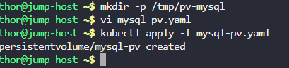

* Create the pvc

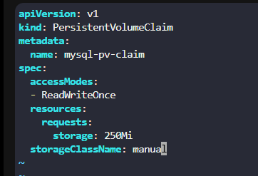

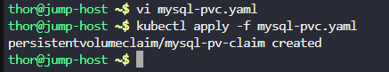

* Create the deployment

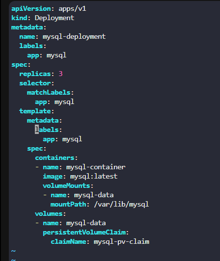

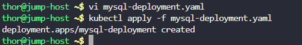

* Create the secrets

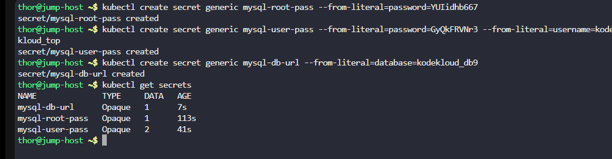

* Create the full deployment

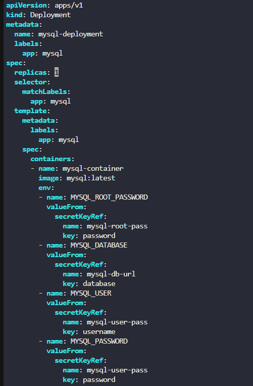

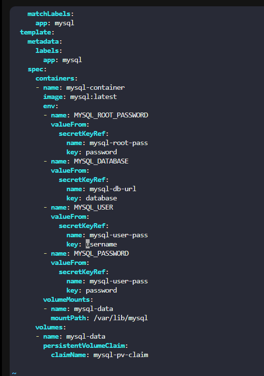

* Create the service

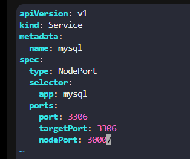

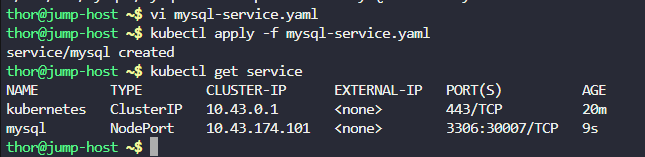

* Check the db

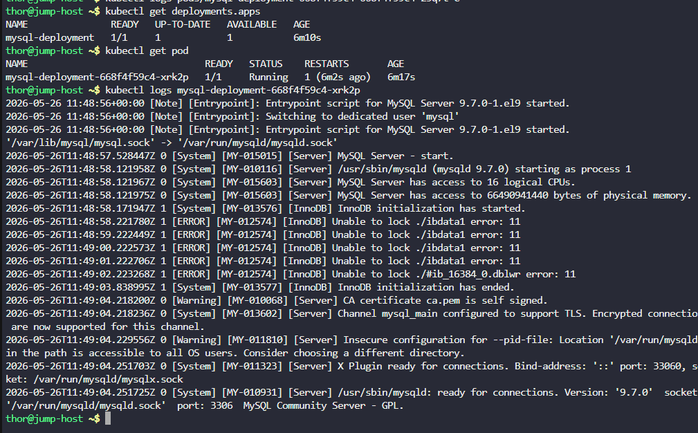

