# Day 68: Set Up Jenkins Server

**subject**

***

The DevOps team at xFusionCorp Industries is initiating the setup of CI/CD pipelines and has decided to utilize Jenkins as their server. Execute the task according to the provided requirements:

1\. Install`Jenkins`on the jenkins server using the`apt`utility only, and start it using the`service`command.

* If you face a timeout issue while starting the Jenkins service, first check the service status with`service jenkins status`
* Then review the logs in`/var/log/jenkins/jenkins.log`to identify the cause.

2\. Jenkin's admin user name should be`theadmin`, password should be`Adm!n321`, full name should be`Siva`and email should be`siva@jenkins.stratos.xfusioncorp.com`.

`Note:`

1\. To access the`jenkins`server, connect from the jump host using the`root`user with the password`S3curePass`.

2\. After Jenkins server installation, click the`Jenkins`button on the top bar to access the Jenkins UI and follow on-screen instructions to create an admin user.

***

https://www.jenkins.io/doc/book/installing/linux/

https://www.digitalocean.com/community/tutorials/how-to-install-jenkins-on-ubuntu-22-04

* ssh into the jenkins server

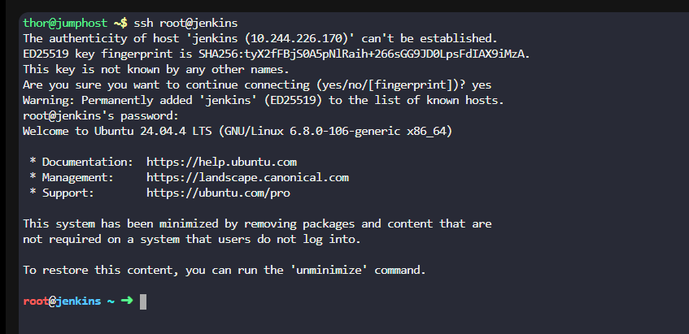

* Setup environment before installation

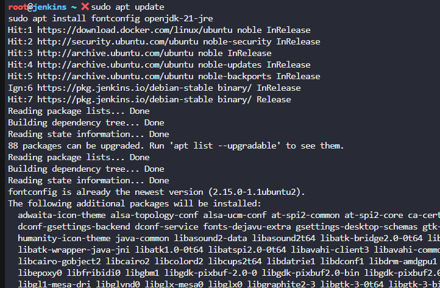

* Check the java version used

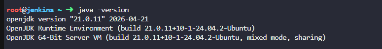

* Install jenkins

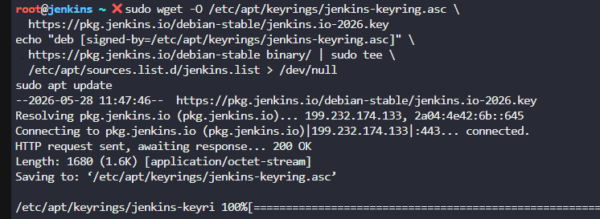

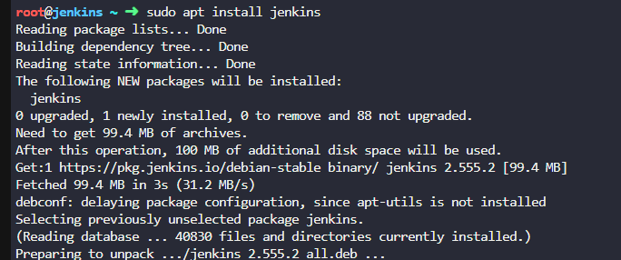

* Start jenkins

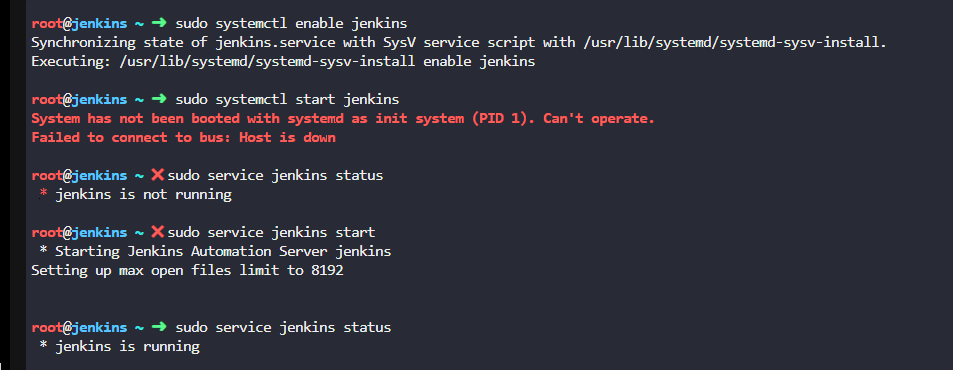

* run  and config

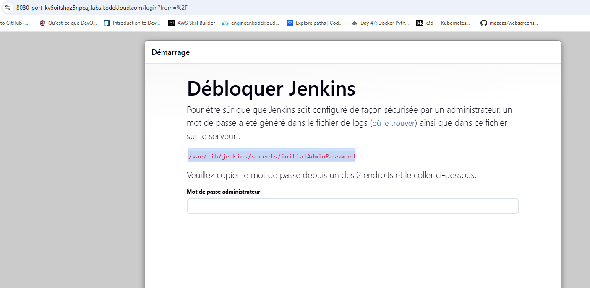

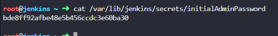

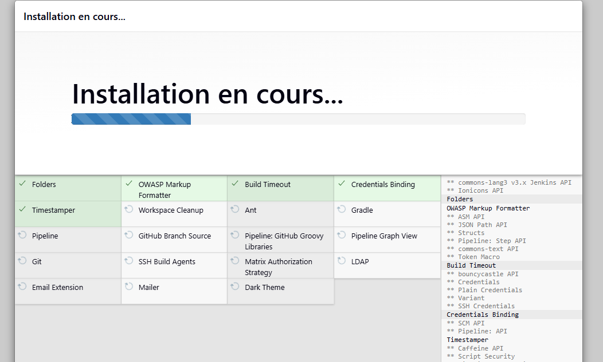

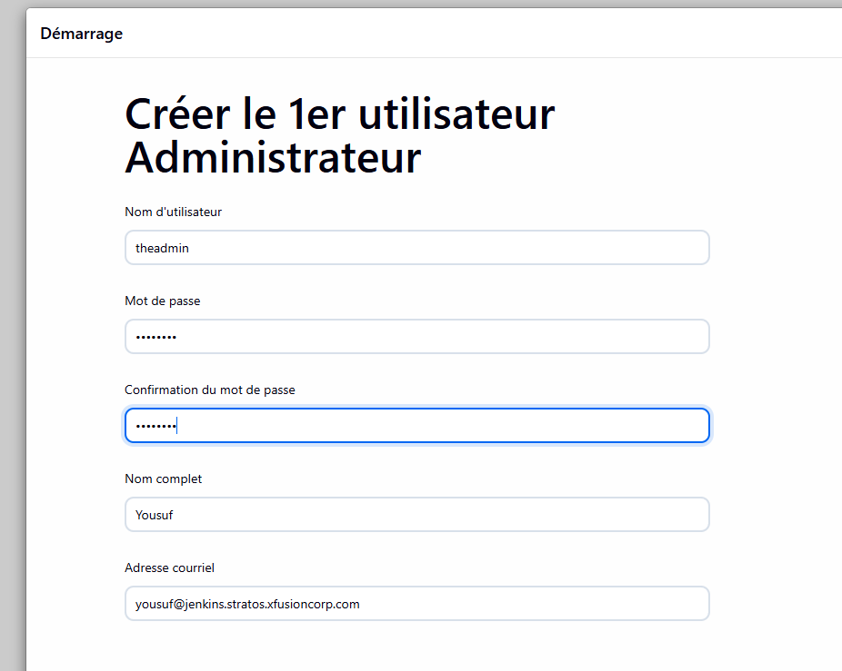

* Test 

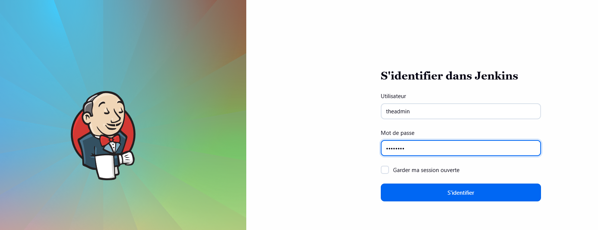

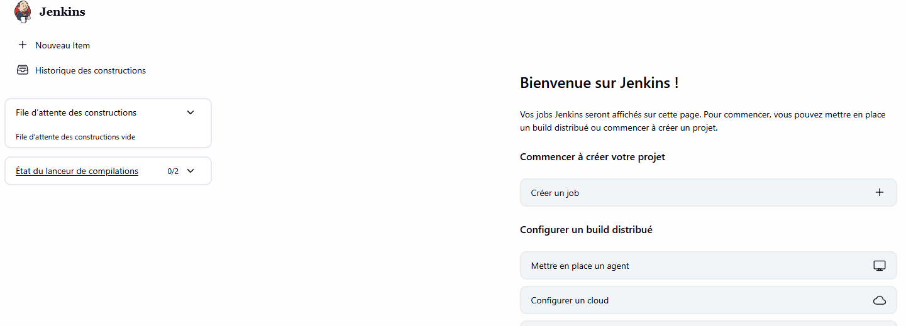
