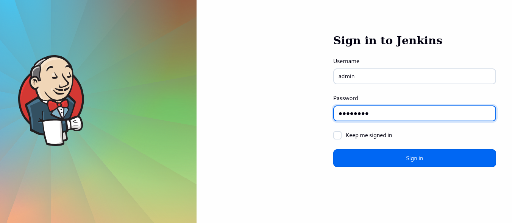
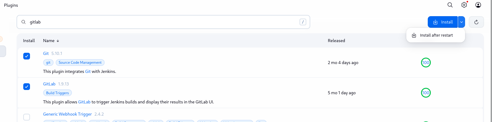
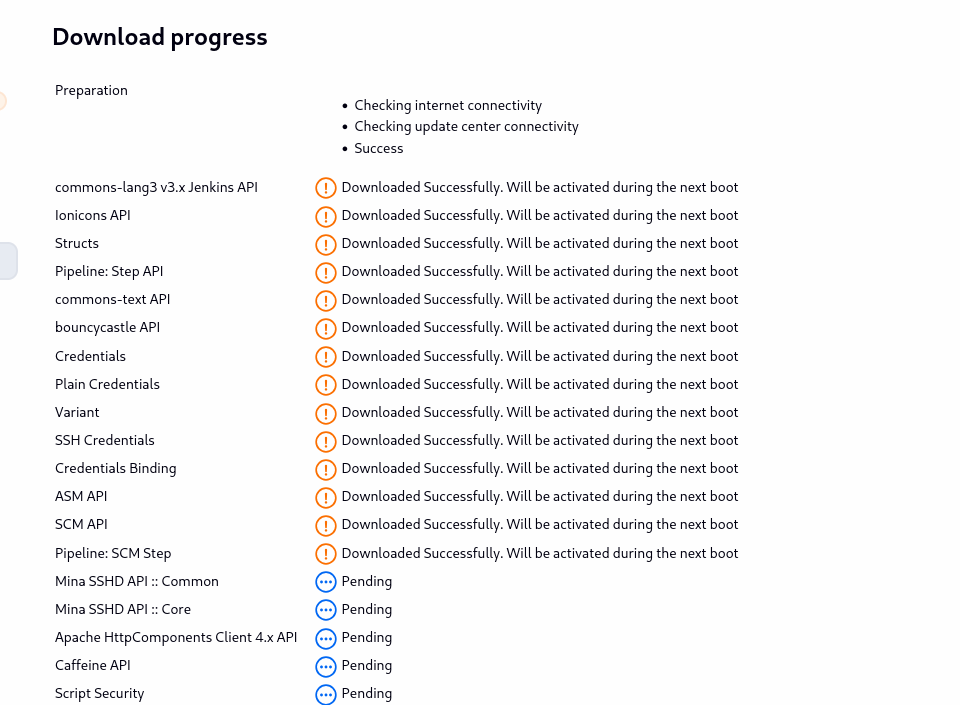
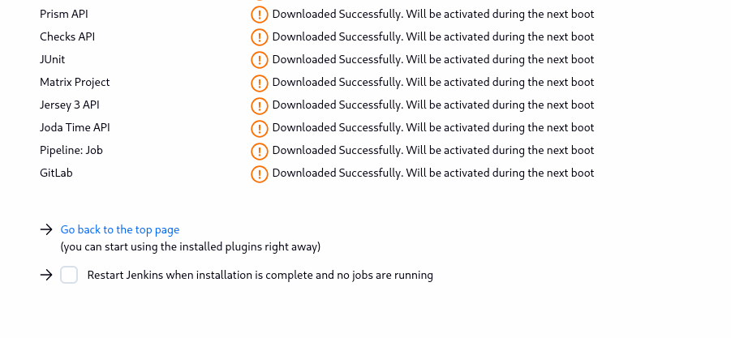
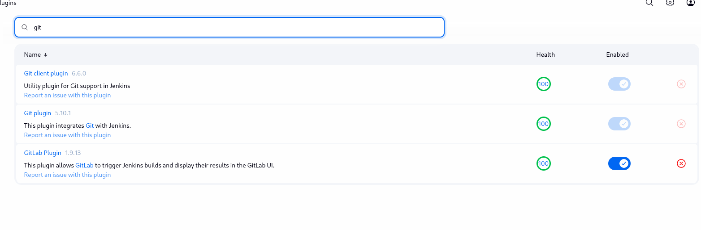

# Day 69: Install Jenkins Plugins

**subject**

***

The Nautilus DevOps team has recently setup a Jenkins server, which they want to use for some CI/CD jobs. Before that they want to install some plugins which will be used in most of the jobs. Please find below more details about the task

1\. Click on the Jenkins button on the top bar to access the Jenkins UI. Login using username `admin` and password `Adm!n321`.

2\. Once logged in, install the `Git` and `GitLab` plugins. You may need to restart Jenkins to complete the plugin installation; if required, opt to **Restart Jenkins when installation is complete and no jobs are running** on the plugin installation/update page (Update Centre).

`Note:`

&#x20;1\. After restarting Jenkins, wait for the login page to reappear before proceeding.

&#x20;2\. For tasks involving web UI changes, capture screenshots to share for review or consider using screen recording software like loom.com for documentation and sharing.

***

* Access jenkins

* install plugin

* Check the installation

