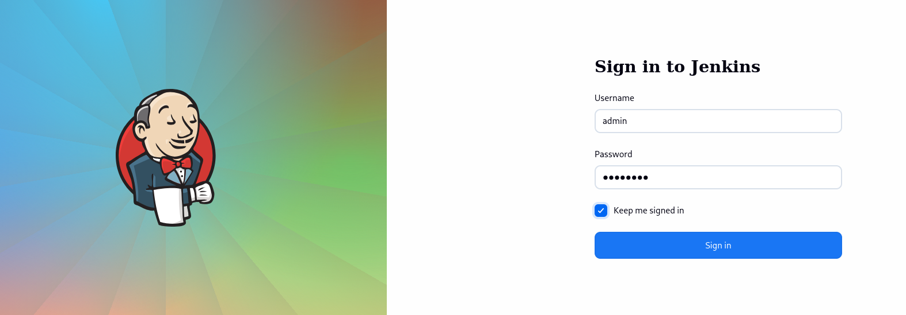
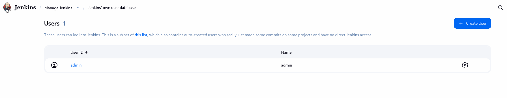
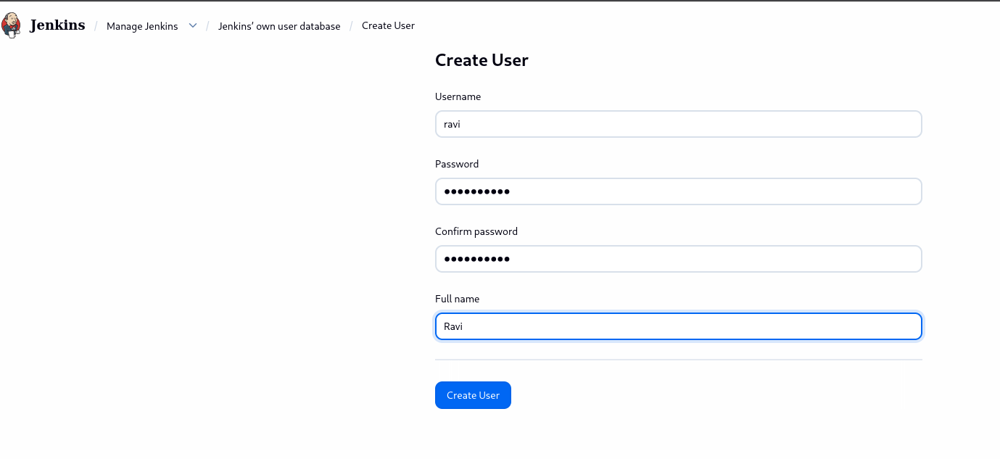
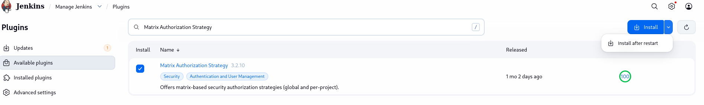
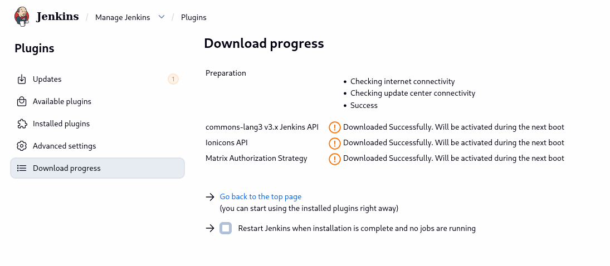
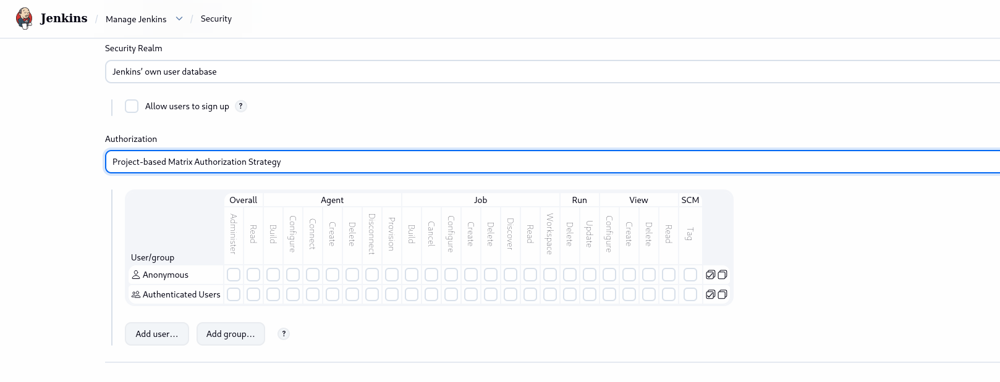
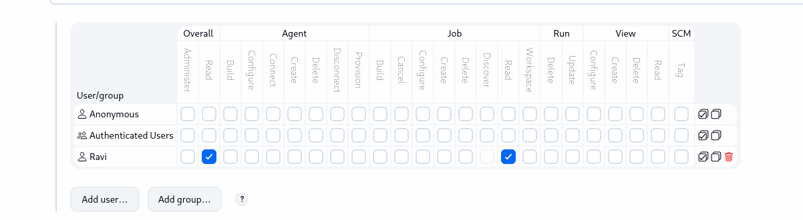

# Day 70: Configure Jenkins Job for Package Installation

**subject**

***

The Nautilus team is integrating Jenkins into their CI/CD pipelines. After setting up a new Jenkins server, they're now configuring user access for the development team, Follow these steps:

1\. Click on the `Jenkins` button on the top bar to access the Jenkins UI. Login with username `admin` and password `Adm!n321`.

2\. Create a jenkins user named `ravi` with the password `ksH85UJjhb`. Their full name should match `Ravi`.

&#x20;3\. Utilize the `Project-based Matrix Authorization Strategy` to assign `overall read` permission to the `ravi` user.

&#x20;4\. Remove all permissions for `Anonymous` users (if any) ensuring that the `admin` user retains overall `Administer` permissions.

&#x20;5\. For the existing job, grant `ravi` user only `read` permissions, disregarding other permissions such as Agent, SCM etc.

`Note:`

&#x20;1\. You may need to install plugins and restart Jenkins service. After plugins installation, select `Restart Jenkins when installation is complete and no jobs are running` on plugin installation/update page.

&#x20;2\. After restarting the Jenkins service, wait for the Jenkins login page to reappear before proceeding. Avoid clicking `Finish` immediately after restarting the service.

&#x20;3\. Capture screenshots of your configuration for review purposes. Consider using screen recording software like `loom.com` for documentation and sharing.

***

https://plugins.jenkins.io/matrix-auth/

https://medium.com/@maheshparade/metrix-based-role-based-and-project-based-matrix-authentication-in-jenkins-ab984314b1d8

* Access jenkins

* Create a new user

* Matrix Authorization Strategy plugin

* assign read permission to new user

