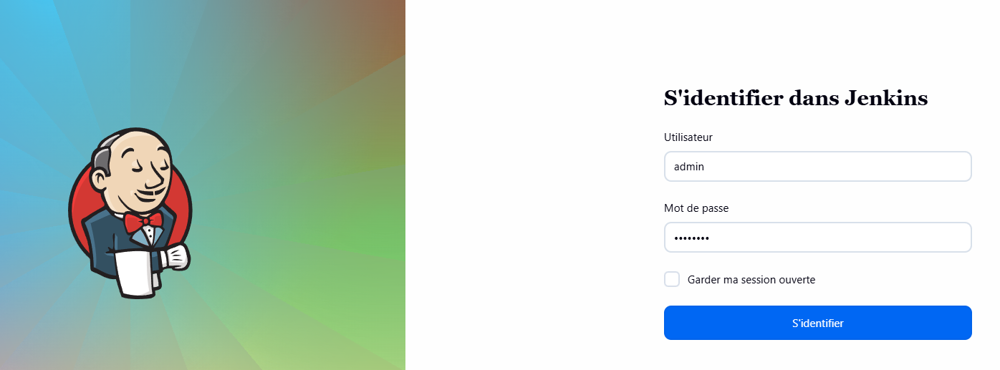
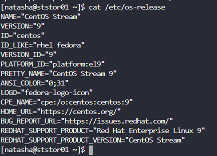
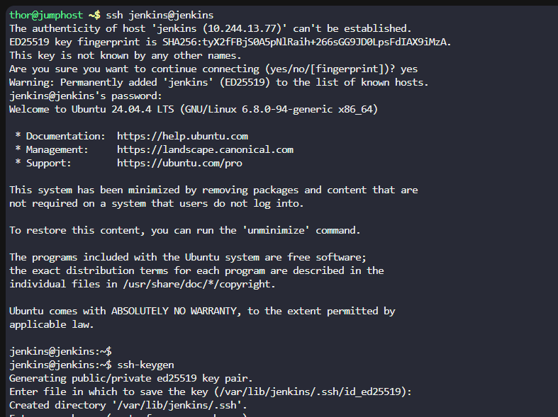
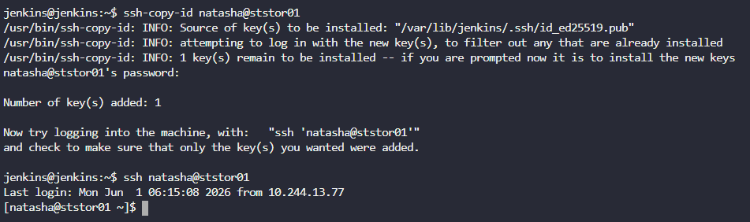
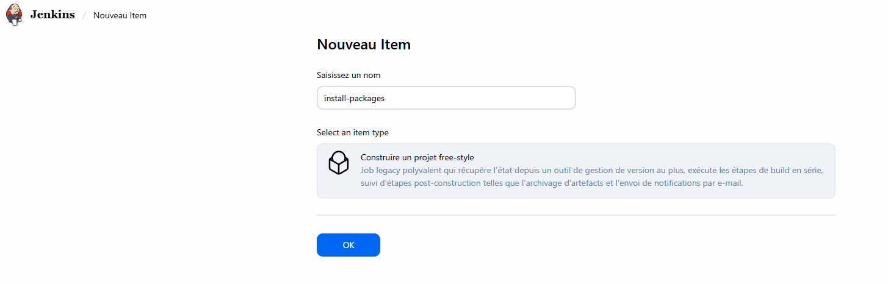
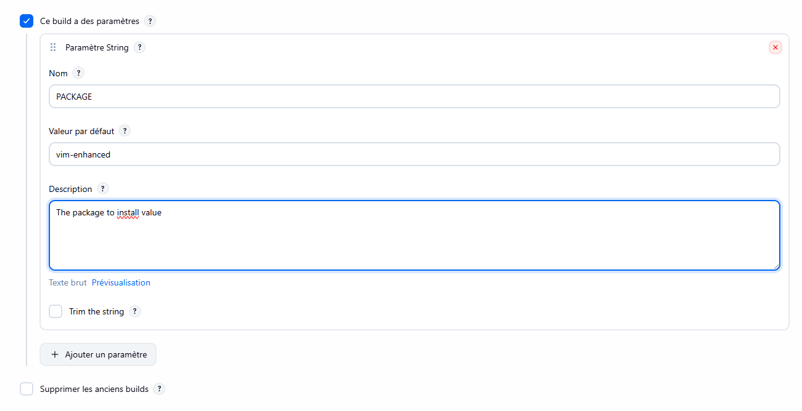
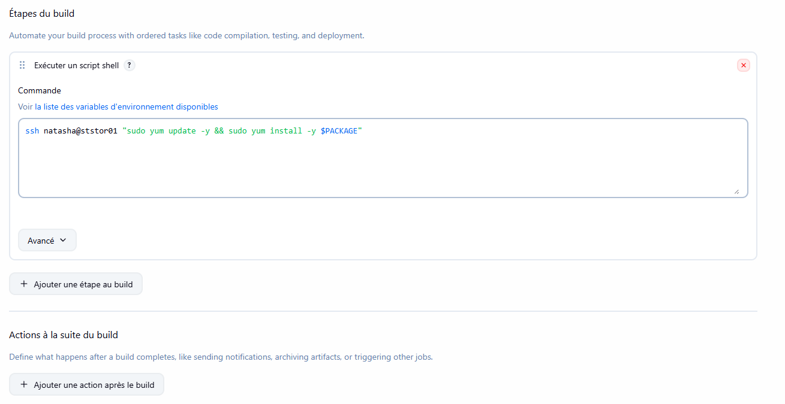
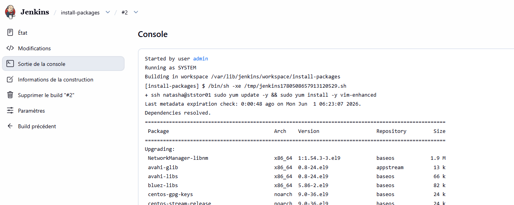
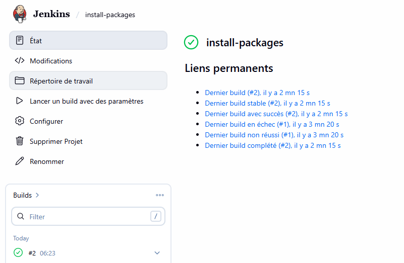

# Day 71: Configure Jenkins Job for Package Installation

**subject**

***

Some new requirements have come up to install and configure some packages on the Nautilus infrastructure under Stratos Datacenter. The Nautilus DevOps team installed and configured a new Jenkins server so they wanted to create a Jenkins job to automate this task. Find below more details and complete the task accordingly:

1\. Access the Jenkins UI by clicking on the`Jenkins`button in the top bar. Log in using the credentials: username`admin`and password`Adm!n321`.

2\. Create a new Jenkins job named`install-packages`and configure it with the following specifications:

* Add a string parameter named`PACKAGE`.
* Configure the job to install a package specified in the`$PACKAGE`parameter on the`storage server`(Stratos Datacenter).
* Build the job at least once (e.g. with parameter`PACKAGE=vim-enhanced`) so the package is installed on the Storage server and can be verified.

`Note`:

1\. Ensure to install any required plugins and restart the Jenkins service if necessary. Opt for`Restart Jenkins when installation is complete and no jobs are running`on the plugin installation/update page. Refresh the UI page if needed after restarting the service.

2\. Verify that the Jenkins job runs successfully on repeated executions to ensure reliability.

3\. Capture screenshots of your configuration for documentation and review purposes. Alternatively, use screen recording software like`loom.com`for comprehensive documentation and sharing.

***

https://askubuntu.com/questions/46930/how-can-i-set-up-password-less-ssh-login

* Access jenkins

* Check what is the os used in stratos storage

* Configure an ssh no password

* Create the job

* Test the job

