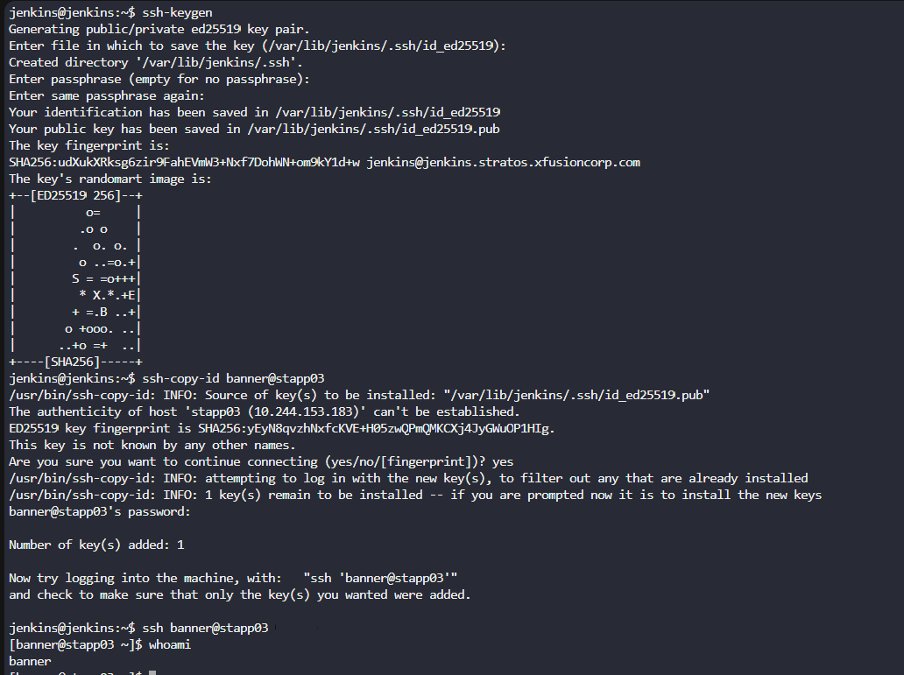
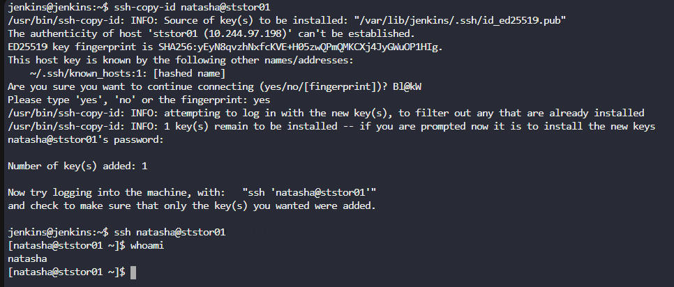
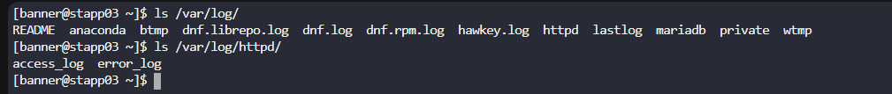
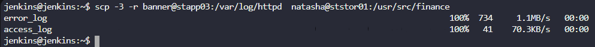
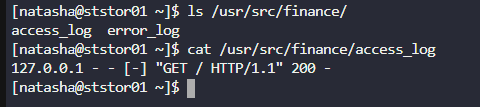
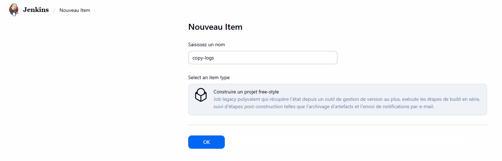
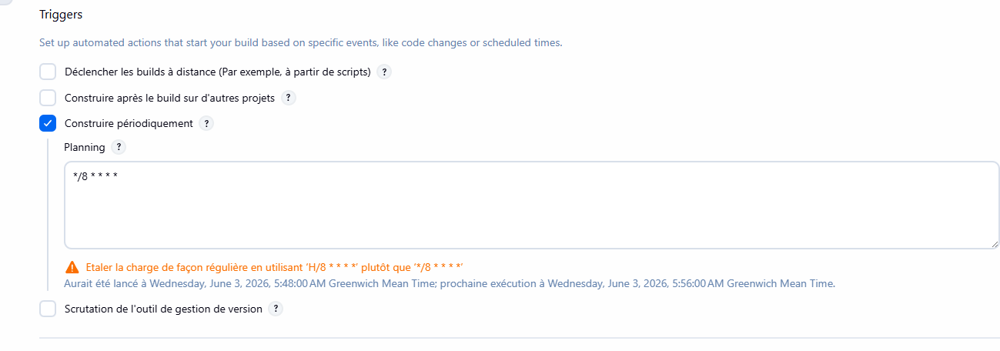
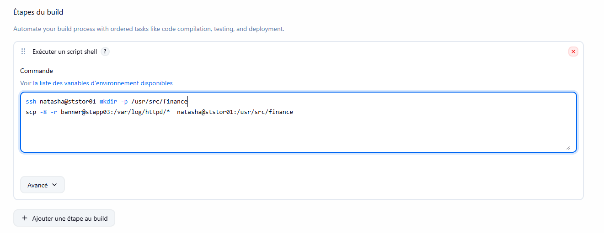
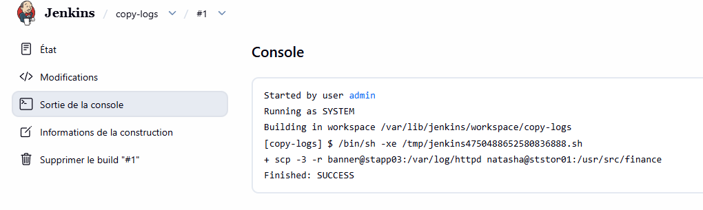
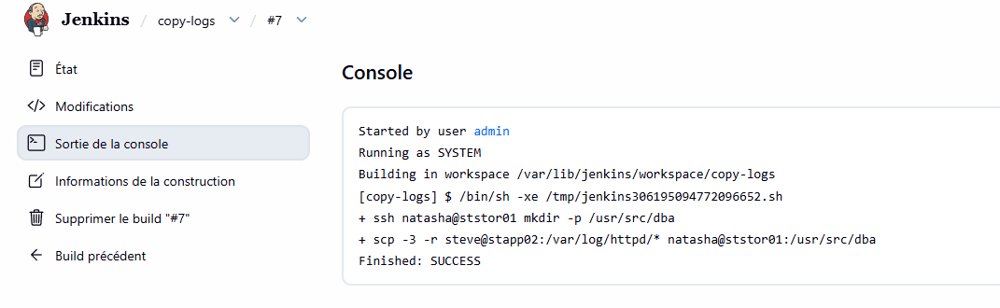

# Day 73: Jenkins Scheduled Jobs

**subject**

***

The devops team of xFusionCorp Industries is working on to setup centralised logging management system to maintain and analyse server logs easily. Since it will take some time to implement, they wanted to gather some server logs on a regular basis. At least one of the app servers is having issues with the Apache server. The team needs Apache logs so that they can identify and troubleshoot the issues easily if they arise. So they decided to create a Jenkins job to collect logs from the server. Please create/configure a Jenkins job as per details mentioned below:

Click on the`Jenkins`button on the top bar to access the Jenkins UI. Login using username`admin`and password`Adm!n321`

1\. Create a Jenkins jobs named`copy-logs`.

2\. Configure it to periodically build`every 8 minutes`to copy the Apache logs (both`access_log`and`error_log`) from**App Server 3**(stapp03) from the default logs location to location`/usr/src/finance`on the Storage Server.

3\. Build the job at least once so that the logs are copied and can be verified.

`Note:`

1\. You might need to install some plugins and restart Jenkins. We recommend selecting`Restart Jenkins when installation is complete and no jobs are running`in the update centre. Refresh the page if the UI gets stuck after a restart.

2\. Define the cron expression as required (e.g.`*/10 * * * *`to run every 10 minutes).

3\. For scenarios that require web UI changes, take screenshots or record your work (e.g. using loom.com) so you can share it for review if the task is marked incomplete.

***

https://stackoverflow.com/questions/12472645/how-do-i-schedule-jobs-in-jenkins

https://www.geeksforgeeks.org/devops/what-is-build-periodically-in-jenkins/

* Access jenkins

* Create an ssh keyless connection to app03 and storage server

* Check the apache log and test the copy

scp -3 -r banner@stapp03:/var/log/httpd  natasha@ststor01:/usr/src/finance

-3 to not copy in the local machine

* Create the job

* test and run

