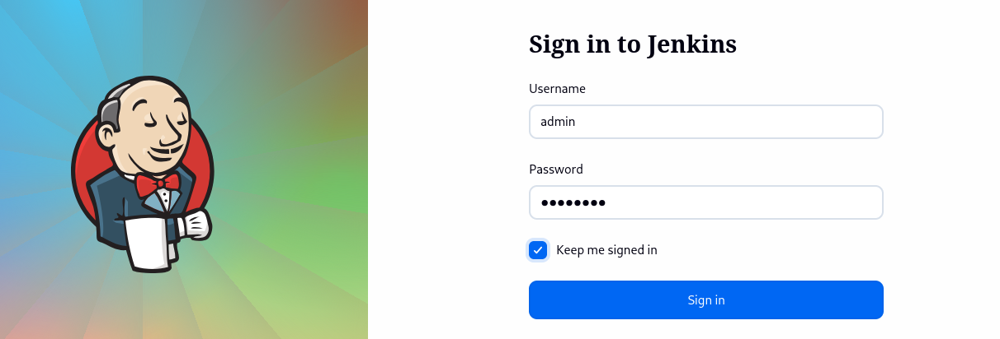
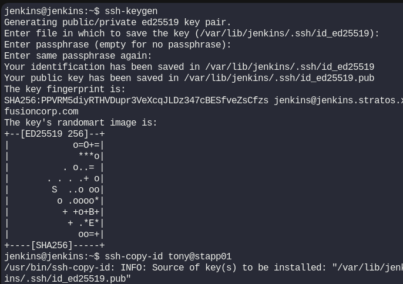
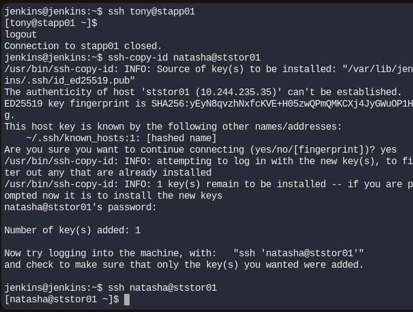
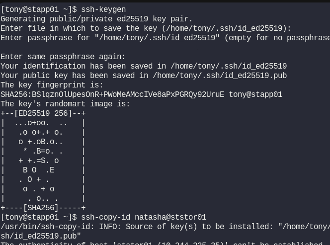
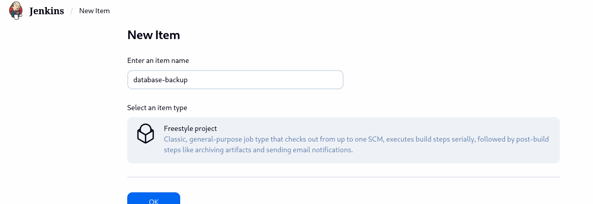
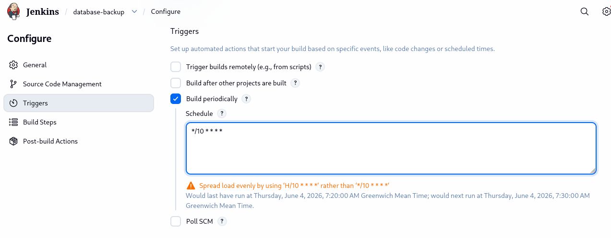
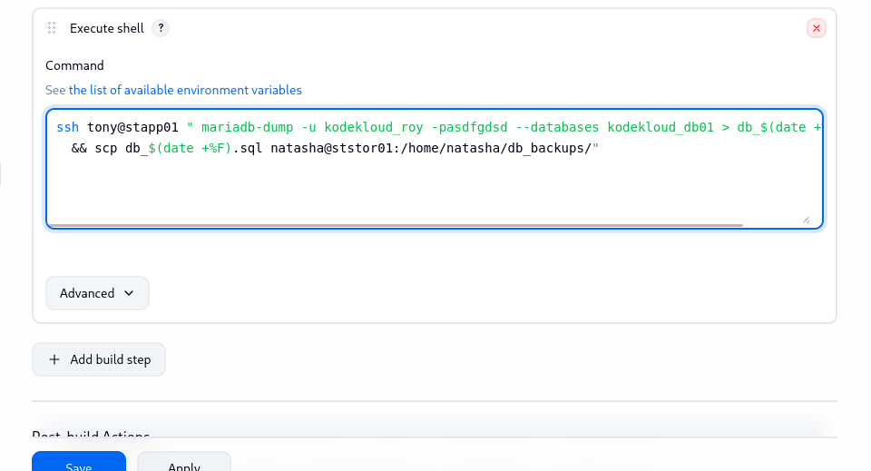
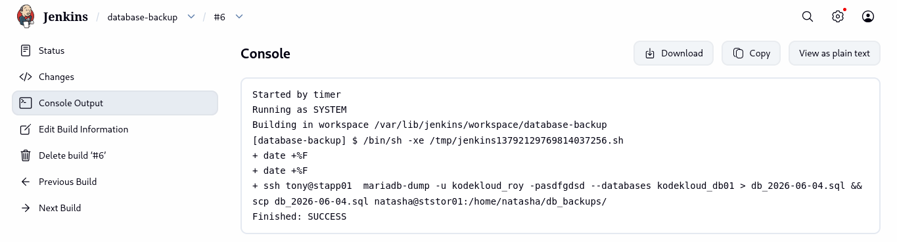
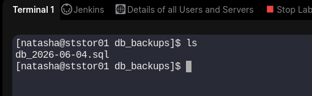

# Day 74: Jenkins Database Backup Job

**subject**

***

There is a requirement to create a Jenkins job to automate the database backup. Below you can find more details to accomplish this task:

Click on the `Jenkins` button on the top bar to access the Jenkins UI. Login using username `admin` and password `Adm!n321`.

1. Create a Jenkins job named `database-backup`.
2. Configure it to take a database dump of the `kodekloud_db01` database present on the **App server (stapp01)** in Stratos Datacenter, the database user is `kodekloud_roy` and password is `asdfgdsd`.
3. The dump should be named in `db_$(date +%F).sql` format, where `date +%F` is the current date.
4. Copy the `db_$(date +%F).sql` dump to the **Storage server (ststor01)** under location `/home/natasha/db_backups`.
5. Further, schedule this job to run periodically at `*/10 * * * *` (please use this exact schedule format).

`Note:`

1. You might need to install some plugins and restart Jenkins service. So, we recommend clicking on `Restart Jenkins when installation is complete and no jobs are running` on plugin installation/update page i.e `update centre`. Also, Jenkins UI sometimes gets stuck when Jenkins service restarts in the back end. In this case please make sure to refresh the UI page.
2. Please make sure to define you cron expression like this `*/10 * * * *` (this is just an example to run job every 10 minutes).
3. For these kind of scenarios requiring changes to be done in a web UI, please take screenshots so that you can share it with us for review in case your task is marked incomplete. You may also consider using a screen recording software such as loom.com to record and share your work.

***

https://dev.mysql.com/doc/refman/8.4/en/mysqldump-sql-format.html

* Access jenkins

* Create ssh passwordless connection

* Create the job

* run and test

