# Day 75: Jenkins Slave Nodes

**subject**

***

The Nautilus DevOps team has installed and configured new Jenkins server in Stratos DC which they will use for CI/CD and for some automation tasks. There is a requirement to add all app servers as slave nodes in Jenkins so that they can perform tasks on these servers using Jenkins. Find below more details and accomplish the task accordingly.

Click on the`Jenkins`button on the top bar to access the Jenkins UI. Login using username`admin`and password`Adm!n321`.

1\. Add all app servers as SSH build agent/slave nodes in Jenkins. Slave node name for`app server 1`,`app server 2`and`app server 3`must be`App_server_1`,`App_server_2`,`App_server_3`respectively.

2\. Add labels as below:

`App_server_1 : stapp01`

`App_server_2 : stapp02`

`App_server_3 : stapp03`

3\. Remote root directory for`App_server_1`must be`/home/tony/jenkins`, for`App_server_2`must be`/home/steve/jenkins`and for`App_server_3`must be`/home/banner/jenkins`.

4\. Make sure slave nodes are online and working properly.

`Note:`

1\. You might need to install some plugins and restart Jenkins service. So, we recommend clicking on`Restart Jenkins when installation is complete and no jobs are running`on plugin installation/update page i.e`update centre`. Also, Jenkins UI sometimes gets stuck when Jenkins service restarts in the back end. In this case, please make sure to refresh the UI page.

2\. For these kind of scenarios requiring changes to be done in a web UI, please take screenshots so that you can share it with us for review in case your task is marked incomplete. You may also consider using a screen recording software such as loom.com to record and share your work.

***

https://www.jenkins.io/doc/book/using/using-agents/

https://gist.github.com/NotHarshhaa/f5ded6760305c734d562c743f7a53d46

* Configure passwordless SSH

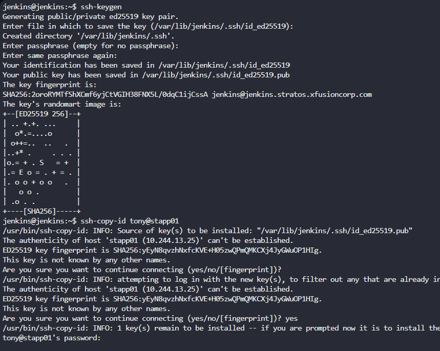

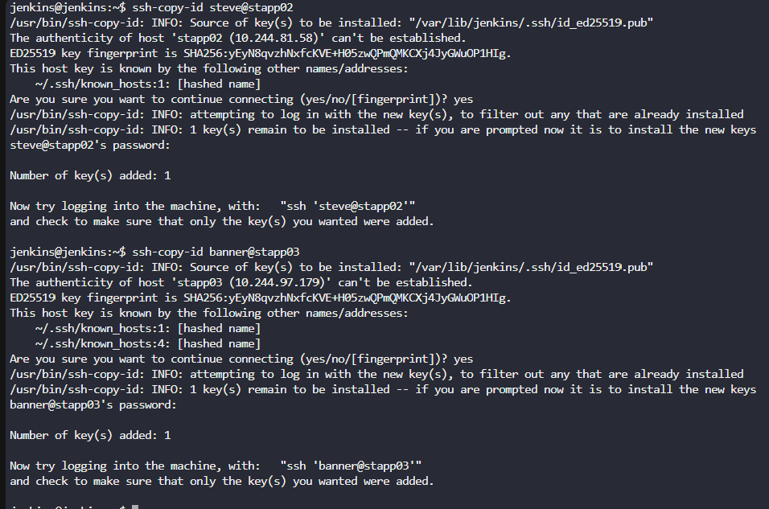

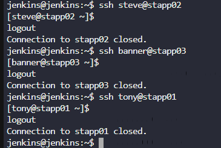

* Install ssh plugin

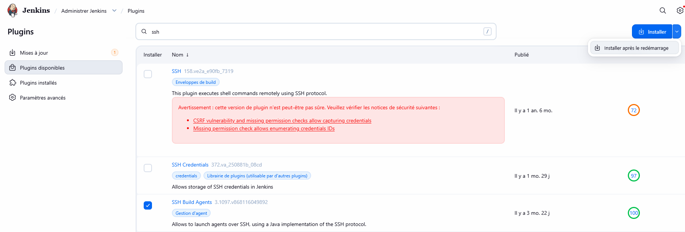

* Update java version on agent

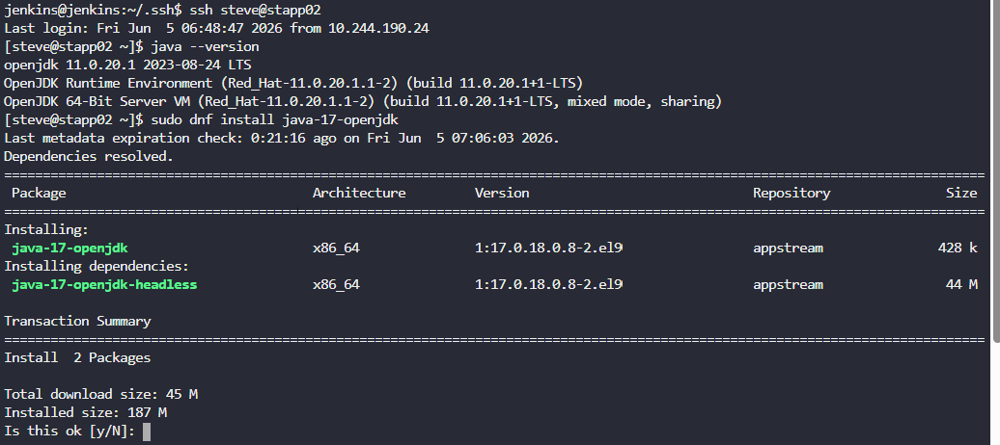

* Configure jenkins slave in UI

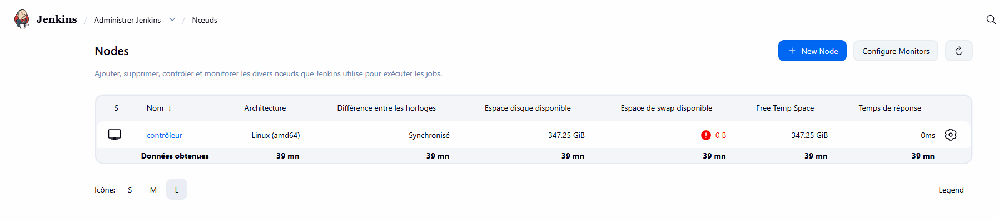

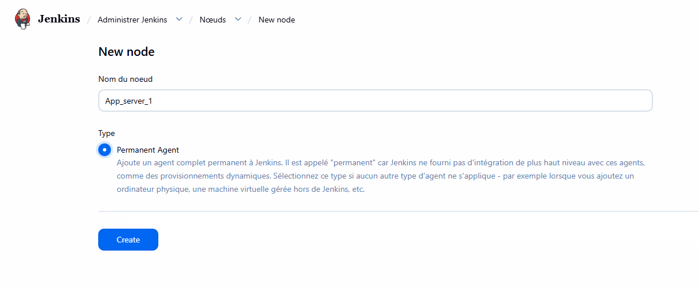

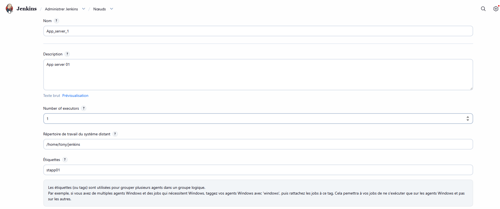

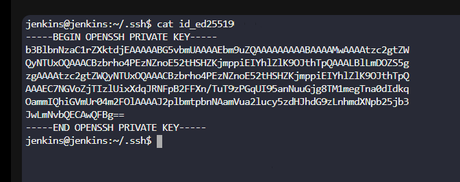

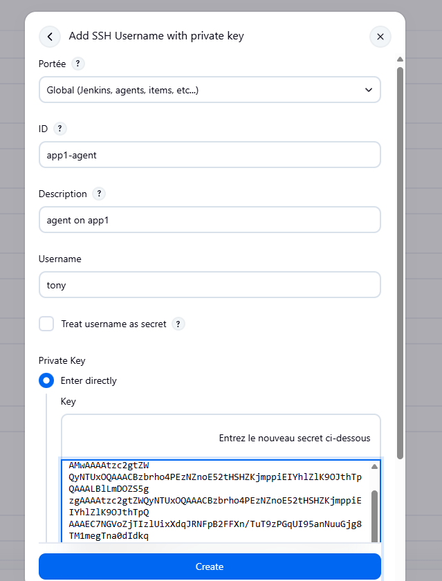

* Test the agent

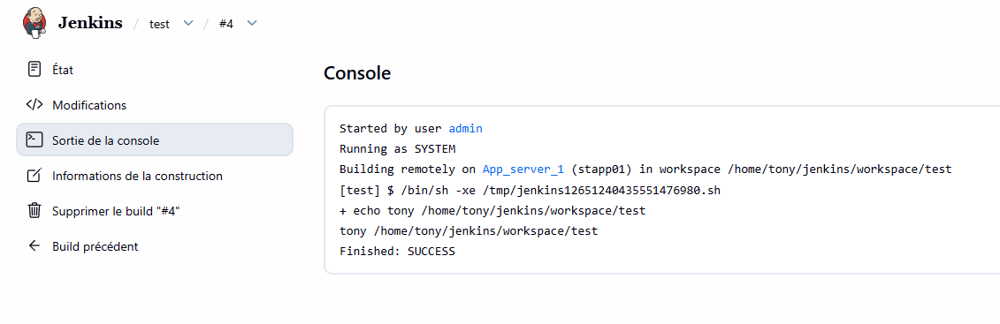

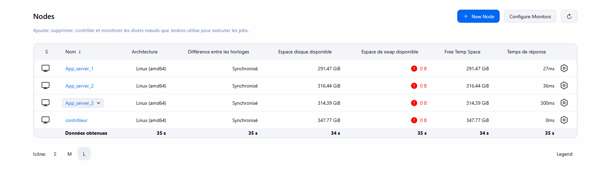
