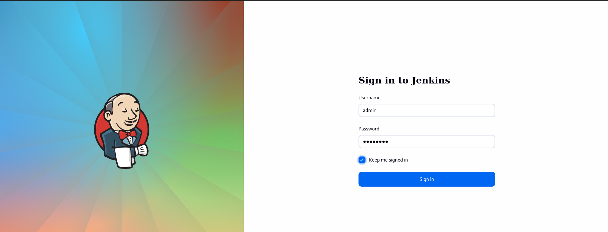
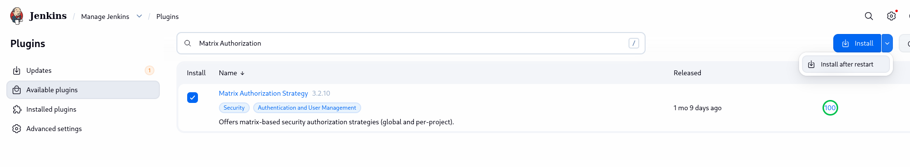
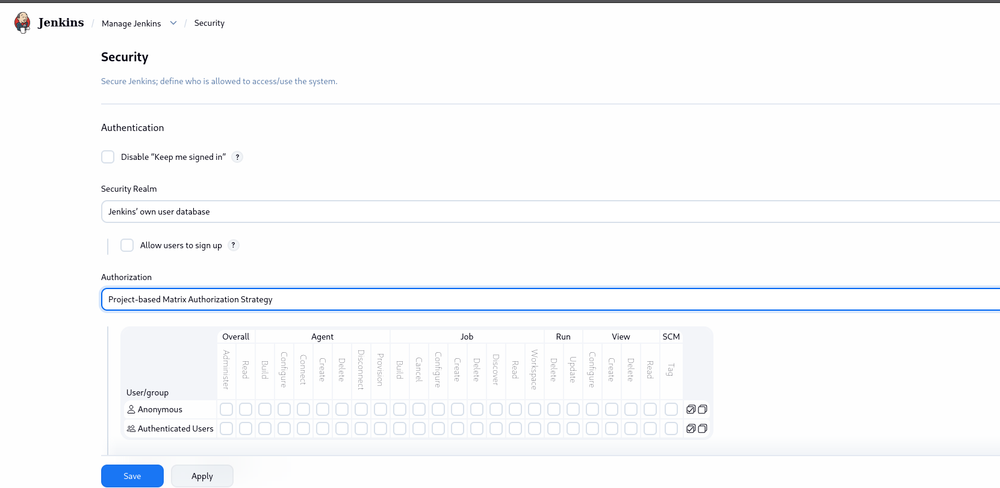
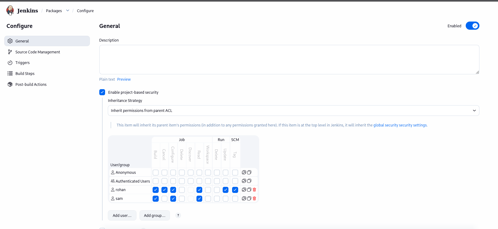
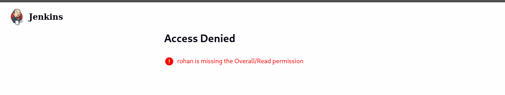
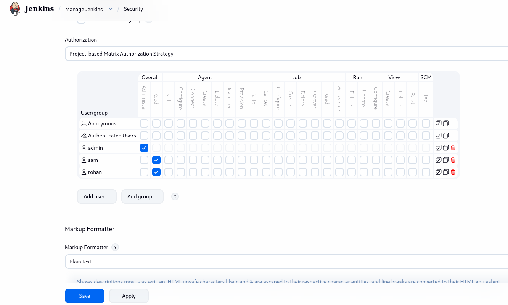
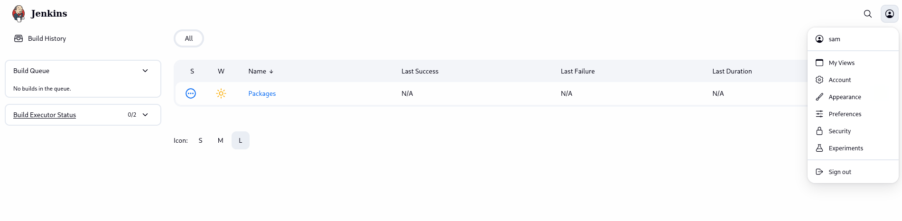
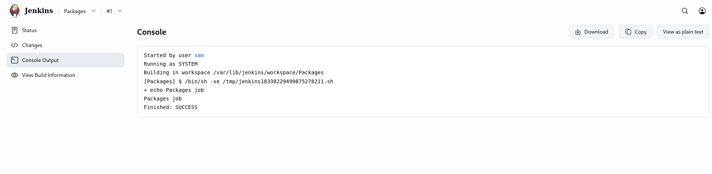

# Day 76: Jenkins Project Security

**subject**

***

The xFusionCorp Industries has recruited some new developers. There are already some existing jobs on Jenkins and two of these new developers need permissions to access those jobs. The development team has already shared those requirements with the DevOps team, so as per details mentioned below grant required permissions to the developers.

Click on the `Jenkins` button on the top bar to access the Jenkins UI. Login using username `admin` and password `Adm!n321`.

1. There is an existing Jenkins job named `Packages`, there are also two existing Jenkins users named `sam` with password `sam@pass12345` and `rohan` with password `rohan@pass12345`.
2. Grant permissions to these users to access `Packages` job as per details mentioned below:
   a.) Make sure to select `Inherit permissions from parent ACL` under `inheritance strategy` for granting permissions to these users.
   b.) Grant mentioned permissions to `sam` user : `build`, `configure` and `read`.
   c.) Grant mentioned permissions to `rohan` user : `build`, `cancel`, `configure`, `read`, `update` and `tag`.

`Note:`

1. Please do not modify/alter any other existing job configuration. 
2. You might need to install some plugins and restart Jenkins service. So, we recommend clicking on `Restart Jenkins when installation is complete and no jobs are running` on plugin installation/update page i.e `update centre`. Also Jenkins UI sometimes gets stuck when Jenkins service restarts in the back end. In this case, please make sure to refresh the UI page.
3. For these kind of scenarios requiring changes to be done in a web UI, please take screenshots so that you can share it with us for review in case your task is marked incomplete. You may also consider using a screen recording software such as loom.com to record and share your work.

***

https://medium.com/@maheshparade/metrix-based-role-based-and-project-based-matrix-authentication-in-jenkins-ab984314b1d8

* Access jenkins



* Install **Project-based Matrix Authorization**





* Create the security rule on the job



* We need to configure the global security 





* Check the view for different user





***

In Jenkins, **Project-based Matrix Authorization** does **not create Linux users or container users**. It only creates **Jenkins users** inside Jenkins' security realm (or users authenticated through LDAP, GitHub, Active Directory, etc.).

### 1. Is it a real user on the Jenkins server?

No.

If you create a user called `alice` in Jenkins:

* Jenkins knows about `alice`
* Jenkins can grant `alice` permissions
* Jenkins can track builds triggered by `alice`

But on the Jenkins host:

```
cat /etc/passwd

```

you will **not** see a Linux account called `alice` unless you created it separately.

The actual build process usually runs as:

```
jenkins

```

or whatever OS user started Jenkins.

For example:

```
ps aux | grep java

```

might show:

```
jenkins  1234  java -jar jenkins.war

```

Even if `alice` clicks "Build Now", the build still executes as the OS user `jenkins`.

***

### 2. How does Overall Security vs Project-based Security work?

Think of it as:

```
Overall permissions
        +
Project permissions

```

A user generally needs both:

#### Overall Matrix

Controls access to Jenkins itself.

Examples:

* Overall → Read
* Overall → Administer
* Job → Read (global)
* Job → Build (global)

#### Project-based Matrix

Controls access to a specific job/folder.

Example:

```
User: alice

Overall:
  Read

Project: Payment-App
  Job Read
  Job Build

```

Result:

✅ Alice can see and build **Payment-App**

❌ Alice cannot build other projects.

***

### 3. Does Overall Security overwrite Project Security?

Not exactly.

The permissions are evaluated together.

Example:

#### Case A

Overall:

```
alice
  Overall Read

```

Project:

```
Payment-App
  Job Read
  Job Build

```

Result:

✅ Can access Jenkins

✅ Can view Payment-App

✅ Can build Payment-App

***

#### Case B

Overall:

```
(no Overall Read)

```

Project:

```
Payment-App
  Job Read
  Job Build

```

Result:

❌ Usually cannot even browse Jenkins properly because the user lacks the basic Overall Read permission.

Project permissions don't magically grant access to Jenkins itself.

***

#### Case C

Overall:

```
Job Build (global)

```

Project:

```
Payment-App
  no permissions

```

Result:

✅ Can build **all jobs** because the global permission already grants it.

Global permissions are broader than project-specific permissions.

***

### 4. Typical setup for "user can only build one job"

For user `developer1`:

**Global Matrix**

```
Overall Read

```

**Project Matrix (Job A)**

```
Job Read
Job Build

```

**No permissions on other jobs**

Result:

* Can log in
* Can see Job A
* Can build Job A
* Cannot access other jobs

This is the most common use case for Project-based Matrix Authorization.

***

### 5. What user actually runs the build?

Suppose `developer1` triggers:

```
Build #42

```

The build execution is usually:

```
developer1 (Jenkins permission check)
          ↓
Jenkins schedules build
          ↓
Agent executes build
          ↓
OS user runs commands

```

The OS user is typically:

* `jenkins`
* `ec2-user`
* `ubuntu`
* a Kubernetes agent container user

depending on how the agent is configured.

So Jenkins users control **who is allowed to trigger the build**, while the operating system user controls **who actually executes the commands**.
