# Day 77: Jenkins Deploy Pipeline

**subject**

***

The development team of xFusionCorp Industries is working on to develop a new static website and they are planning to deploy the same on Nautilus App Server using Jenkins pipeline. They have shared their requirements with the DevOps team and accordingly we need to create a Jenkins pipeline job. Please find below more details about the task:

Click on the `Jenkins` button on the top bar to access the Jenkins UI. Login using username `admin` and password `Adm!n321`.

Similarly, click on the `Gitea` button on the top bar to access the Gitea UI. Login using username `sarah` and password `Sarah_pass123`. There under user `sarah` you will find a repository named `web_app` that is already cloned on **App Server 1** under `/var/www/html`. sarah is a developer who is working on this repository.

1. Add a slave node named `App Server 1`. It should be labeled as `stapp01` and its remote root directory should be `/home/sarah/jenkins_agent` (the repository is cloned under `/var/www/html`; the agent uses a separate directory so it does not pollute the repo).
2. We have already cloned repository on **App Server 1** under `/var/www/html`.
3. Apache is already installed on the app server and is running on port `8080`.
4. Create a Jenkins pipeline job named `xfusion-webapp-job` (it must not be a `Multibranch pipeline`) and configure it to:
   * Deploy the code from `web_app` repository under `/var/www/html` on **App Server 1**, as this is the document root of the app server. The pipeline should have a single stage named `Deploy` ( which is case sensitive ) to accomplish the deployment.

LB server is already configured. You should be able to see the latest changes you made by clicking on the `App` button. Please make sure the required content is loading on the main URL `https://<LBR-URL>` i.e there should not be a sub-directory like `https://<LBR-URL>/web_app` etc.

`Note:`

1. You might need to install some plugins and restart Jenkins service. So, we recommend clicking on `Restart Jenkins when installation is complete and no jobs are running` on plugin installation/update page i.e `update centre`. Also, Jenkins UI sometimes gets stuck when Jenkins service restarts in the back end. In this case, please make sure to refresh the UI page.
2. For these kind of scenarios requiring changes to be done in a web UI, please take screenshots so that you can share it with us for review in case your task is marked incomplete. You may also consider using a screen recording software such as loom.com to record and share your work.

***

https://www.jenkins.io/doc/book/pipeline/

* Check all base plateform: jenkins, git

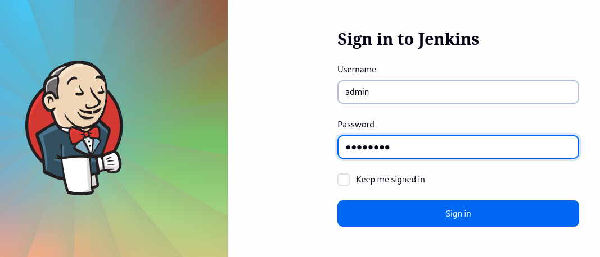

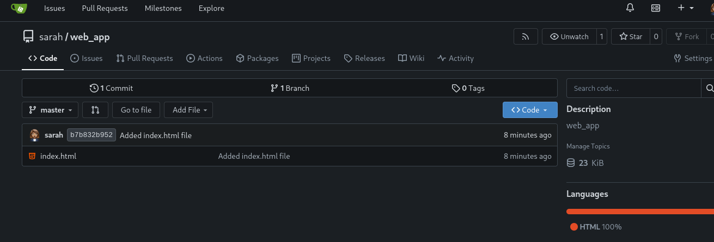

* Create ssh passwordless connection

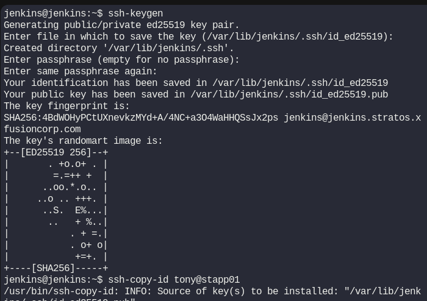

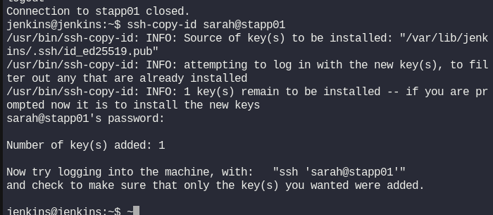

* Create slave node

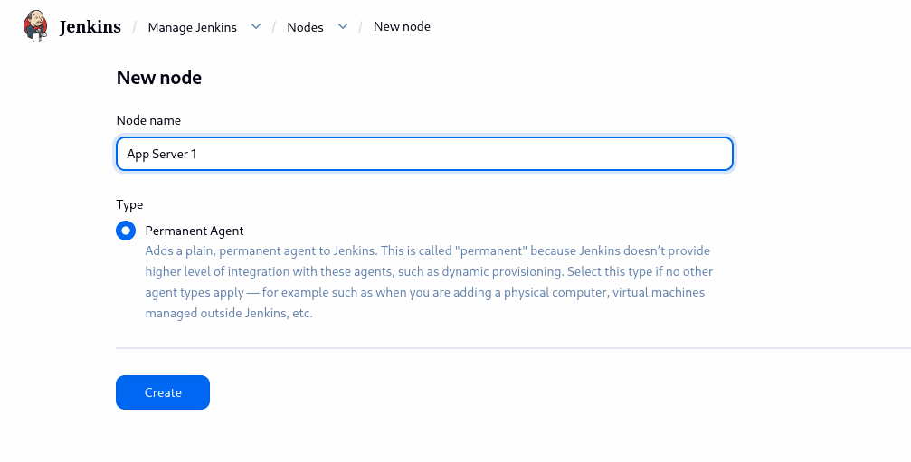

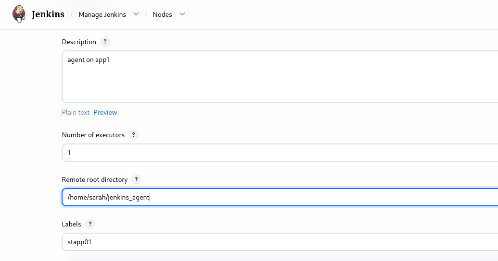

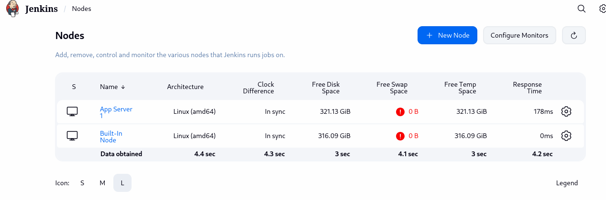

* Check the existant project on the agent

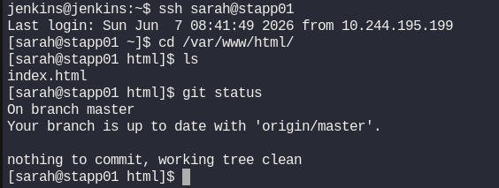

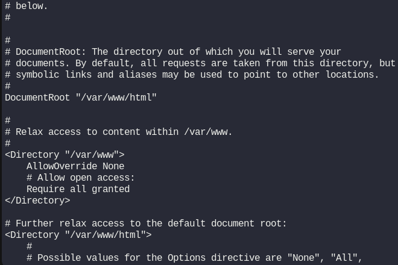

* Create the Pipeline

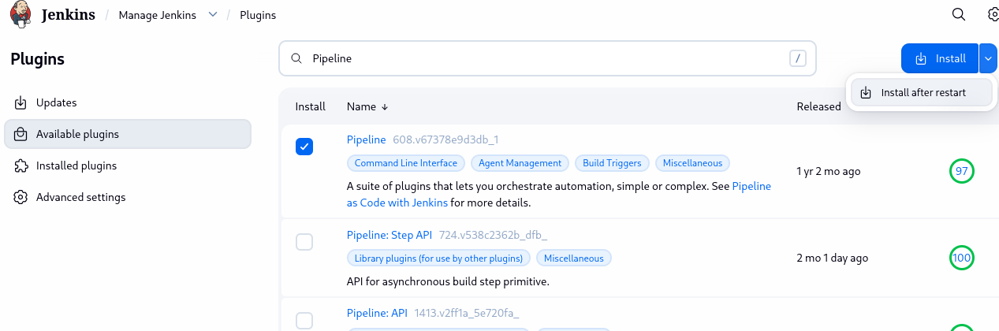

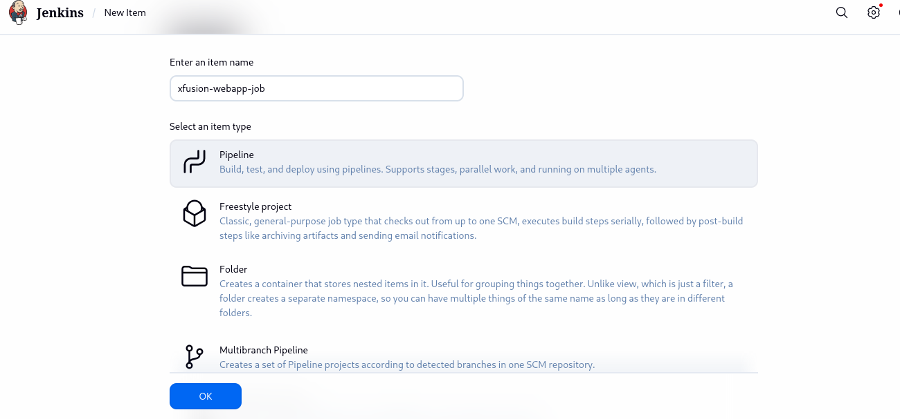

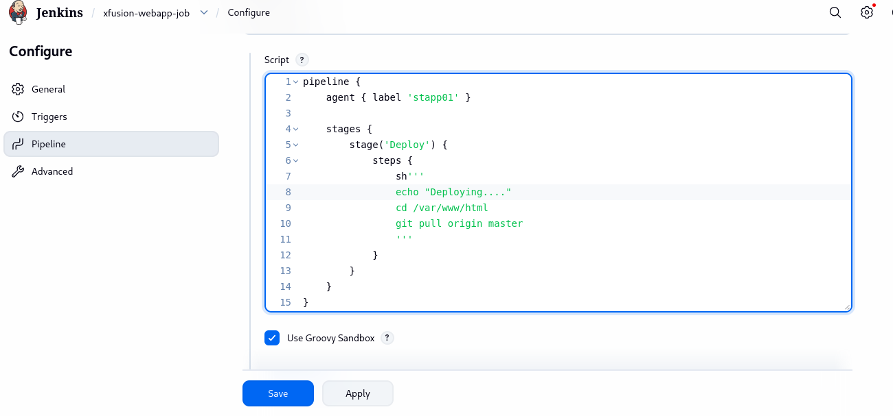

* Test the pipeline 

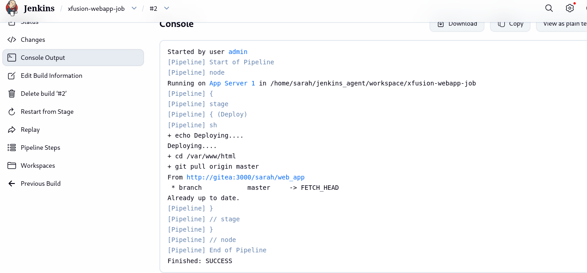

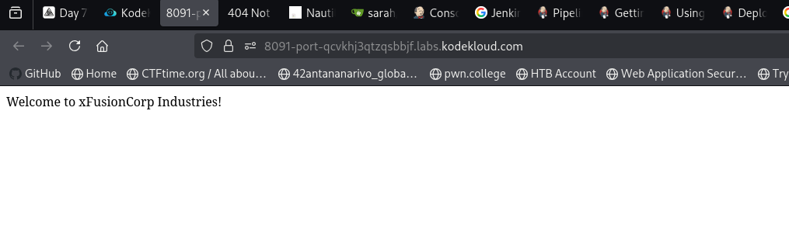
