# Day 79: Jenkins Deployment Job

**subject**

***

The Nautilus development team had a meeting with the DevOps team where they discussed automating the deployment of one of their apps using Jenkins (the one in`Stratos Datacenter`). They want to auto deploy the new changes in case any developer pushes to the repository. As per the requirements mentioned below configure the required Jenkins job.

Click on the`Jenkins`button on the top bar to access the Jenkins UI. Login using username`admin`and`Adm!n321`password.

Similarly, you can access the`Gitea UI`using`Gitea`button. Username and password for Git are`sarah`and`Sarah_pass123`. Under user`sarah`you will find a repository named`web`that is already cloned on**App Server 1**under sarah's home (`/home/sarah/web`).`sarah`is a developer who is working on this repository.

1.`httpd`is already installed and configured on the app server (listening on port`8080`). Ensure the`httpd`service is running on App Server 1 (e.g. start it manually if needed). You can make starting/restarting httpd part of your Jenkins job if you prefer.

2\. Create a Jenkins job named`xfusion-app-deployment`and configure it so that if anyone pushes any new change to the origin repository in`master`branch, the job should auto build and deploy the latest code on**App Server 1**under`/var/www/html`directory.
Before deployment, ensure that the ownership of the`/var/www/html`directory is set to user`sarah`, so that Jenkins can successfully deploy files to that directory.

3\. SSH into**App Server 1**using`sarah`user credentials mentioned above. Under sarah user's home (`/home/sarah/web`) you will find a cloned Git repository named`web`. Under this repository there is an`index.html`file, update its content to`Welcome to the xFusionCorp Industries`, then push the changes to the`origin`into`master`branch. This push must trigger your Jenkins job and the latest changes must be deployed on the server, also make sure it deploys the entire repository content not only`index.html`file.

Click on the`App`button on the top bar to access the app. Please make sure the required content is loading on the main URL (e.g. http://stlb01:8091) i.e there should not be any sub-directory like http://stlb01:8091/web etc.

`Note:`
1\. You might need to install some plugins and restart Jenkins service. So, we recommend clicking on`Restart Jenkins when installation is complete and no jobs are running`on plugin installation/update page i.e`update centre`. Also some times Jenkins UI gets stuck when Jenkins service restarts in the back end so in such case please make sure to refresh the UI page.

2\. Make sure Jenkins job passes even on repetitive runs as validation may try to build the job multiple times.

3\. Deployment related tasks should be done by`sudo`user on the destination server to avoid any permission issues so make sure to configure your Jenkins job accordingly.

4\. For these kind of scenarios requiring changes to be done in a web UI, please take screenshots so that you can share it with us for review in case your task is marked incomplete. You may also consider using a screen recording software such as loom.com to record and share your work.

***

https://medium.com/@shyrradev/understanding-jenkins-build-triggers-a-beginners-journey-b6333a752049

https://oneuptime.com/blog/post/2026-01-30-jenkins-pipeline-triggers/view

* Access resources

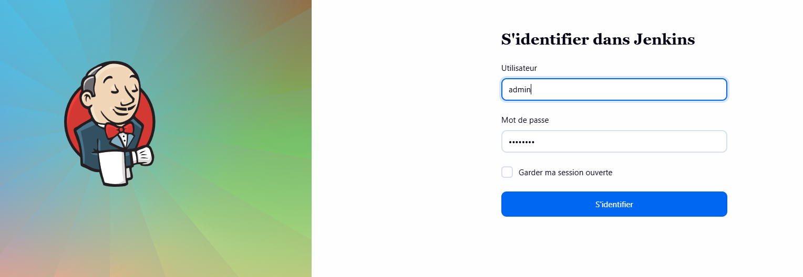

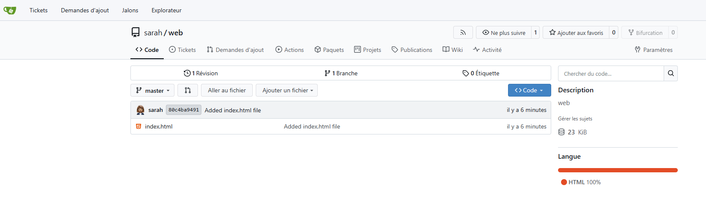

* Create a ssh passwordless connection

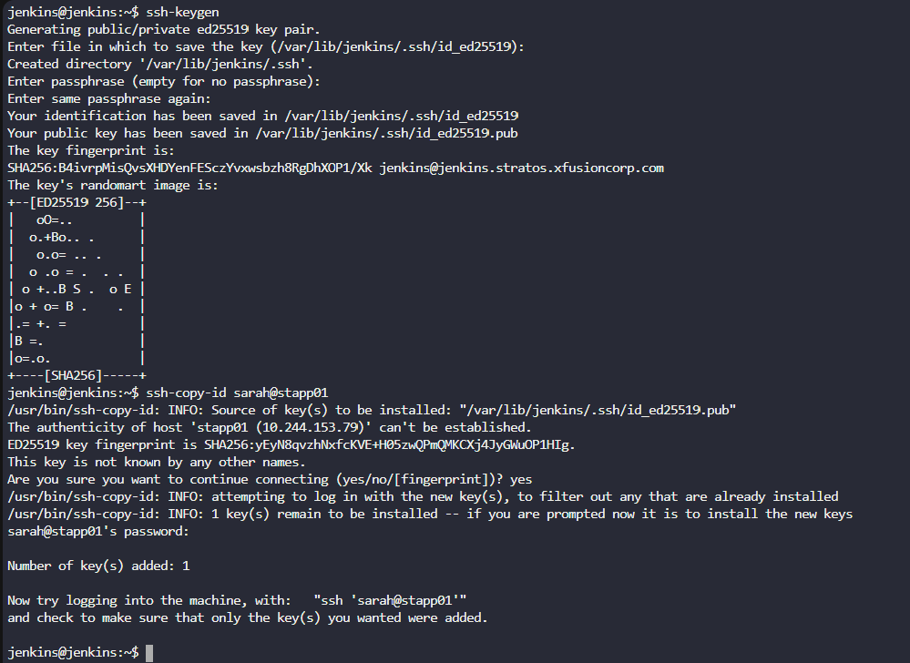

* Check the agent on app01

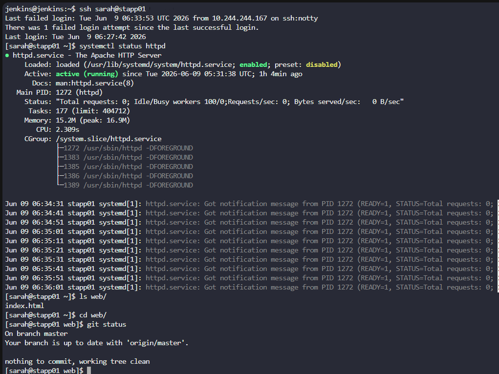

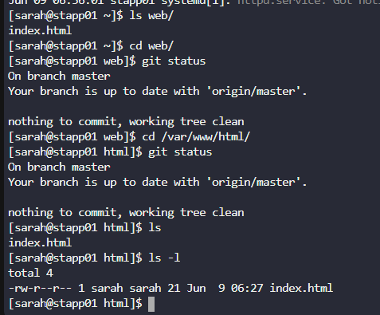

* Configure no password for start the httpd

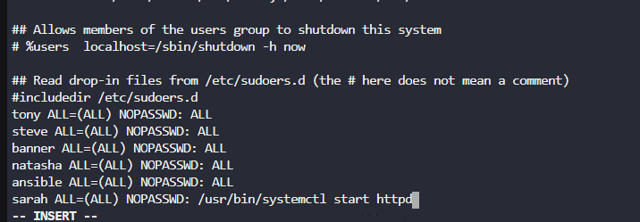

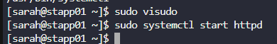

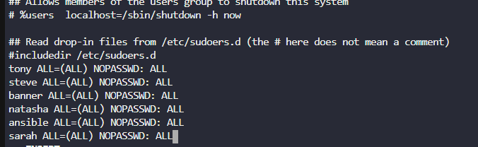

* Install plugins

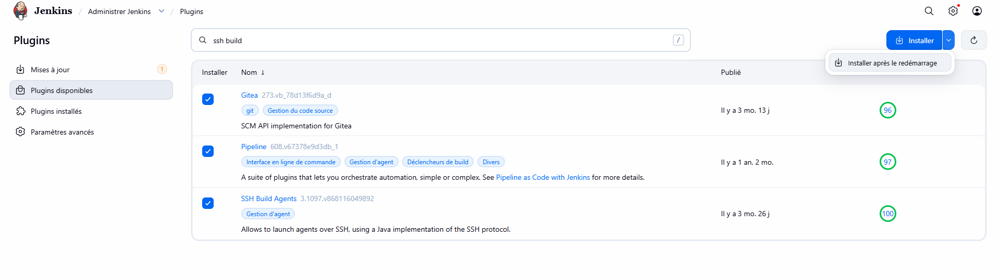

* Create the agent node

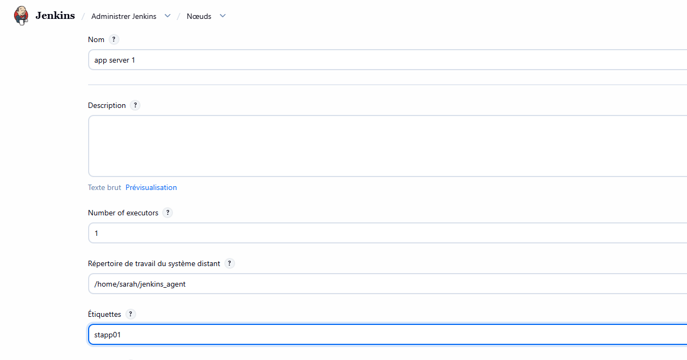

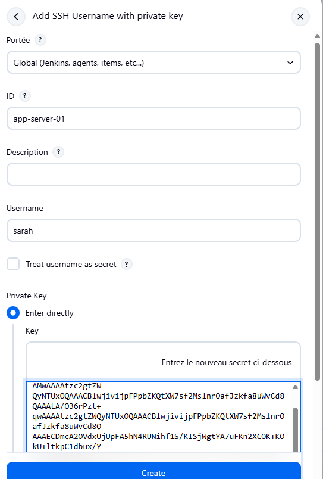

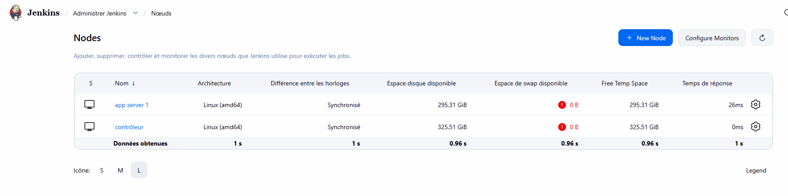

* Create the job

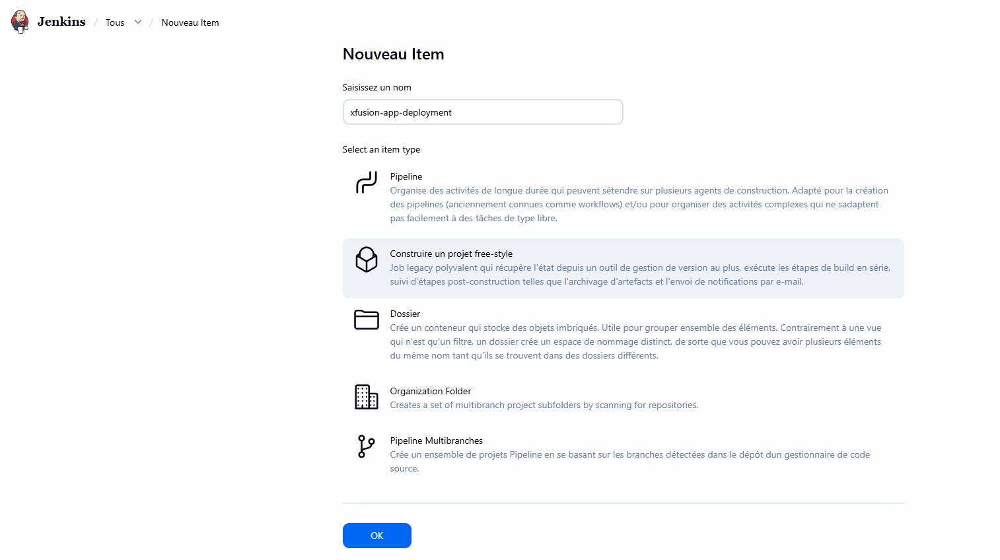

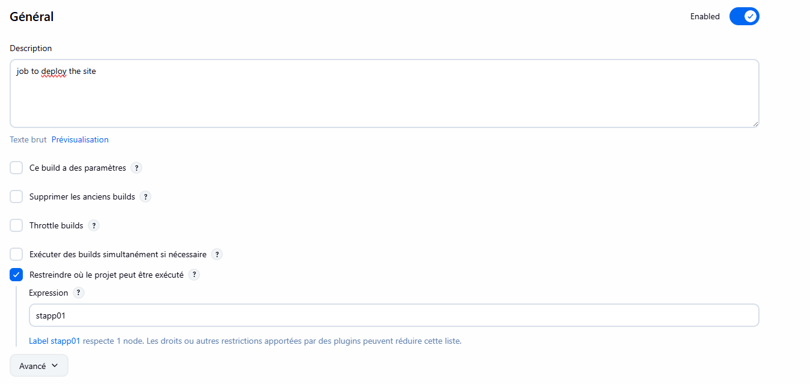

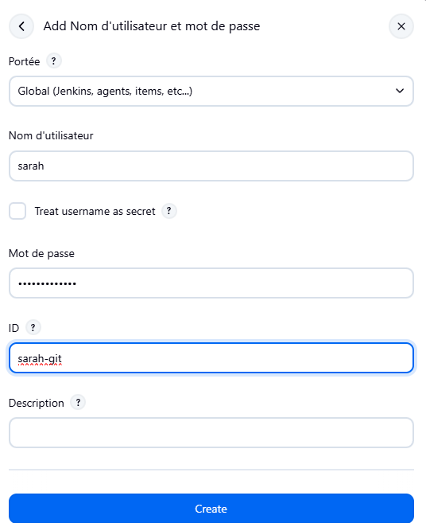

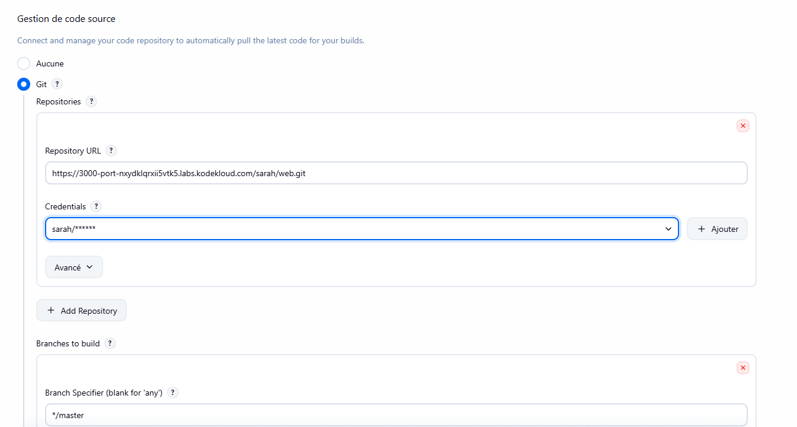

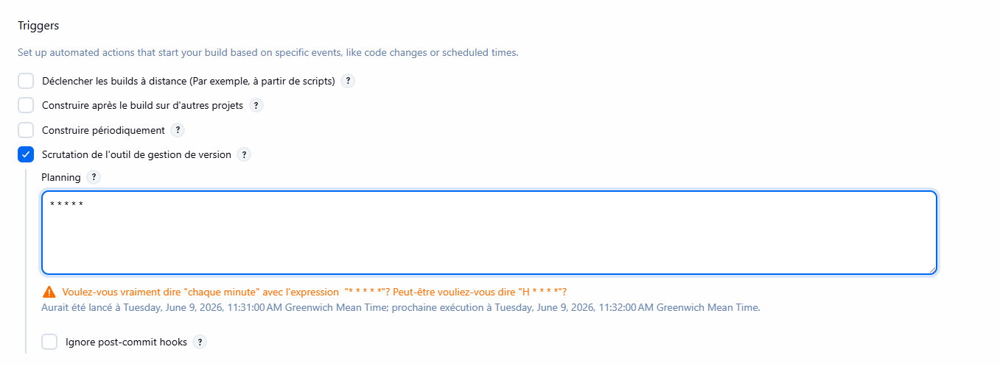

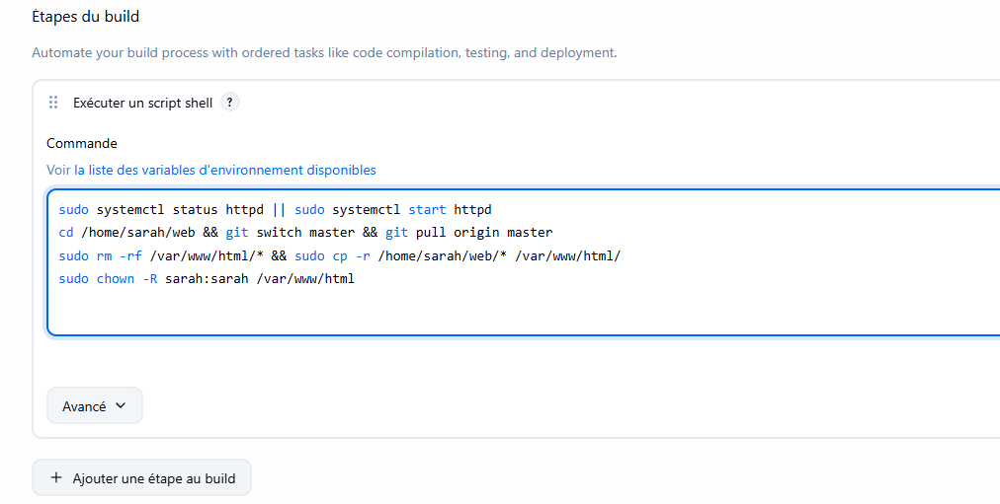

* Run and test

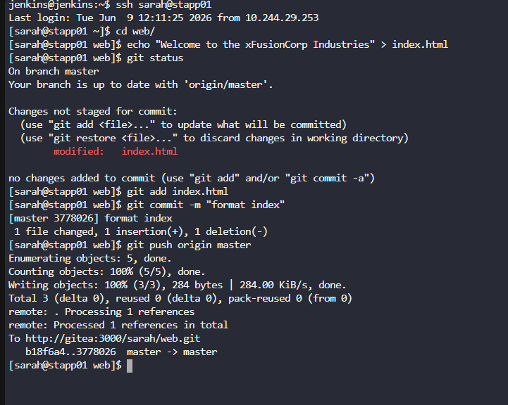

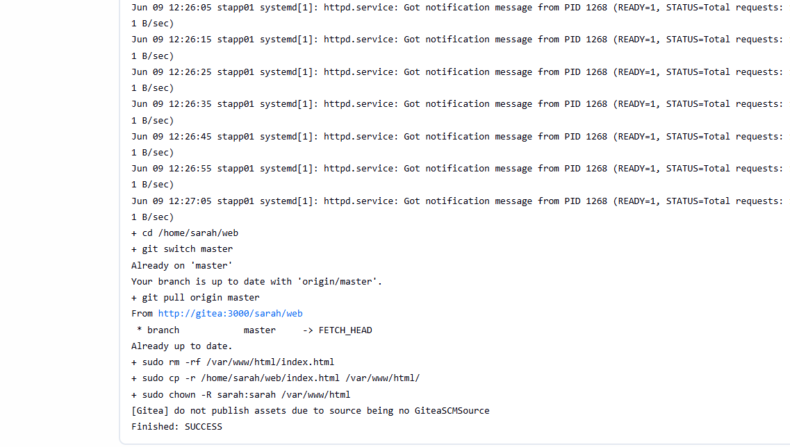

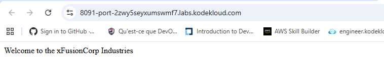

