# Day 80: Jenkins Chained Builds

**subject**

***

The DevOps team was looking for a solution where they want to restart Apache service on all app servers if the deployment goes fine on these servers in Stratos Datacenter. After having a discussion, they came up with a solution to use Jenkins chained builds so that they can use a downstream job for services which should only be triggered by the deployment job. So as per the requirements mentioned below configure the required Jenkins jobs.

Click on the`Jenkins`button on the top bar to access the Jenkins UI. Login using username`admin`and`Adm!n321`password.

Similarly you can access`Gitea UI`on port`3000`(or click the`Gitea`button) and username and password for Git is`sarah`and`Sarah_pass123`respectively. Under user`sarah`you will find a repository named`web`.

Apache is already installed and configured on the app server. The doc root`/var/www/html`on**App Server 1**is a local git repository tracking the origin`web`repository.

1\. Create a Jenkins job named`nautilus-app-deployment`and configure it to pull changes from the`master`branch of the`web`repository on**App Server 1**under`/var/www/html`directory.

2\. Create another Jenkins job named`manage-services`and make it a`downstream job`for`nautilus-app-deployment`. Things to take care about this job are:

a. This job should restart`httpd`service on the app server (App Server 1).

b. Trigger this job only if the`upstream job`i.e`nautilus-app-deployment`is stable.

The LB server is already configured. Click on the`App`button on the top bar to access the app. Please make sure the required content is loading on the main URL (e.g. http://stlb01:8091) i.e there should not be a sub-directory like http://stlb01:8091/web etc.

`Note:`

1\. You might need to install some plugins and restart Jenkins service. So, we recommend clicking on`Restart Jenkins when installation is complete and no jobs are running`on plugin installation/update page i.e`update centre`. Also some times Jenkins UI gets stuck when Jenkins service restarts in the back end so in such case please make sure to refresh the UI page.

2\. Make sure Jenkins job passes even on repetitive runs as validation may try to build the job multiple times.

3\. Deployment related tasks should be done by`sudo`user on the destination server to avoid any permission issues so make sure to configure your Jenkins job accordingly.

4\. For these kind of scenarios requiring changes to be done in a web UI, please take screenshots so that you can share it with us for review in case your task is marked incomplete. You may also consider using a screen recording software such as loom.com to record and share your work.

***

https://upstream-downstream-job.hashnode.dev/understanding-upstream-and-downstream-jobs-in-jenkins

* Access all resources

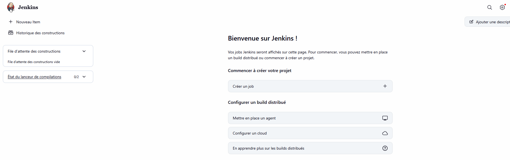

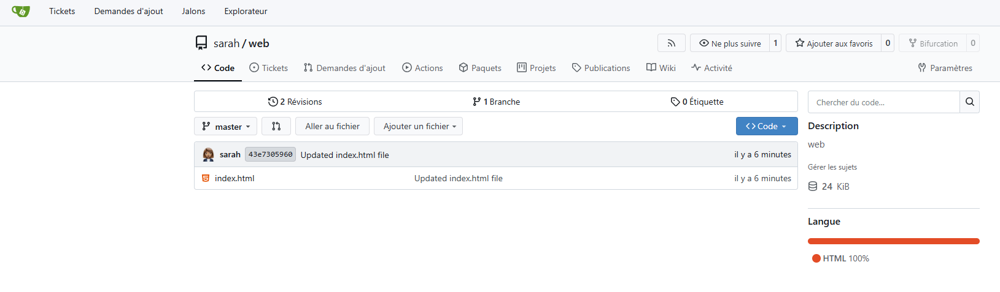

* configure passwordless ssh

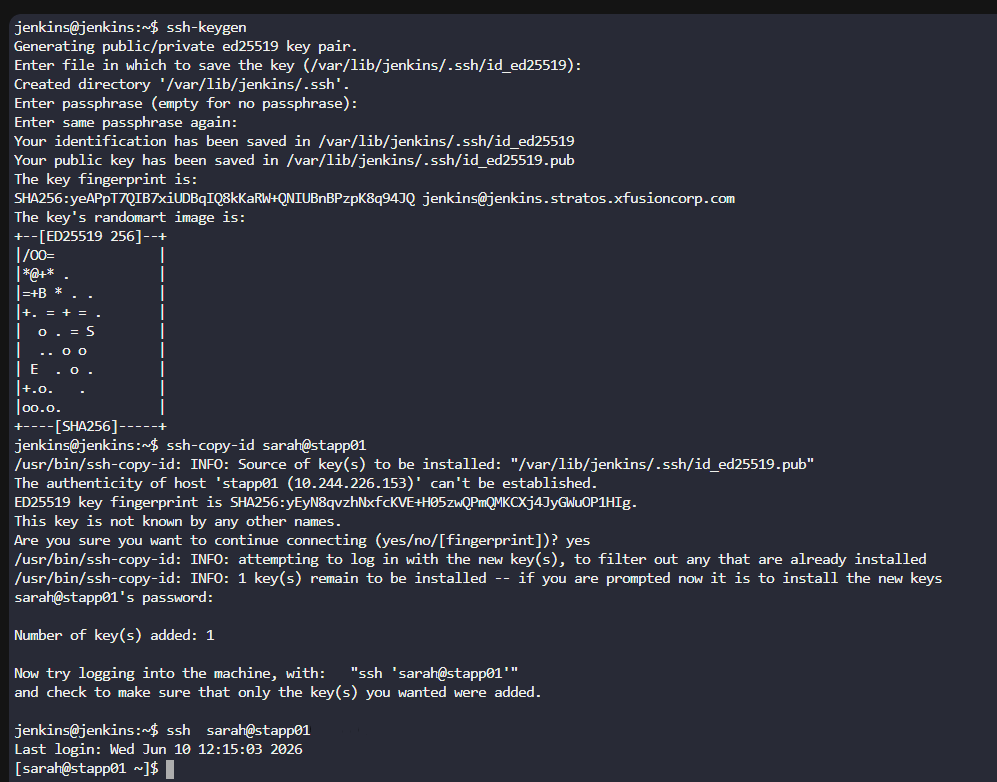

* Configure the app server

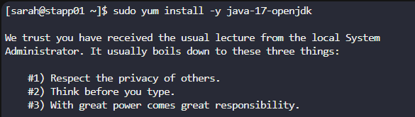

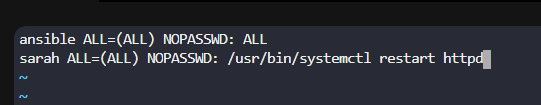

* Install jenkins plugin

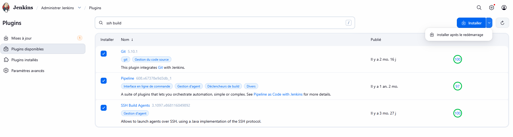

* Configure node agent

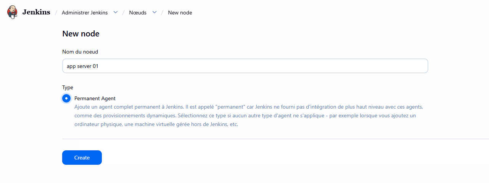

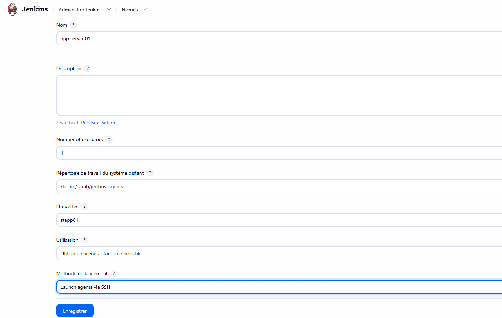

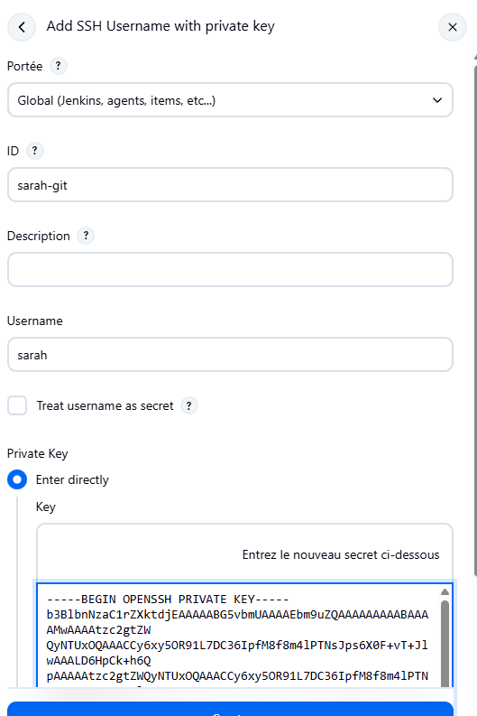

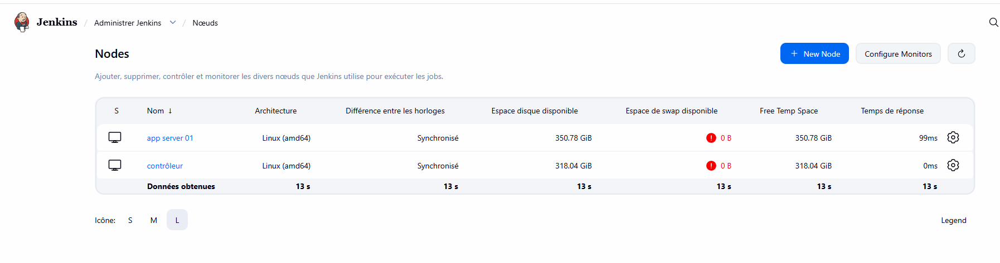

* Configure the first job

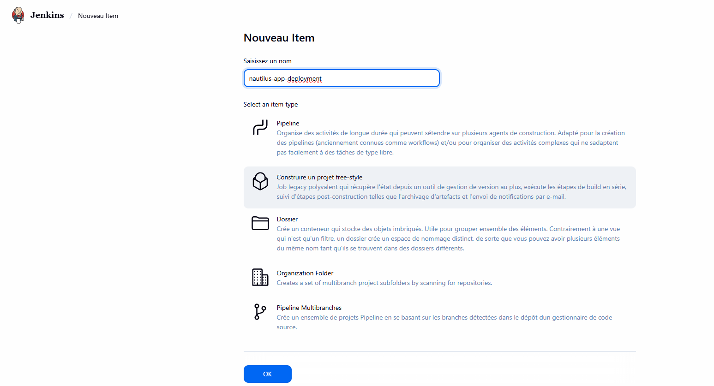

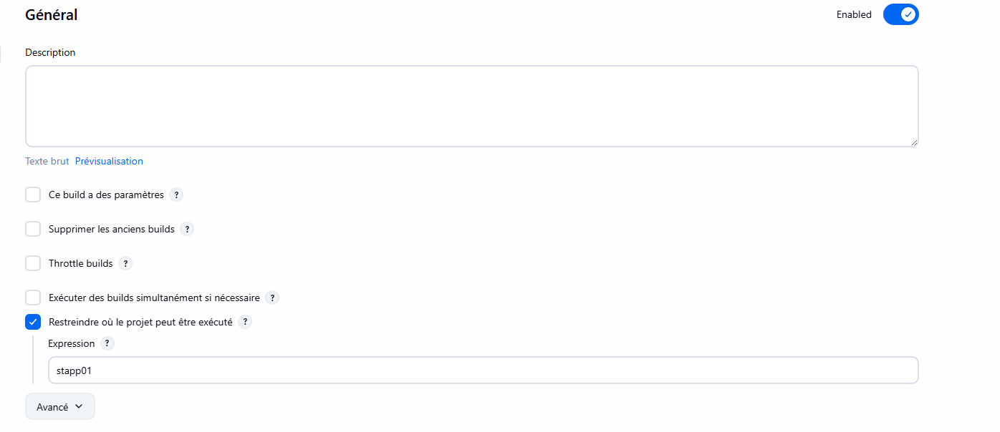

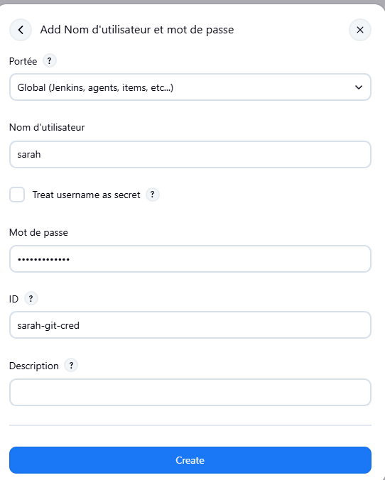

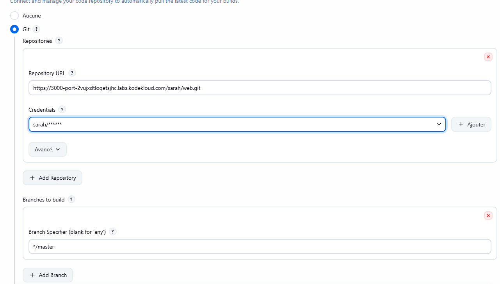

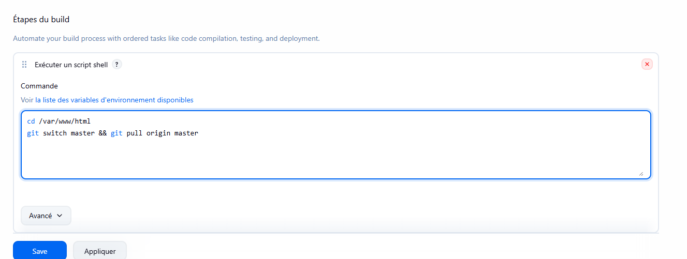

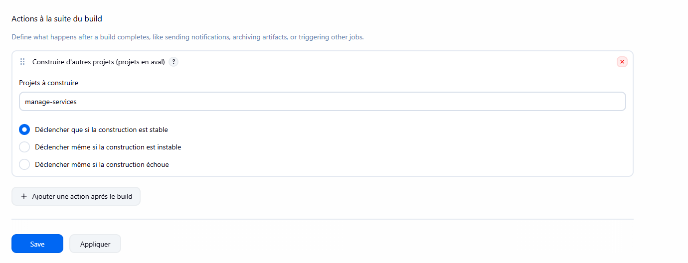

* Configure second job

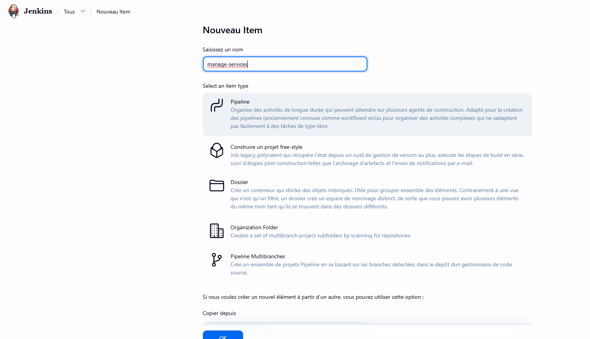

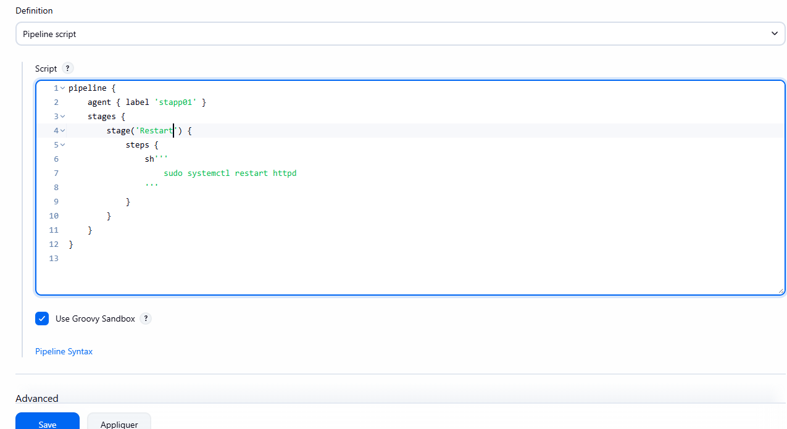

* Run and test

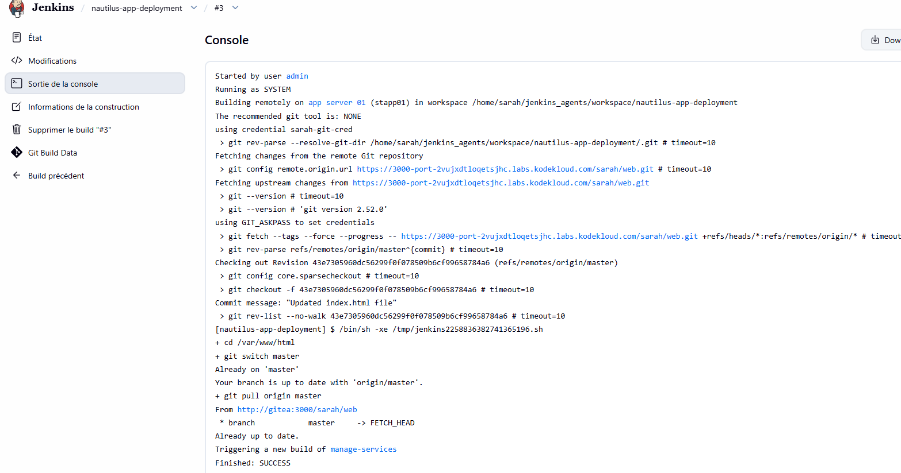

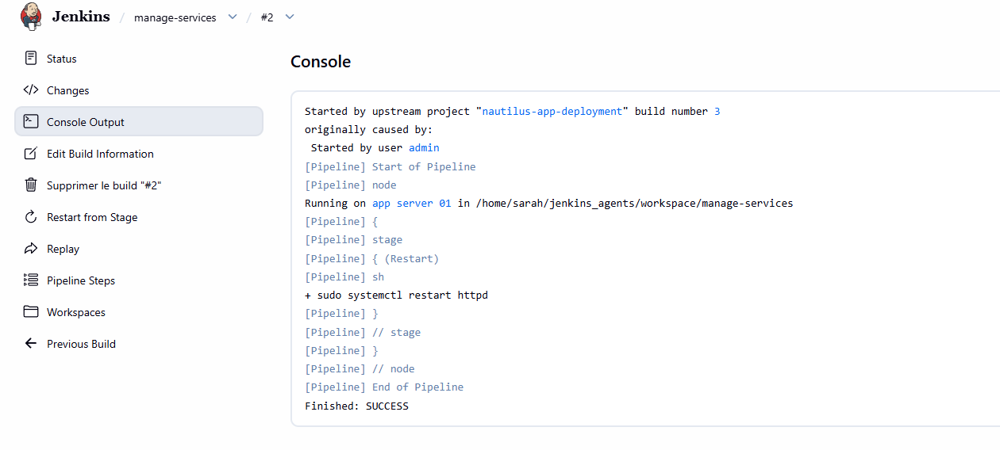
