# Day 81: Jenkins Multistage Pipeline

**subject**

***

The development team of xFusionCorp Industries is working on to develop a new static website and they are planning to deploy the same on Nautilus App Server using Jenkins pipeline. They have shared their requirements with the DevOps team and accordingly we need to create a Jenkins pipeline job. Please find below more details about the task:

Click on the `Jenkins` button on the top bar to access the Jenkins UI. Login using username `admin` and password `Adm!n321`.

Similarly, click on the `Gitea` button on the top bar to access the Gitea UI. Login using username `sarah` and password `Sarah_pass123`.

There is a repository named `sarah/web` in Gitea that is already cloned on **App Server 1** under `/var/www/html` directory.

1. Update the content of the file `index.html` under the same repository to `Welcome to xFusionCorp Industries` and push the changes to the origin into the `master` branch.

2. Apache is already installed on the app server and is running on port `8080`.

3. Add **App Server 1** as a Jenkins agent (slave) node: name `App Server 1`, label `stapp01`, remote root directory `/home/sarah/jenkins_agent`, launch via SSH with host `stapp01` and credentials for user `sarah`. Install `java-17-openjdk` on App Server 1 if needed.

4. Create a Jenkins pipeline job named `deploy-job` (it must not be a `Multibranch pipeline` job) and pipeline should have two stages `Deploy` and `Test` ( names are case sensitive ). Configure these stages as per details mentioned below. 

   a. The `Deploy` stage should deploy the code from `web` repository under `/var/www/html` on **App Server 1**, as this is the document root of the app server.

   b. The pipeline should run on the **App Server 1** node (e.g. use label `stapp01`).

   c. The `Test` stage should just test if the app is working fine and website is accessible. Its up to you how you design this stage to test it out, you can simply add a `curl` command as well to run a curl against the LBR URL (`http://stlb01:8091`) to see if the website is working or not. Make sure this stage fails in case the website/app is not working or if the `Deploy` stage fails.

Click on the `App` button on the top bar to see the latest changes you deployed. Please make sure the required content is loading on the main URL `http://stlb01:8091` i.e there should not be a sub-directory like `http://stlb01:8091/web` etc.

`Note:`

1. You might need to install some plugins and restart Jenkins service. So, we recommend clicking on `Restart Jenkins when installation is complete and no jobs are running` on plugin installation/update page i.e `update centre`. Also, Jenkins UI sometimes gets stuck when Jenkins service restarts in the back end. In this case, please make sure to refresh the UI page.

2. For these kind of scenarios requiring changes to be done in a web UI, please take screenshots so that you can share it with us for review in case your task is marked incomplete. You may also consider using a screen recording software such as loom.com to record and share your work.

***

* Access all resources

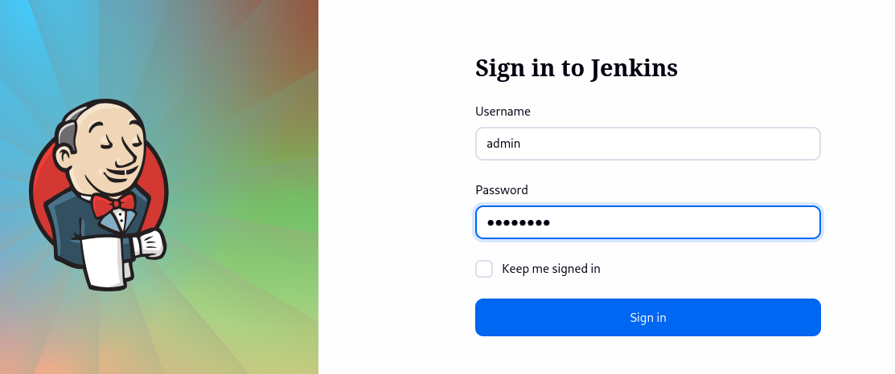

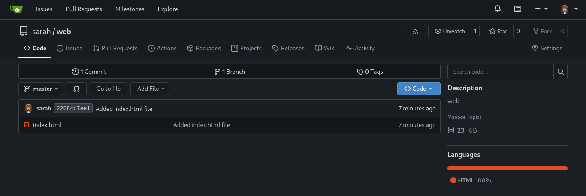

* Setup passwordless ssh

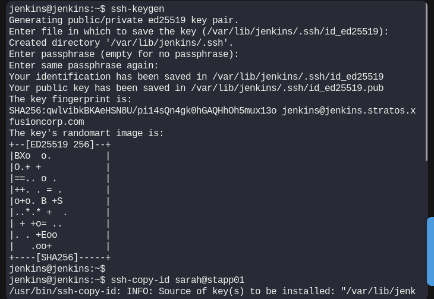

* Setup the app server 01

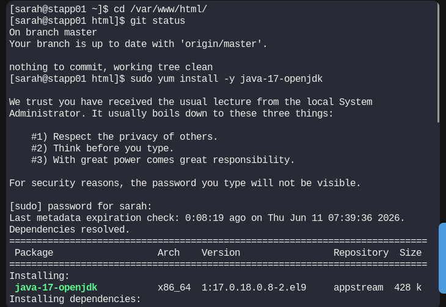

* Install jenkins plugins

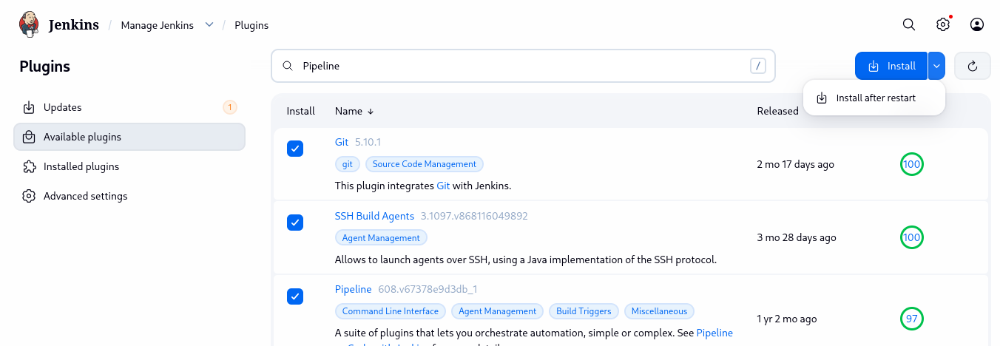

* Setup node agent

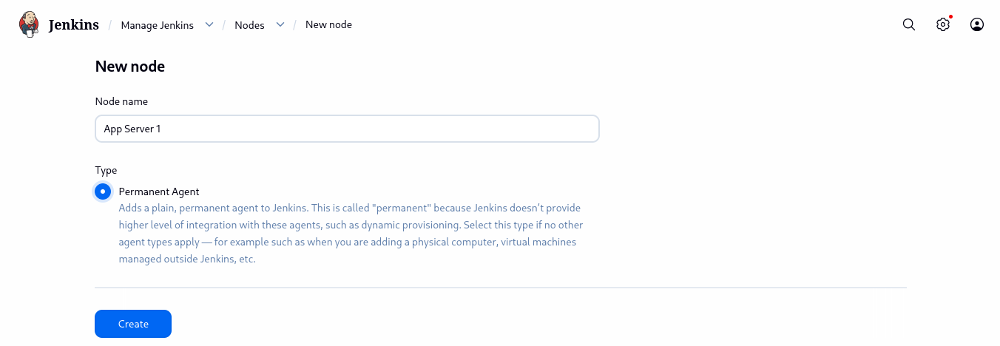

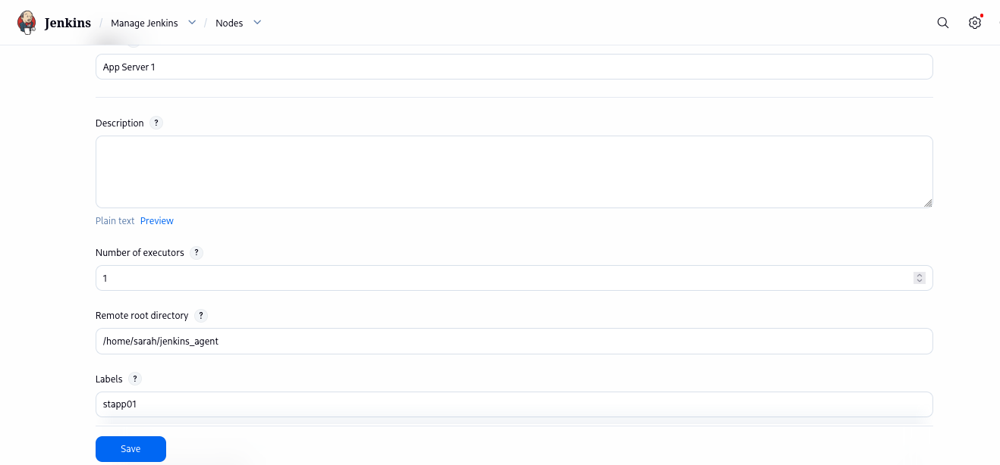

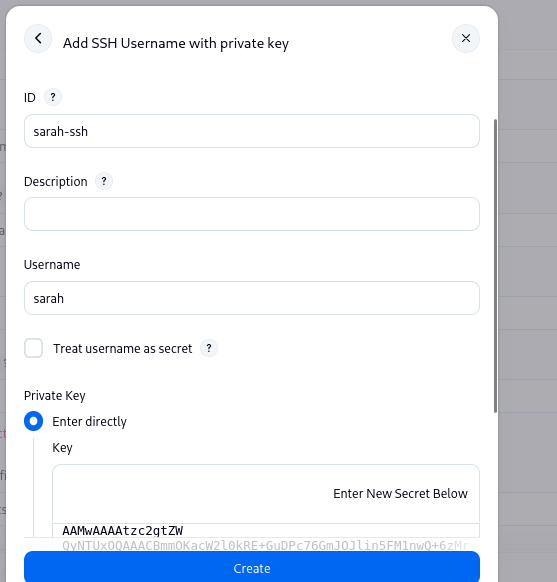

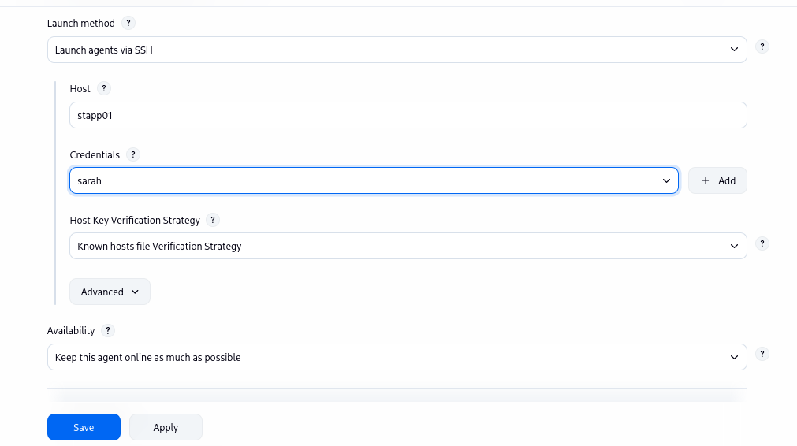

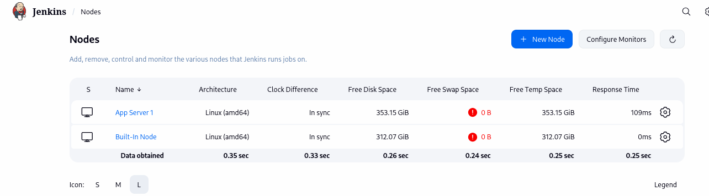

* Create the job

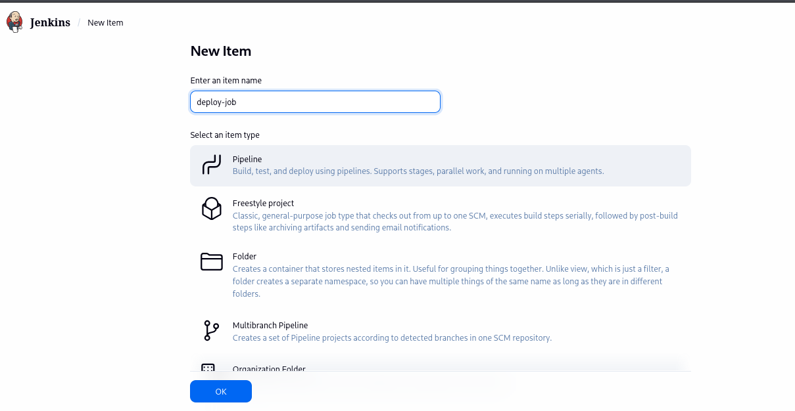

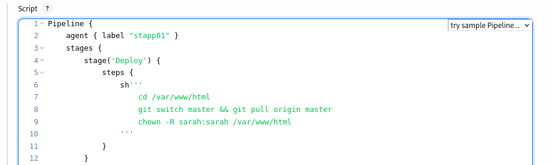

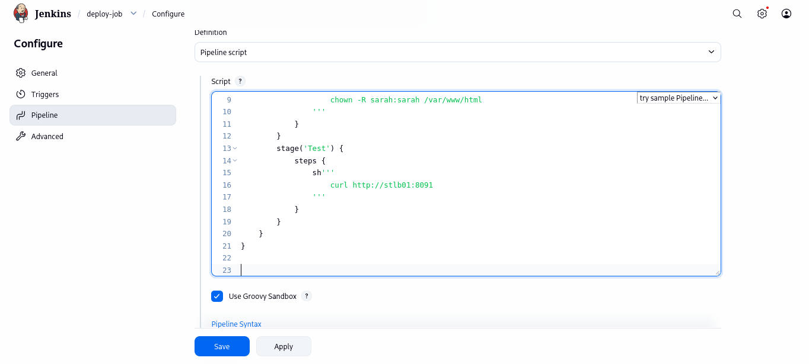

* Run ad test

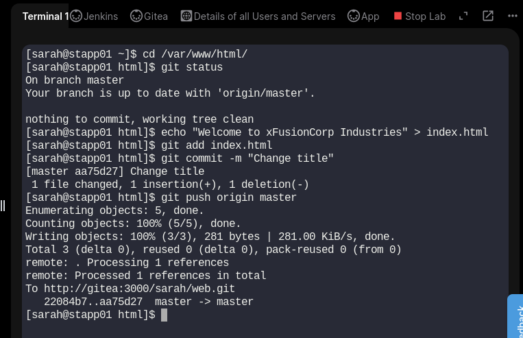

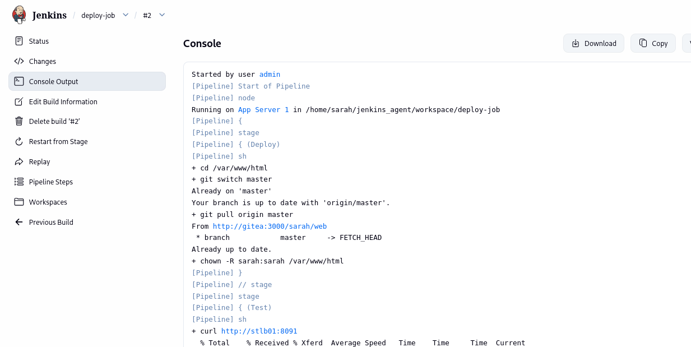

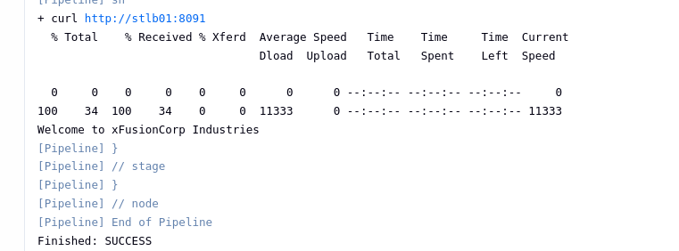
