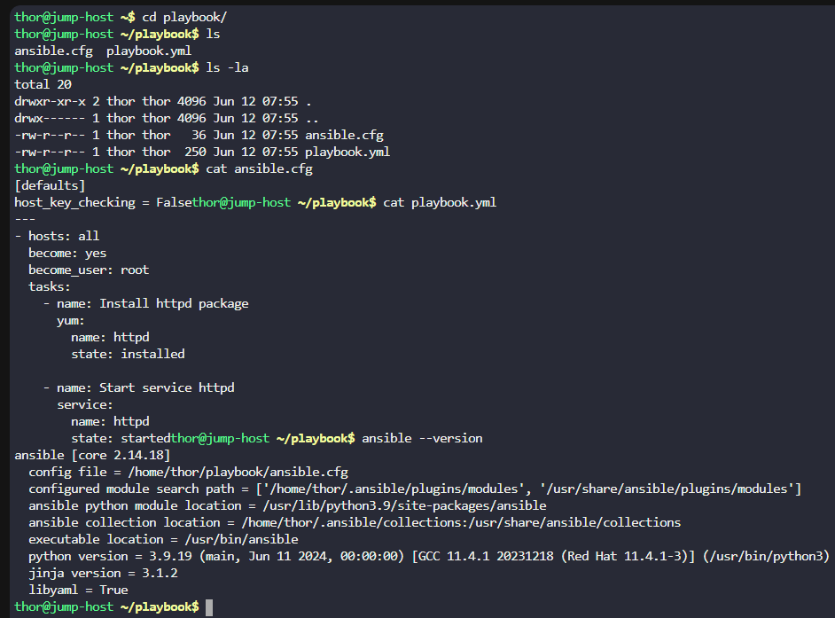
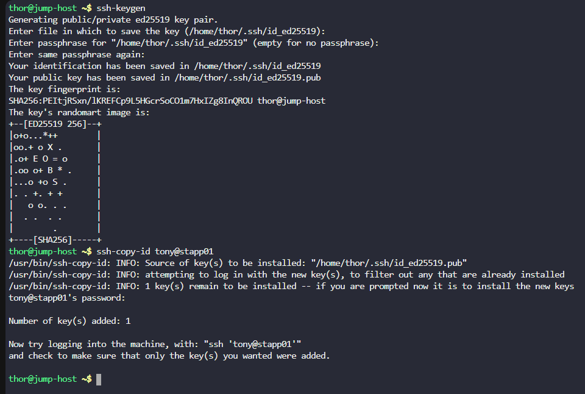
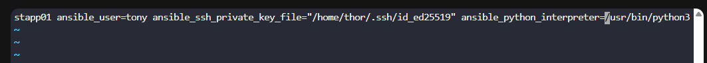
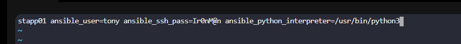
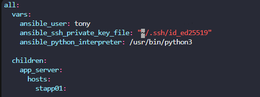
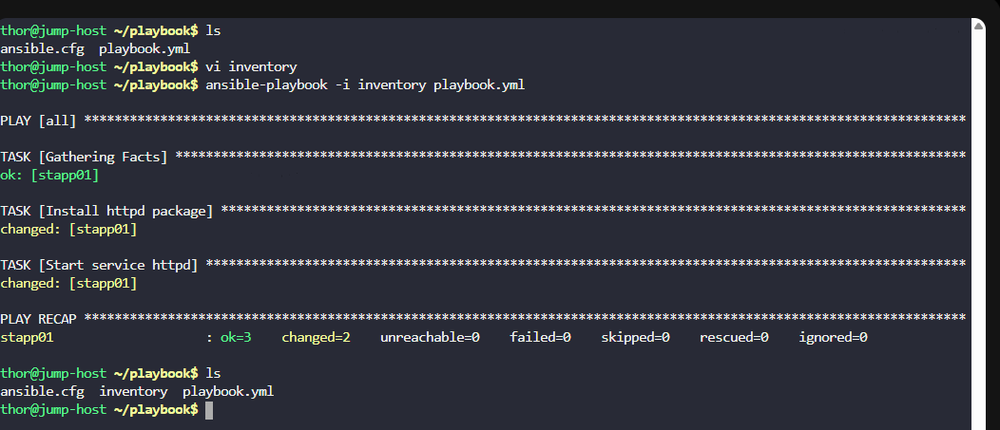

# Day 82: Create Ansible Inventory for App Server Testing

**subject**

***

The Nautilus DevOps team is testing Ansible playbooks on various servers within their stack. They've placed some playbooks under`/home/thor/playbook/`directory on the`jump host`and now intend to test them on`app server 1`in`Stratos DC`. However, an inventory file needs creation for Ansible to connect to the respective app. Here are the requirements:

a. Create an ini type Ansible inventory file`/home/thor/playbook/inventory`on`jump host`.

b. Include`App Server 1`in this inventory along with necessary variables for proper functionality.

c. Ensure the inventory hostname corresponds to the`server name`as per the wiki, for example`stapp01`for`app server 1`in`Stratos DC`.

`Note:`Validation will execute the playbook using the command`ansible-playbook -i inventory playbook.yml`. Ensure the playbook functions properly without any extra arguments.

***

https://blog.stephane-robert.info/docs/infra-as-code/gestion-de-configuration/ansible/premiers-pas/premier-inventaire/

https://docs.ansible.com/projects/ansible/latest/collections/ansible/builtin/ini\_inventory.html

* Check the current structure

* Create password less ssh

* Create the playbook

ini version for the subject

or

yaml version (we have failled with it thou)

* Test it

####
