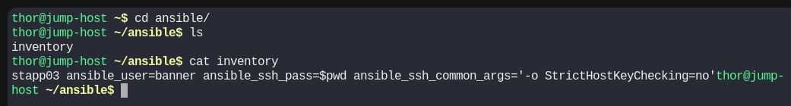
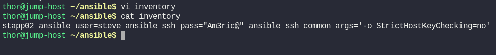
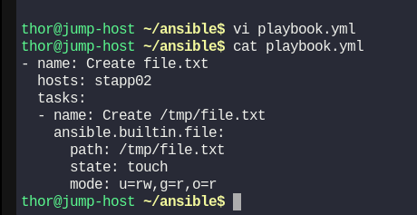
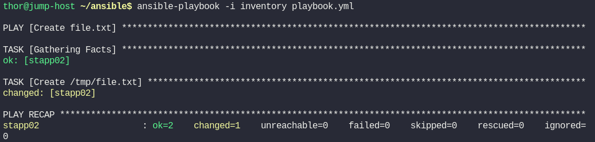
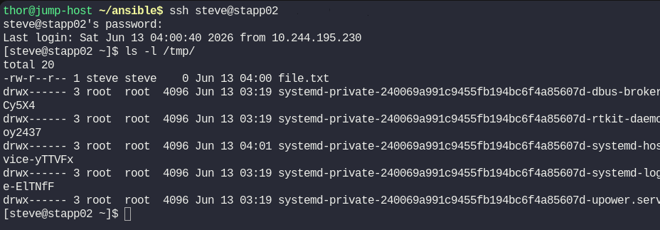

# Day 83: Troubleshoot and Create Ansible Playbook

**subject**

***

An Ansible playbook needs completion on the `jump host`, where a team member left off. Below are the details:

1. The inventory file `/home/thor/ansible/inventory` requires adjustments. The playbook must run on `App Server 2` in `Stratos DC`. Update the inventory accordingly.

2. Create a playbook `/home/thor/ansible/playbook.yml`. Include a task to create an empty file `/tmp/file.txt` on `App Server 2`.

`Note:` Validation will run the playbook using the command `ansible-playbook -i inventory playbook.yml`. Ensure the playbook works without any additional arguments.

***

https://blog.stephane-robert.info/docs/infra-as-code/gestion-de-configuration/ansible/ecrire-code/playbooks/plays-et-tasks/

https://docs.ansible.com/projects/ansible/latest/playbook\_guide/playbooks\_intro.html

https://docs.ansible.com/projects/ansible/latest/collections/ansible/builtin/file\_module.html

* Check the current inventory

* FIx it

* Create the playbook

* Run and test

