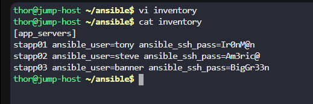

# Day 84: Copy Data to App Servers using Ansible

**subject**

***

The Nautilus DevOps team needs to copy data from the`jump host`to all`application servers`in`Stratos DC`using Ansible. Execute the task with the following details:

a. Create an inventory file`/home/thor/ansible/inventory`on`jump_host`and add all application servers as managed nodes.

b. Create a playbook`/home/thor/ansible/playbook.yml`on the`jump host`to copy the`/usr/src/devops/index.html`file to all application servers, placing it at`/opt/devops`.

`Note:`Validation will run the playbook using the command`ansible-playbook -i inventory playbook.yml`. Ensure the playbook functions properly without any extra arguments.

***

https://blog.stephane-robert.info/docs/infra-as-code/gestion-de-configuration/ansible/inventaires/

https://blog.stephane-robert.info/docs/infra-as-code/gestion-de-configuration/ansible/inventaires/statiques-ini/

https://blog.stephane-robert.info/docs/infra-as-code/gestion-de-configuration/ansible/ecrire-code/playbooks/plays-et-tasks/

https://docs.ansible.com/projects/ansible/latest/collections/ansible/builtin/copy\_module.html

https://stackoverflow.com/questions/56693857/ansible-chown-operation-not-permitted-for-non-root-user

* Create the inventory ini

* Create the ansible playbook

become: yes -> become root

* Run and check
