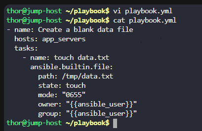
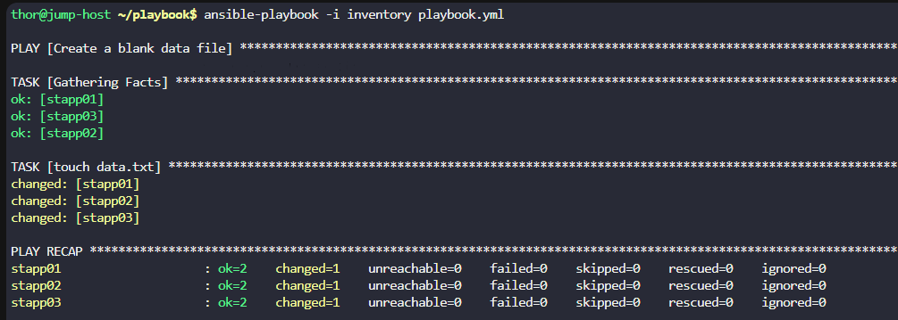
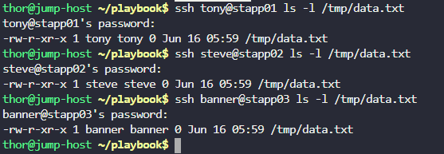

# Day 85: Create Files on App Servers using Ansible

**subject**

***

The Nautilus DevOps team is testing various Ansible modules on servers in`Stratos DC`. They're currently focusing on file creation on remote hosts using Ansible. Here are the details:

a. Create an inventory file`~/playbook/inventory`on`jump host`and include`all app servers`.

b. Create a playbook`~/playbook/playbook.yml`to create a blank file`/tmp/data.txt`on`all app servers`.

c. Set the permissions of the`/tmp/data.txt`file to`0655`.

d. Ensure the user/group owner of the`/tmp/data.txt`file is`tony`on`app server 1`,`steve`on`app server 2`and`banner`on`app server 3`.

`Note:`Validation will execute the playbook using the command`ansible-playbook -i inventory playbook.yml`, so ensure the playbook functions correctly without any additional arguments.

***

https://docs.ansible.com/projects/ansible/latest/inventory\_guide/intro\_inventory.html

https://docs.ansible.com/projects/ansible/latest/network/getting\_started/first\_inventory.html

https://docs.ansible.com/projects/ansible/latest/collections/index\_module.html

https://docs.ansible.com/projects/ansible/latest/collections/ansible/builtin/file\_module.html#ansible-collections-ansible-builtin-file-module

* Create inventory

- Create playbook

* Run and check

