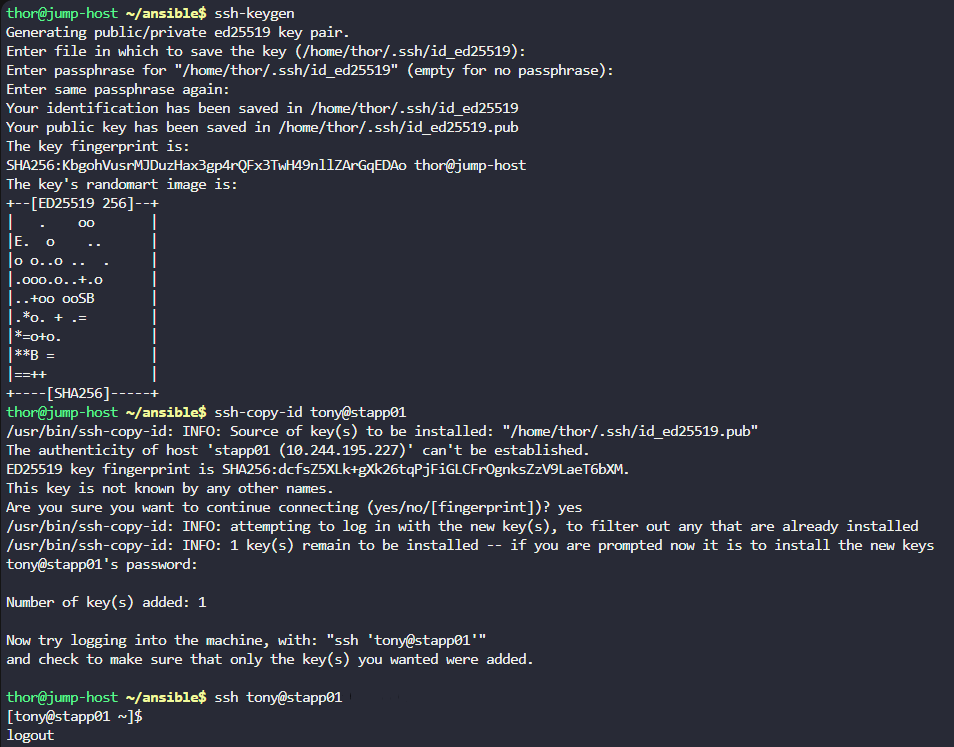
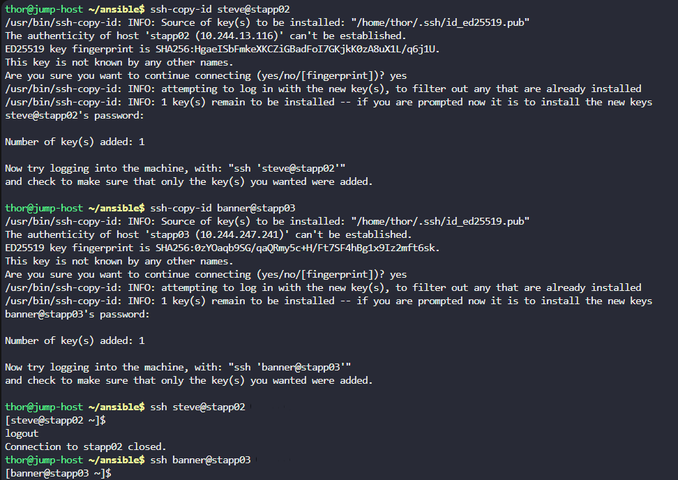
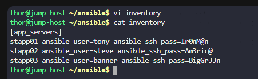

# Day 86: Ansible Ping Module Usage

**subject**

***

The Nautilus DevOps team is planning to test several Ansible playbooks on different app servers in`Stratos DC`. Before that, some pre-requisites must be met. Essentially, the team needs to set up a password-less SSH connection between Ansible controller and Ansible managed nodes. One of the tickets is assigned to you; please complete the task as per details mentioned below:

a.`Jump host`is our Ansible controller, and we are going to run Ansible playbooks through`thor`user from`jump host`.

b. There is an inventory file`/home/thor/ansible/inventory`on`jump host`. Using that inventory file test`Ansible ping`from`jump host`to`App Server 3`, make sure ping works.

***

https://docs.ansible.com/projects/ansible/latest/inventory\_guide/intro\_patterns.html

* Check the existing work

- Create the passwordless SSH

* Fix the inventory

* We can already ping them

- Create the ping playbook
