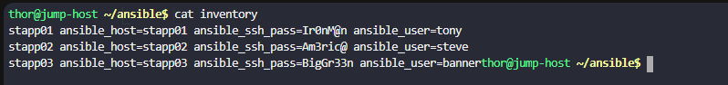
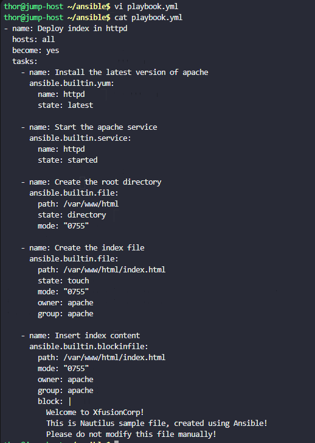

# Day 88: Ansible Blockinfile Module

**subject**

***

The Nautilus DevOps team wants to install and set up a simple`httpd`web server on all app servers in`Stratos DC`. Additionally, they want to deploy a sample web page for now using Ansible only. Therefore, write the required playbook to complete this task. Find more details about the task below.

We already have an`inventory`file under`/home/thor/ansible`directory on`jump host`. Create a`playbook.yml`under`/home/thor/ansible`directory on`jump host`itself.

1. Using the playbook, install`httpd`web server on all app servers. Additionally, make sure its service should up and running.

2. Using`blockinfile`Ansible module add some content in`/var/www/html/index.html`file. Below is the content:

   `Welcome to XfusionCorp!`
   `This is Nautilus sample file, created using Ansible!`
   `Please do not modify this file manually!`

3. The`/var/www/html/index.html`file's user and group`owner`should be`apache`on all app servers.

4. The`/var/www/html/index.html`file's permissions should be`0755`on all app servers.

`Note:`

i. Validation will try to run the playbook using command`ansible-playbook -i inventory playbook.yml`so please make sure the playbook works this way without passing any extra arguments.

ii. Do not use any custom or empty`marker`for`blockinfile`module.

***

https://blog.stephane-robert.info/docs/infra-as-code/gestion-de-configuration/ansible/ecrire-code/playbooks/plays-et-tasks/

https://docs.ansible.com/projects/ansible/latest/collections/ansible/builtin/blockinfile\_module.html

https://docs.ansible.com/projects/ansible-core/2.16/collections/ansible/builtin/yum\_module.html

https://docs.ansible.com/projects/ansible/latest/collections/ansible/builtin/file\_module.html

https://docs.ansible.com/projects/ansible/latest/collections/ansible/builtin/service\_module.html

* Check the inventory

* Create the playbook

* Run 

- check
