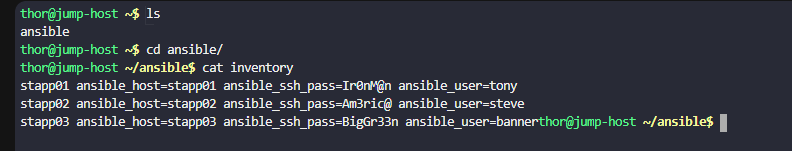
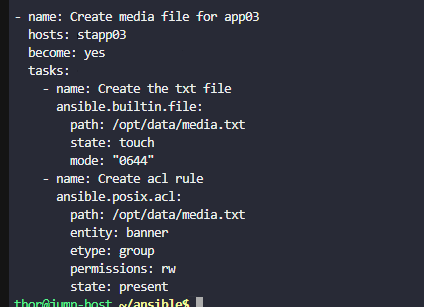

# Day 90: Managing ACLs Using Ansible

**subject**

***

There are some files that need to be created on all app servers in`Stratos DC`. The Nautilus DevOps team want these files to be owned by user`root`only however, they also want that the app specific user to have a set of permissions on these files. All tasks must be done using Ansible only, so they need to create a playbook. Below you can find more information about the task.

Create a playbook named`playbook.yml`under`/home/thor/ansible`directory on`jump host`, an`inventory`file is already present under`/home/thor/ansible`directory on`Jump Server`itself.

1. Create an empty file`blog.txt`under`/opt/data/`directory on app server 1. Set some`acl`properties for this file. Using`acl`provide`read '(r)'`permissions to`group tony`(i.e`entity`is`tony`and`etype`is`group`).

2. Create an empty file`story.txt`under`/opt/data/`directory on app server 2. Set some`acl`properties for this file. Using`acl`provide`read + write '(rw)'`permissions to`user steve`(i.e`entity`is`steve`and`etype`is`user`).

3. Create an empty file`media.txt`under`/opt/data/`on app server 3. Set some`acl`properties for this file. Using`acl`provide`read + write '(rw)'`permissions to`group banner`(i.e`entity`is`banner`and`etype`is`group`).

`Note:`Validation will try to run the playbook using command`ansible-playbook -i inventory playbook.yml`so please make sure the playbook works this way, without passing any extra arguments.

***

https://docs.ansible.com/projects/ansible/latest/collections/ansible/posix/acl\_module.html

* Check the current work

* Create the playbook

* Run and check

***

**Yes, Access Control Lists (ACLs) and standard file permissions are fundamentally different in how they are structured and applied**, even though both allow you to assign Read (r), Write (w), and Execute (x) permissions. \[[1](https://www.youtube.com/watch?v=3VKFY0GPAzE\&t=26), [2](https://quizlet.com/study-guides/understanding-linux-file-permissions-and-acls-3a931433-7ce2-435b-9207-fbdc2c091be5)]

The key difference comes down to **flexibility** and **who you can assign access to**. \[[1](https://www.youtube.com/watch?v=3VKFY0GPAzE\&t=26), [2](https://quizlet.com/study-guides/understanding-linux-file-permissions-and-acls-3a931433-7ce2-435b-9207-fbdc2c091be5)]

**Standard File Permissions (chmod)**

* **How it works:** Grants permissions based strictly on three fixed categories: **User** (owner), **Group**, and **Other** (everyone else).
* **The limitation:** You can only assign one specific owner and one specific owning group. If you need to give *User B* read/write access without making them the owner or adding them to the primary group, standard permissions cannot do it. \[[1](https://doc.opensuse.org/documentation/leap/archive/15.2/security/html/book-security/cha-security-acls.html), [2](https://www.comptia.org/en-us/blog/what-you-need-to-know-to-set-linux-permissions-and-access-control-lists/), [3](https://www.youtube.com/watch?v=3VKFY0GPAzE\&t=26)]

**Access Control Lists (ACLs)**

* **How it works:** Acts as an extension to standard permissions, allowing you to bypass the User/Group/Other restriction. It lets you attach specific `rwx` rules to **individual users** or **specific secondary groups** on a file-by-file basis. \[[1](https://www.youtube.com/watch?v=3VKFY0GPAzE\&t=26), [2](https://doc.opensuse.org/documentation/leap/archive/15.2/security/html/book-security/cha-security-acls.html), [3](https://www.comptia.org/en-us/blog/what-you-need-to-know-to-set-linux-permissions-and-access-control-lists/)]
* **The use case:** You can make *User A* the owner of a file, set the primary group to *Staff*, and simultaneously use an ACL to give *User B* read-only permissions and *User C* read-write permissions—all without altering the base permissions. \[[1](https://www.redhat.com/en/blog/linux-access-control-lists), [2](https://doc.opensuse.org/documentation/leap/archive/15.2/security/html/book-security/cha-security-acls.html)]

**How to use them**

* **Standard Permissions:** Managed using the `chmod` command.
* **ACLs:** Managed using the `setfacl` command to set permissions and `getfacl` to view them. When a file or directory has an ACL applied, its standard permission display (like you see in `ls -l`) ends with a `+` (plus) symbol.
