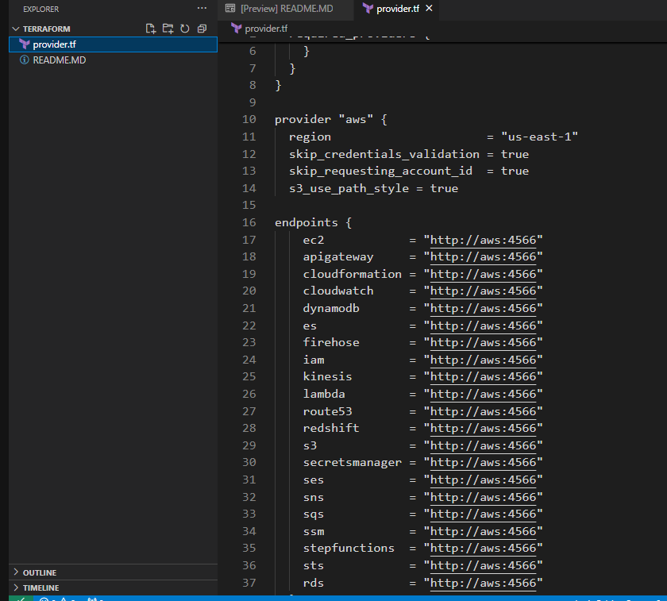
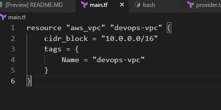
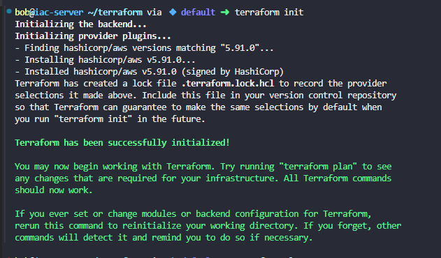
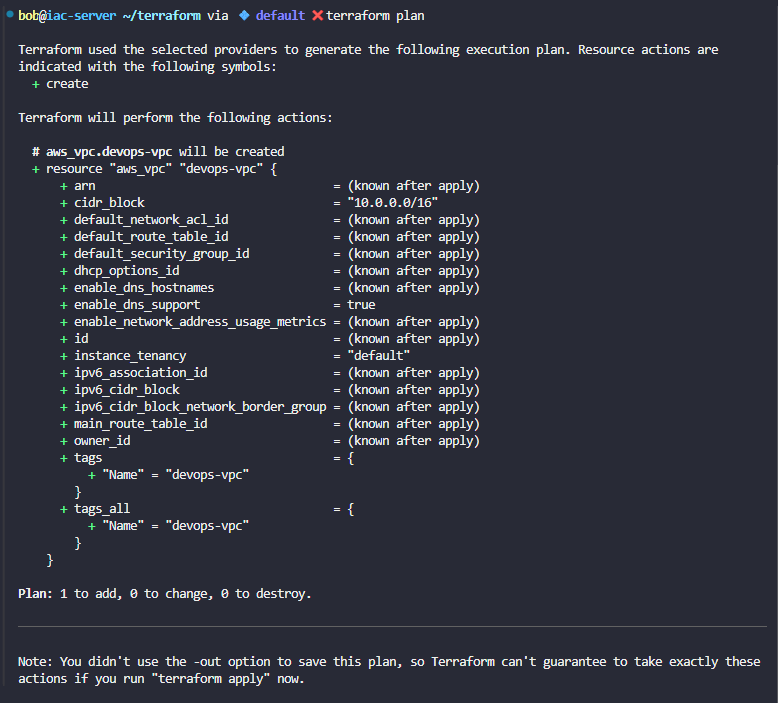
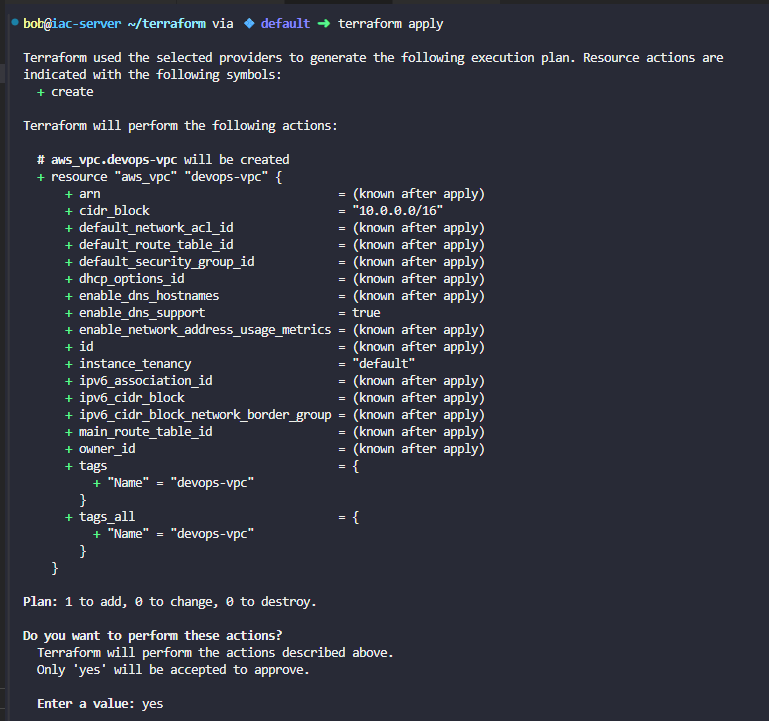

# Day 94: Create VPC Using Terraform

**subject**

***

The Nautilus DevOps team is strategizing the migration of a portion of their infrastructure to the AWS cloud. Recognizing the scale of this undertaking, they have opted to approach the migration in incremental steps rather than as a single massive transition. To achieve this, they have segmented large tasks into smaller, more manageable units. This granular approach enables the team to execute the migration in gradual phases, ensuring smoother implementation and minimizing disruption to ongoing operations. By breaking down the migration into smaller tasks, the Nautilus DevOps team can systematically progress through each stage, allowing for better control, risk mitigation, and optimization of resources throughout the migration process.

Create a VPC named`devops-vpc`in region`us-east-1`with any`IPv4`CIDR block through terraform.

The Terraform working directory is`/home/bob/terraform`. Create the`main.tf`file (do not create a different`.tf`file) to accomplish this task.

`Note:`Right-click under the`EXPLORER`section in`VS Code`and select`Open in Integrated Terminal`to launch the terminal.

***

https://blog.stephane-robert.info/docs/infra-as-code/provisionnement/terraform/

https://www.gruntwork.io/blog/a-crash-course-on-terraform

https://registry.terraform.io/providers/hashicorp/awS/6.0.0/docs/resources/vpc

https://spacelift.io/blog/terraform-apply

* Check the current work

* Create the main.tf to create an aws vpc

* Check it

